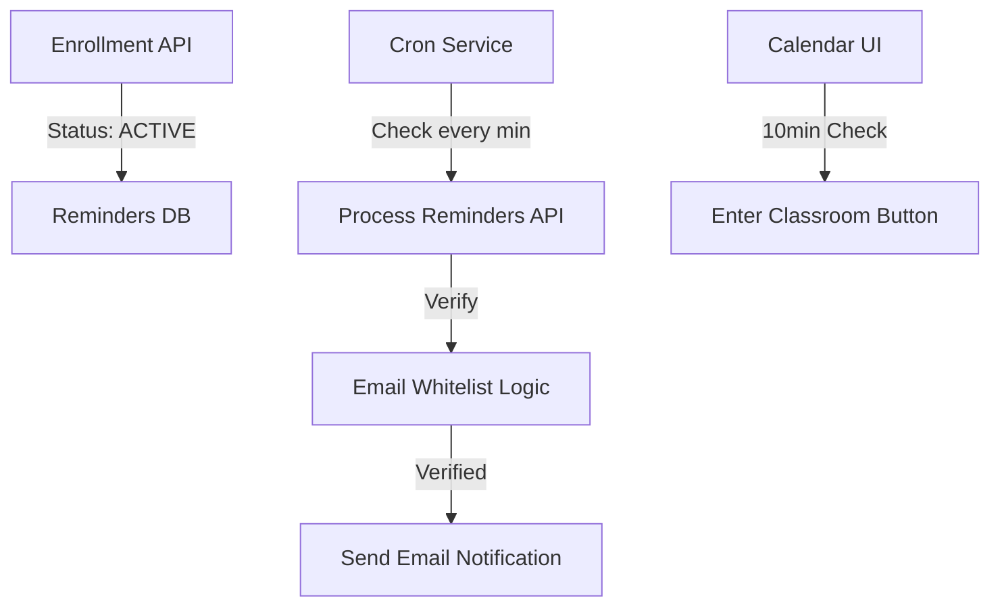

# Course Scheduling & Reminders Orchestration

此代碼單元負責 JV Tutor Corner 的核心排程邏輯，包含前端 `/calendar` 的互動顯示，以及後端基於時間觸發的自動提醒服務。

## 核心功能 (Core Capabilities)

### 1. 智慧日曆顯示 (Intelligent Calendar UI)
- **角色感知與視覺差異**: 根據用戶角色（學生/教師）動態調整顯示名稱。
- **狀態顏色標準化**: 
    - `Violet`: 未開始上課 (已過開始時間但未有進場紀錄)
    - `Sky`: 即將開始 (Upcoming)
    - `Emerald`: 進行中 (Ongoing)
    - `Slate`: 已結束 (Finished)
    - `Orange`: 中斷 (Interrupted)
    - `Rose`: 缺席 (Absent)

### 2. 進場區間控制 (Classroom Entry Interval Control)
- **精確限時**: 限制「進入等候室 (Waiting Room)」按鈕僅在課程開始前 **10 分鐘** 內啟用。
- **倒數與引導**: 針對未開放時段提供 Tooltip 提示，減少用戶困惑。

### 3. 多階段自動郵件提醒 (Automated Email Reminders)
- **全自動任務建立**: 在 Enrollment 狀態轉為 `ACTIVE` 時，系統自動編排 **開課前 180 分鐘 (3 小時)** 的提醒任務。
- **智慧時間轉換**: 郵件內容支持從分鐘到小時的語意轉換（例如：顯示為 "3 小時" 而非 "180 分鐘"）。
- **內建安全校驗**: 每次發信前皆會調用 `isEmailWhitelisted` 檢查發信權限與用戶認證狀態。

## 系統架構 (System Architecture)

## 驗證流程 (Verification Steps)

### A. 介面顯示與色標檢查
- 進入 `/calendar` 頁面。
- 驗證頂部狀態圖例 (Legend) 是否正確顯示。
- 確認日曆事件顏色與後端 API 傳回的 `status` 一致。

### B. 進入教室控制測試
- 選取一個距離開始時間大於 10 分鐘的課程：確認按鈕為禁用狀態且顯示「(未開放)」。
- 選取一個距離開始時間小於 10 分鐘的課程：確認按鈕變為琥珀色並導向等候室。

### C. 3 小時提醒機制發送驗證
- 註冊並購買課程，確認 `ACTIVE` 後 `jvtutorcorner-calendar-reminders` 表中有對應的 `reminderMinutes: 180` 紀錄。
- 模擬發送：確認郵件標題顯示為「...將於 3 小時 後開始」。
- **安全性驗證**: 嘗試刪除該用戶的認證紀錄，確認發信任務會被攔截並標記為 `not_sent`。

## 相關組件
- **Cron Job**: `app/api/cron/process-reminders/route.ts`
- **數據存儲**: `jvtutorcorner-calendar-reminders` (DynamoDB)
- **安全邏輯**: `lib/email/whitelist.ts`
