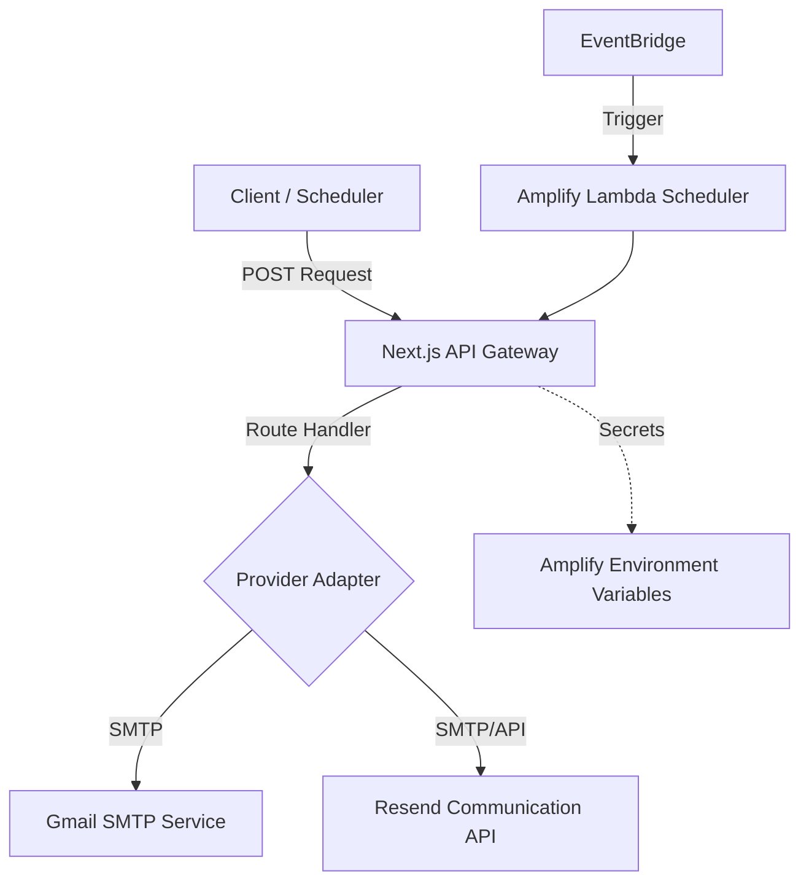

# Email Communication & Notification Service

本 Skill 負責管理 JV Tutor Corner 的電子郵件通訊體系，為內部組件提供統一的通知與自動化郵件發送介面。本服務深度整合 **Next.js (App Router)** 與 **AWS Amplify** 雲端架構，確保高可用性與通訊安全性。

## 1. 系統架構 (System Architecture)



## 2. 服務能力與適配器 (Core Capabilities)

### A. Gmail SMTP 適配器
- **實作路徑**: `app/api/workflows/gmail-send/route.ts`
- **技術細節**: 使用 Nodemailer 配合 SMTP over TLS (Port 587)。
- **安全要求**: 必須啟用 2FA 並配置 16 位元「應用程式密碼」。

### B. Resend 企業級適配器
- **實作路徑**: `app/api/workflows/resend-send/route.ts`
- **技術細節**: 支援單一 API Key 或透過 `/apps` 動態配置。
- **優勢**: 具備更高的送達率、開信追蹤與自定義網域支援。

---

## 3. 安全與權限規範 (Security & Authentication)

### 憑證管理 (Secret Management)
所有敏感資訊必須透過 **AWS Amplify Console -> Hosting -> Environment variables** 進行配置，嚴禁硬編碼於代碼中：
- `SMTP_PASS` / `RESEND_API_KEY`: 通訊憑證。
- `CRON_SECRET`: 用於保護微服務端點的授權 Token。

### 端點保護 (Endpoint Protection)
所有自動化路由（Cron API）必須實施 `Bearer Token` 驗證。
**標頭範例**: `Authorization: Bearer ${CRON_SECRET}`

---

## 4. API 端點規格 (API Specification)

| 功能 | 方法 | 路徑 | 必要參數 |
| :--- | :--- | :--- | :--- |
| Gmail 發送 | POST | `/api/workflows/gmail-send` | `to`, `subject`, `body` |
| Resend 發送 | POST | `/api/workflows/resend-send` | `to`, `subject`, `body` |
| 排程任務掃描 | POST | `/api/cron/process-reminders` | `Authorization` Header |

### 請求格式 (JSON Payload)
```json
{
  "to": "string",
  "subject": "string",
  "body": "string", // 純文字
  "html": "string"  // (選填) HTML 模板
}
```

---

## 5. 自動化任務調度 (Automation & Orchestration)

本系統僅採用 **AWS 原生架構** 作為單一且唯一的任務調度引擎，以確保通訊的準時性與與 Amplify 環境的深度整合。

### 核心機制：AWS EventBridge + AWS Lambda
所有定時任務（如課程提醒、報表生成）必須遵循以下規範：

1. **Lambda 控制層**: 統一存放於 `amplify/functions` (例如現有的 `dailyReportScheduler`)。其職責是封裝 `CRON_SECRET` 認證並執行對 Next.js API 的 HTTP POST 調用。
2. **觸發引擎**: 使用 **Amazon EventBridge** 設定定時規則，避免第三方外部工具可能造成的延遲或安全性風險。
3. **優點**: 
   - 無需額外費用（在 AWS 免費額度內）。
   - 與專案的私有環境與 Secrets 完美對齊。
   - 解決 Next.js 路由無法自我定時觸發的限制。

### 參考資源
- **實作範例**: [amplify-lambda-scheduler.js](file:///d:/jvtutorcorner-rwd/.agents/skills/email-service-integration/examples/amplify-lambda-scheduler.js)
- **配置步驟**: 透過 `amplify add/update function` 新增或修改 EventBridge 觸發表達式。

---

## 6. 可觀測性與除錯 (Observability)

- **標準化日誌**: 每個發送動作必須記錄 `messageId` 與 `timestamp`。
- **錯誤代碼**:
    - `503 Service Unavailable`: 憑證未配置。
    - `401 Unauthorized`: 授權憑證無效。
    - `400 Bad Request`: 參數校驗失敗或格式錯誤。
- **監控**: 透過 AWS CloudWatch Logs 監控 Lambda 與 Hosting 路由的執行狀態。

---

## 7. 維護建議

1. **頻率控制**: 監控 Gmail 每日 500 封的配額限制。
2. **SPF/DKIM**: 若切換至 Resend 並使用自定義網域，請確保 DNS 記錄已正確配置以優化送達率。
3. **超時校調**: Next.js 路由超時為 30 秒，如需處理大量附件或批量發送，請優化為非同步對列。
