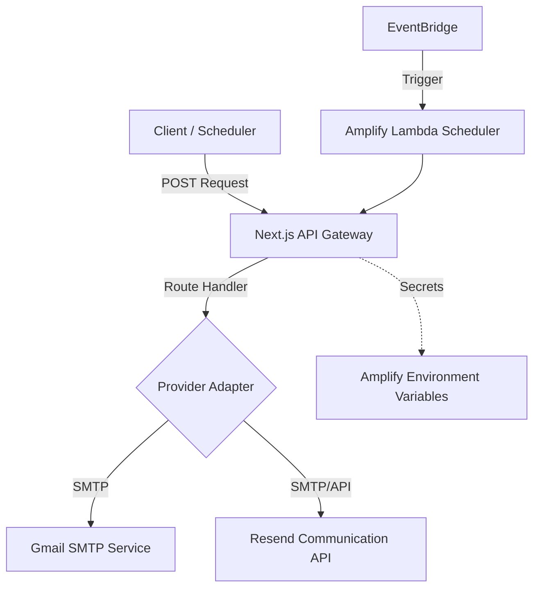

# Email Communication & Notification Service

本 Skill 負責管理 JV Tutor Corner 的電子郵件通訊體系，為內部組件提供統一的通知與自動化郵件發送介面。本服務深度整合 **Next.js (App Router)** 與 **AWS Amplify** 雲端架構，確保高可用性與通訊安全性。

## 1. 系統架構 (System Architecture)



## 2. 服務能力與適配器 (Core Capabilities)

### A. Gmail SMTP 適配器
- **實作路徑**: `app/api/workflows/gmail-send/route.ts`
- **技術細節**: 使用 Nodemailer 配合 SMTP over TLS (Port 587)。
- **安全要求**: 必須啟用 2FA 並配置 16 位元「應用程式密碼」。

### B. Resend 企業級適配器
- **實作路徑**: `app/api/workflows/resend-send/route.ts`
- **技術細節**: 支援單一 API Key 或透過 `/apps` 動態配置。
- **優勢**: 具備更高的送達率、開信追蹤與自定義網域支援。

---

## 3. 安全與權限規範 (Security & Authentication)

### 憑證管理 (Secret Management)
所有敏感資訊必須透過 **AWS Amplify Console -> Hosting -> Environment variables** 進行配置，嚴禁硬編碼於代碼中：
- `SMTP_PASS` / `RESEND_API_KEY`: 通訊憑證。
- `CRON_SECRET`: 用於保護微服務端點的授權 Token。

### 端點保護 (Endpoint Protection)
所有自動化路由（Cron API）必須實施 `Bearer Token` 驗證。
**標頭範例**: `Authorization: Bearer ${CRON_SECRET}`

### 電子郵件白名單 (Email Whitelist)
為防止在開發或測試環境中誤發郵件給真實用戶，系統實施了白名單機制：
- **環境變數**: `EMAIL_WHITELIST`
- **格式**: 以逗號分隔的電子郵件地址或網域（例如 `admin@test.com, @jvtutorcorner.com`）。
- **行為**: 
  - 若變數未設定或為 `*`: 允許發送至所有地址。
  - 若已設定: 僅允許發送至列表中的地址、匹配網域的地址，**或是任何已在平台註冊（存在於 DynamoDB profiles 表）的用戶**。
  - **動態識別**: 系統會自動識別註冊用戶，不受固定組織網域（如 `@jvtutorcorner.com`）的限制，這允許來自任何網域的學生接收系統通知。
  - **驗證免除**: 註冊時發送的驗證信會帶有 `purpose: 'verification'` 參數以繞過初始白名單攔截。
- **實作**: 透過 `lib/email/whitelist.ts` 統一管理，使用高度優化的 `GetCommand` 進行即時註冊狀態檢索。

---

## 4. API 端點規格 (API Specification)

| 功能 | 方法 | 路徑 | 必要參數 |
| :--- | :--- | :--- | :--- |
| Gmail 發送 | POST | `/api/workflows/gmail-send` | `to`, `subject`, `body` |
| Resend 發送 | POST | `/api/workflows/resend-send` | `to`, `subject`, `body` |
| 排程任務掃描 | POST | `/api/cron/process-reminders` | `Authorization` Header |

### 請求格式 (JSON Payload)
```json
{
  "to": "string",
  "subject": "string",
  "body": "string", // 純文字
  "html": "string"  // (選填) HTML 模板
}
---

## 4.5. 帳號建立驗證信流程 (Registration Verification Email Flow)

當用戶在 `/login/register` 頁面提交註冊表單時，系統會自動寄送驗證信至註冊的 Email 地址。

### 流程說明
1. **表單提交**: 用戶填寫完整表單並通過驗證碼驗證（使用 `jv_secret_bypass_2024` bypass）
2. **後端處理**: 
   - 路由: `app/api/register/route.ts`
   - 驗證郵件白名單 (EMAIL_WHITELIST 優先)
   - 驗證信以 `purpose: 'verification'` 參數發送，繞過初始白名單檢查
3. **Email 寄送** (✅ 2026-04-22 已優化):
   - **新方案**: 直接使用 `lib/email/verificationService.ts` 的 nodemailer
   - **雙引擎架構**:
     1. **Gmail SMTP (優先)**: 嘗試從 DynamoDB `/apps` 配置或 `SMTP_USER`/`SMTP_PASS` 環境變數
     2. **Resend (備用)**: 嘗試從 DynamoDB `/apps` 配置或 `RESEND_API_KEY` 環境變數
   - 支援在 Serverless 環境（AWS Amplify Hosting）正常運作
   - 詳細的錯誤日誌便於除錯

### 舊方案問題 (已修正)
- 原始設計使用內部 `fetch()` 調用 `/api/workflows/gmail-send`
- 在 Serverless 環境中不穩定（localhost 無法訪問）
- 無法可靠地在 Amplify Hosting 中發送驗證信

### 新方案優勢
- ✅ 直接在服務端發送，無需中間 API 層
- ✅ 支援多種發送引擎（Resend、Gmail、自定義）
- ✅ 錯誤日誌詳細，便於調試
- ✅ 在所有環境（Local、Amplify）都能正常運作
- ✅ 白名單檢查已內置在驗證信流程中

### 測試驗證
- **自動化測試**: `npx playwright test e2e/register_and_email_test.spec.ts --headed --project=chromium`
- **成功指標**:
  - 帳號成功建立
  - 驗證信成功寄送
  - 日誌中顯示 `[VerificationService] Sent via [Resend|Gmail SMTP]:`

---

本系統採用 **Amazon EventBridge + AWS Lambda** 作為全域任務調度引擎。這套架構確保了所有 Email 相關的 Cron 任務（如課程提醒、每日報表）能夠在受控且安全的環境下準時觸發。

### 核心原則：EventBridge 優先驅動
嚴禁使用第三方不穩定或非加密的外部 Cron 工具。所有調度邏輯必須在 AWS 內部生命週期中循環：

1.  **EventBridge 定時規則 (Rules)**: 
    - 設定 `cron(0/1 * * * ? *)`（每分鐘執行一次）用於 **課程提醒系統 (Course Reminders)**。
    - 設定 `cron(0 0 * * ? *)`（每日午夜）用於 **每日營運報表 (Daily Reports)**。
2.  **Amplify Lambda 轉送器 (Relay)**: 
    - 任務觸發時，由 Lambda 函數 (如 `dailyReportScheduler`) 承接。
    - **職責**: 從 AWS Secret Manager 或系統環境變數中安全讀取 `CRON_SECRET`。
    - **動作**: 發起帶有 `Authorization` 標頭的 HTTPS POST 請求至 Next.js API 路由。
3.  **優勢 (Architectural Benefits)**: 
    - **高可用性**: 依託 AWS 的高 SAA 保證。
    - **安全性**: 所有通訊均受 `CRON_SECRET` 保護，且觸發源固定在 AWS 內部 IP。
    - **零成本運行**: 任務量完全在 AWS Free Tier 範圍內。

### 相關實作參考
- **實作範例**: [amplify-lambda-scheduler.js](file:///d:/jvtutorcorner-rwd/.agents/skills/email-service-integration/examples/amplify-lambda-scheduler.js)
- **課程提醒 API**: `app/api/cron/process-reminders/route.ts`
- **每日報表 API**: `app/api/cron/daily-report/route.ts`

---

## 6. 可觀測性與除錯 (Observability)

- **標準化日誌**: 每個發送動作必須記錄 `messageId` 與 `timestamp`。
- **錯誤代碼**:
    - `503 Service Unavailable`: 憑證未配置。
    - `401 Unauthorized`: 授權憑證無效。
    - `400 Bad Request`: 參數校驗失敗或格式錯誤。
- **監控**: 透過 AWS CloudWatch Logs 監控 Lambda 與 Hosting 路由的執行狀態。

### 特殊供應商故障排除：Resend
在測試階段，開發者常會遇到以下 Resend 特定錯誤：

1. **403 Forbidden (Testing Mode限制)**:
    - **訊息範例**: "You can only send to [owner_email] in testing mode."
    - **原因**: 您的 Resend 帳戶尚未驗證自定義網域 (Domain Verification)，因此僅允許發送至註冊帳號時的 Email。
    - **對策**: 
        - 測試時請將收件者設為 Resend 帳號擁有者。
        - 正式環境請至 Resend 控制台完成 DNS 設定 (SPF/DKIM)。
2. **503 Service Unavailable (配置缺失)**:
    - **原因**: `/apps` 頁面的整合未設為 `ACTIVE` 或 API Key 填寫不完整。
    - **對策**: 確認整合狀態並重新儲存配置。

---

## 7. 維護建議

1. **頻率控制**: 監控 Gmail 每日 500 封的配額限制。
2. **SPF/DKIM**: 若切換至 Resend 並使用自定義網域，請確保 DNS 記錄已正確配置以優化送達率。
3. **超時校調**: Next.js 路由超時為 30 秒，如需處理大量附件或批量發送，請優化為非同步對列。

---

## 8. Resend DNS 配置指南 (DNS Setup Guide)

為了突破 Resend 的「測試模式」限制並提高郵件送達率，您必須針對您的網域進行 DNS 驗證。

### 步驟 1：在 Resend Dashboard 新增網域
1. 登錄 [Resend 控制台](https://resend.com/domains)。
2. 點擊 **Add Domain**，輸入您的網域（建議使用子網域如 `mail.yourdomain.com`）。
3. 系統會自動生成需要配置的 **MX, TXT (SPF), CNAME (DKIM)** 紀錄。

### 步驟 2：配置 DNS 紀錄內容
請登入您的域名供應商（如 Cloudflare, GoDaddy, AWS Route 53），並依序新增：

| 紀錄類型 | 主機名 (Host/Name) | 內容 (Content/Value) | 備註 |
| :--- | :--- | :--- | :--- |
| **MX** | `mail` (或 @) | `feedback-smtp.resend.com` | 優先級 (Priority): 10 |
| **TXT** | `mail` (或 @) | `v=spf1 include:amazonses.com ~all` | **SPF 授權** (若已有 SPF 請進行合併) |
| **CNAME** | `resend._domainkey` | `[Unique-DKIM-Key].dkim.resend.com` | **DKIM 簽章** (通常會有三組) |

### 步驟 3：驗證與生效
1. 在 Resend 頁面點擊 **Verify** 按鈕。
2. **注意**：DNS 生效可能需要 1~24 小時。
3. 驗證成功後，該網域的狀態會顯示為 **Verified**，此時即可發信給任何受眾。

### 步驟 4：(建議) 配置 DMARC
在 DNS 中新增一條 TXT 紀錄以加強保護：
- **Host**: `_dmarc`
- **Value**: `v=DMARC1; p=none; rua=mailto:your-admin@domain.com`
