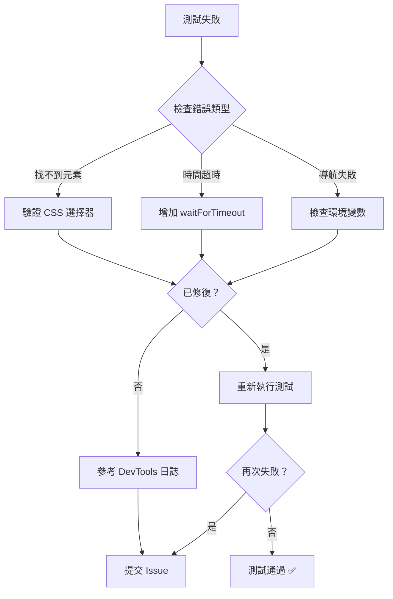

# 首頁驗證 Skill - 使用指南

## 概述

此 Skill 定義了 JV Tutor Corner 首頁的完整自動化測試套件，涵蓋以下核心功能：

- ✅ **多語言支持** - 繁體中文、簡體中文、英文
- ✅ **翻譯系統** - Hero、How it Works、Carousel 等區段
- ✅ **快取管理** - 無語言閃爍問題
- ✅ **行動版響應** - 菜單按鈕與佈局
- ✅ **新手引導** - Product Tour 觸發
- ✅ **推薦系統** - 個性化課程推薦
- ✅ **訪客問卷** - 3 分鐘閒置觸發

## 快速開始

### 1. 運行完整測試套件

```bash
npx playwright test e2e/homepage_verification.spec.ts --headed
```

### 2. 運行特定功能測試

**語言切換測試：**
```bash
npx playwright test e2e/homepage_verification.spec.ts -g "語言切換" --headed
```

**行動版菜單測試：**
```bash
npx playwright test e2e/homepage_verification.spec.ts --tag @mobile --headed
```

**訪客問卷測試：**
```bash
# 注意：此測試需要等待 3 分鐘或設置環境變數加速
IDLE_THRESHOLD_MS=5000 npx playwright test e2e/homepage_verification.spec.ts --tag @questionnaire --headed
```

### 3. 生成測試報告

```bash
npx playwright test e2e/homepage_verification.spec.ts --reporter=html
# 打開報告
npx playwright show-report
```

## 檔案結構

```
.agents/skills/homepage-verification/
├── SKILL.md                          # 完整技能文檔（檢查清單、已知問題等）
└── README.md                         # 本文件

e2e/
├── homepage_verification.spec.ts     # 主測試套件
└── helpers/
    └── homepage-helpers.ts           # 輔助函數庫
```

## 測試場景

### 1️⃣ 語言切換驗證 (無登入)

**目標**: 確保三種語言完整支援且無閃爍

```bash
npx playwright test e2e/homepage_verification.spec.ts -g "語言切換" --headed
```

**涵蓋項目:**
- 語言下拉選單 UI
- Hero 文本翻譯（未登入）
- How it Works 翻譯
- 快取重新整理後無閃爍

### 2️⃣ 行動版菜單驗證 (375px 寬度)

**目標**: 確保移動設備上菜單可正常使用

```bash
npx playwright test e2e/homepage_verification.spec.ts --tag @mobile --headed
```

**涵蓋項目:**
- 菜單按鈕顯示/隱藏
- 點擊互動
- 覆蓋層關閉
- 響應式設計

### 3️⃣ 登入用戶驗證

**目標**: 確保已登入用戶看到個性化內容

```bash
# 此測試會自動註冊新用戶並驗證
npx playwright test e2e/homepage_verification.spec.ts -g "登入用戶" --headed
```

**涵蓋項目:**
- Hero 歡迎訊息
- 個性化推薦課程
- Product Tour 觸發
- CTA 按鈕變化

### 4️⃣ 訪客問卷驗證

**目標**: 確保 3 分鐘後自動彈出問卷

```bash
# 使用加速環境變數（5 秒代替 3 分鐘）
IDLE_THRESHOLD_MS=5000 npx playwright test e2e/homepage_verification.spec.ts --tag @questionnaire --headed
```

**涵蓋項目:**
- 問卷在正確時間彈出
- 互動重置計時器
- 同一訪客不重複彈出

## 環境設置

### 必要環境變數 (.env.local)

```env
NEXT_PUBLIC_BASE_URL=http://localhost:3000
NEXT_PUBLIC_LOGIN_BYPASS_SECRET=jv_secret_bypass_2024

# 可選：加速訪客問卷觸發時間（毫秒）
# IDLE_THRESHOLD_MS=5000
```

### Node 版本

```bash
node >= 18.0.0
npm >= 9.0.0
```

### 相依套件

```bash
# 已在 package.json 中定義，執行即可
npm install
```

## 常見問題

### Q: 語言不切換怎麼辦？

**A:** 檢查以下項目：

1. 清除瀏覽器快取和 localStorage：
   ```bash
   # 在測試代碼中
   localStorage.clear()
   ```

2. 檢查翻譯文件是否存在：
   ```bash
   ls locales/*/common.json
   ```

3. 檢查翻譯鍵是否正確：
   ```bash
   grep "hero_premium_title_guest" locales/zh-TW/common.json
   ```

### Q: 行動版菜單不顯示怎麼辦？

**A:** 驗證以下項目：

1. 視窗寬度是否 ≤ 768px
2. CSS 中菜單按鈕的 `display` 屬性
3. 事件監聽器是否正確綁定（應使用 `click` 而非 `mousedown`）

### Q: Product Tour 不彈出怎麼辦？

**A:** 檢查以下項目：

1. localStorage 中是否有 `jv_tour_phase` 標記
2. 用戶是否已成功登入
3. 清除 localStorage：
   ```bash
   localStorage.removeItem('jv_tour_phase')
   ```

### Q: 測試超時怎麼辦？

**A:** 增加超時時間：

```bash
# 在 package.json scripts 中增加
npx playwright test e2e/homepage_verification.spec.ts --timeout=120000 --headed
```

## 最佳實踐

### 1. 執行測試前檢查清單

- [ ] 開發服務器已啟動 (`npm run dev`)
- [ ] 環境變數 (.env.local) 已設置
- [ ] 無其他進程佔用 3000 端口
- [ ] 瀏覽器快取已清除

### 2. 測試執行順序

建議按以下順序執行測試以避免衝突：

```bash
# 1. 先測試未登入功能
npx playwright test e2e/homepage_verification.spec.ts -g "語言切換|行動版菜單" --headed

# 2. 再測試登入功能
npx playwright test e2e/homepage_verification.spec.ts -g "登入用戶" --headed

# 3. 最後測試長時間等待的功能
IDLE_THRESHOLD_MS=5000 npx playwright test e2e/homepage_verification.spec.ts --tag @questionnaire --headed
```

### 3. 除錯技巧

**查看測試執行過程：**
```bash
npx playwright test e2e/homepage_verification.spec.ts --headed --debug
```

**生成視頻記錄：**
```bash
npx playwright test e2e/homepage_verification.spec.ts --headed --video=on
```

**查看詳細日誌：**
```bash
DEBUG=pw:api npx playwright test e2e/homepage_verification.spec.ts --headed
```

## 相關技能

此 Skill 與以下技能相關，可協同使用：

- **navbar-verification** - 驗證導覽列狀態與自動登入
- **big-data-collection** - 驗證推薦系統與問卷整合
- **recommendation-onboarding** - 驗證個性化推薦課程
- **course-alignment** - 驗證課程列表與教師對齐

## 故障排除流程



## 維護與更新

### 何時更新此 Skill

- 新增首頁功能時
- 修改翻譯文件時
- 變更 UI 選擇器時
- 更新行動版斷點時

### 提交更改檢查清單

- [ ] 已運行完整測試套件
- [ ] 所有測試通過
- [ ] 已更新 SKILL.md 檢查清單
- [ ] 已更新此 README
- [ ] 已記錄已知問題或變更說明

## 聯繫與回報

若發現問題或需改進，請：

1. 檢查 SKILL.md 中的「已知問題」部分
2. 查閱故障排除指南
3. 如仍無法解決，提交 Issue 並包含：
   - 測試環境信息
   - 完整錯誤堆棧
   - 復現步驟
   - 頁面截圖或錄影

---

**最後更新**: 2026-04-25  
**維護者**: Frontend Testing Team
