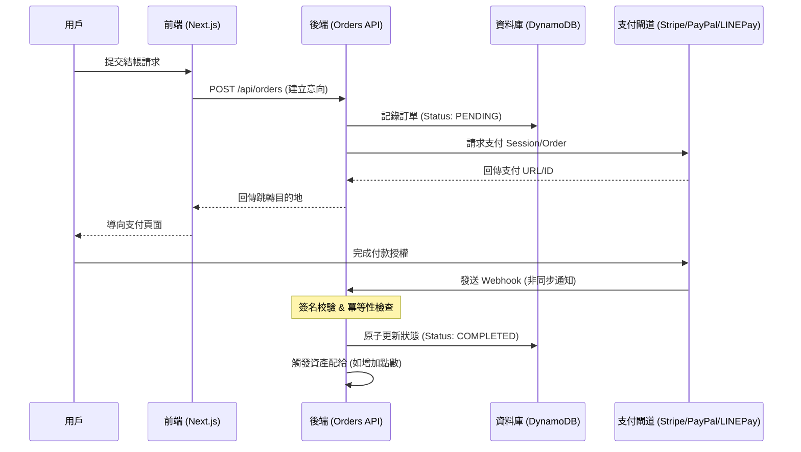

# Payment Infrastructure & Lifecycle Management (Payment Infrastructure Skill)

本 Skill 負責維護平台支付系統的「高可用整合架構」，確保從用戶啟動結帳到資產入庫的完整生命週期（End-to-End Lifecycle）。其核心目標是建立安全、冪等（Idempotent）且可審計的財務交易環境。

## 1. 系統調度流程 (System Orchestration)

支付流程遵循下列嚴謹的時序鏈結，確保異步通知不遺漏：

## 2. 訂單狀態機 (Order State Machine, OSM)

為了防止收入流失（Revenue Leakage）與資產超發，所有交易必須嚴格符合狀態流轉邏輯：

| 當前狀態 | 目標狀態 | 觸發事件 | 執行動作 |
| :--- | :--- | :--- | :--- |
| **None** | `PENDING` | API 建立訂單 | 產生 `orderId`，儲存交易意向 (Intent)。 |
| `PENDING` | `PROCESSING` | 收到 Webhook/回調 | 進入處理鎖定狀態，防止併發。 |
| `PROCESSING` | `COMPLETED` | 驗證支付成功信號 | 配給資產（點數/訂閱），記錄交易憑證。 |
| `PROCESSING` | `FAILED` | 支付拒絕 / 驗證失敗 | 執行狀態回退，紀錄原始回傳 Log。 |
| `ANY` | `REFUNDED` | 發起退款請求 | 依據 `purchase-refund-flow` 撤銷資產。 |

## 3. 安全與合規框架 (Hardened Standards)

### A. 完整性與不可否認性 (Integrity)
- **加密簽名驗證**：所有 Webhook 入口點 **必須** 驗證提供商的加密簽名（如 Stripe-Signature, HMAC-SHA256）。
- **傳輸加密**：支付相關 Endpoint 強制執行 HTTPS 傳輸。

### B. 冪等性策略 (Idempotency)
- 以 **Gateway Transaction ID** 作為唯一的處理 Key。
- 收到重複 Webhook 時，若訂單已是 `COMPLETED`，應直接回傳 `200 OK` 並中斷邏輯，嚴禁重複執行資產配給。

### C. 隱私與 PCI 遵從
- **零卡號保留原則**：平台 **嚴禁** 儲存任何信用卡原資訊（PAN, CVV）。所有敏感資訊均採 Gateway Tokenization。

## 4. 技能對齊 (Skill Alignment)

| 功能屬性 | 本 Skill (payment-infrastructure) | refund 相關 Skills |
| :--- | :--- | :--- |
| **主要場景** | 點數購買、訂閱升級、產品支付 | 訂購錯誤、退款申請、點數回收 |
| **技術重心** | 閘道發起、狀態追蹤、Webhook 校驗 | 金流 API 退回 (`monetary-refund`)、業務狀態同步 (`purchase-refund-flow`) |
| **流程方向** | 前向 (Forward) | 逆向 (Reverse) |

## 5. 核心檢查清單 (Professional Checklist)

- [ ] **驗證機制**：是否已實現 Webhook 來源的簽名驗證？
- [ ] **併發處理**：在高併發下是否會發生重複配給？（使用 DynamoDB `ConditionExpression`）。
- [ ] **錯誤日誌**：是否完整紀錄了 Gateway 回傳的錯誤代碼與原始 Payload？
- [ ] **環境一致性**：所有金鑰是否均從 `.env.local` 讀取，且生產/沙箱配置正確？
- [ ] **API 註冊**：若新增 API 路由，是否已執行 `node scripts/inspect_apis.mjs` 更新註冊表？

## 6. PR / Commit 規範

推薦使用規範化的 Conventional Commits，並區分安全相關更動：
- `feat(payment-infra)`: 新增閘道或支付功能
- `fix(payment-infra)`: 修正狀態流轉或回調問題
- `sec(payment-infra)`: 強化 Webhook 安全或加密機制

---
© 2026 JV Tutor Corner - Payment Infrastructure Group
