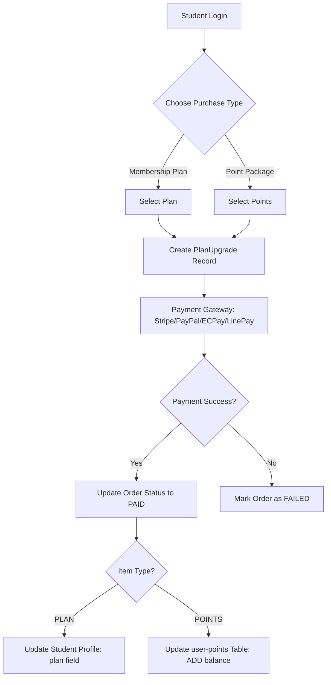
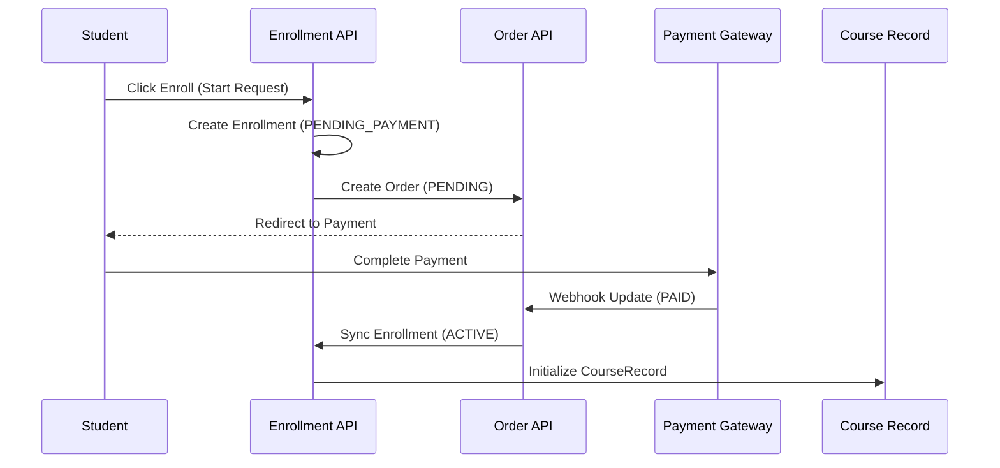
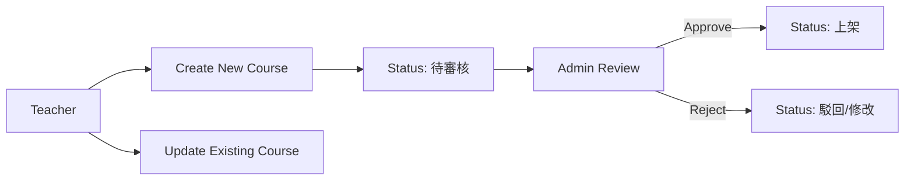
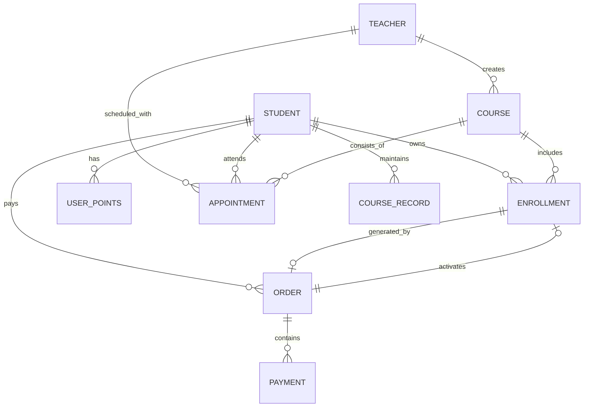

# Platform Architecture & Database Relationship Overview

This document provides a structured overview of the JVTutorCorner platform architecture, focusing on the core database models, user flows, and system relationships.

## 1. Core Entities & Database Models

The platform uses **AWS Amplify (AppSync/GraphQL)** and **DynamoDB** for data storage.

### 1.1 User Roles
- **Student**: Learners who enroll in courses, purchase plans/points, and provide feedback.
- **Teacher**: Educators who create courses, manage sessions, and interact with students.
- **Admin**: Administrators who manage orders, approve teacher profile changes, and oversee the platform.

### 1.2 Data Models (GraphQL/DynamoDB)

| Model | Table Name (Production) | Description |
|-------|--------------------------|-------------|
| **Student** | `jvtutorcorner-Student-...` | Student profiles, levels, goals, and preferred subjects. |
| **Teacher** | `jvtutorcorner-Teacher-...` | Teacher profiles, bios, ratings, and subjects taught. |
| **Course** | `jvtutorcorner-courses` | Course details: title, price, sessions, status (Active/Pending Review). |
| **Enrollment** | `jvtutorcorner-Enrollment-...` | Link between Students and Courses. Tracks status (Pending, Active, Paid). |
| **Order** | `jvtutorcorner-orders` | Financial transaction records for enrollments. |
| **Payment** | `jvtutorcorner-Payment-...` | Records of payments made to external providers. |
| **UserPoints** | `jvtutorcorner-user-points` | Tracks student point balances for point-based enrollment. |
| **PlanUpgrade** | `jvtutorcorner-plan-upgrades` | Records of plan or point purchase requests. |
| **CourseRecord** | `jvtutorcorner-CourseRecord-...` | History of student activities and notes within a course. |
| **TeacherReview** | `jvtutorcorner-teacher-reviews`| Admin logs for reviewing teacher profile modifications. |

---

## 2. Core Operational Flows

### 2.1 Student: Login to Plan Purchase
Students can purchase membership plans or point packages to enroll in courses.

### 2.2 Student: Course Enrollment
Enrollment can be handled via direct payment or by deducting points.

#### Enrollment Flow (Standard)

#### Enrollment Flow (Points)
1. **Deduct Points**: Calls `/api/points` to subtract the `pointCost` of the course.
2. **Sync Status**: Updates `Enrollment` status to `PAID` immediately upon successful deduction.
3. **Activation**: The enrollment becomes `ACTIVE`, granting access to course materials and sessions.

---

### 2.3 Teacher: Course Management
Teachers manage their teaching content through the `courses_manage` dashboard.

---

### 2.4 Course Feedback & Testimonials (學員見證)
Currently, testimonials are displayed on the `/testimony` page and collected via `/testimony/rating`.

- **Testimonials**: Stored as a curated list (often localized via i18n) or in a dedicated carousel table (`jvtutorcorner-carousel`).
- **Student Ratings**: Collected post-course completion.
    - **Logic**: Students select a completed course, give stars (1-5), and write content.
    - **Integrity**: Only students with `finishedCourses` records are allowed to submit.

---

## 3. System Relationships (ER Diagram)

## 4. Key API Endpoints for Skills
- `/api/enroll`: Manage course enrollments.
- `/api/orders`: Manage financial transactions and status.
- `/api/points`: Deduct/Add point balances.
- `/api/courses`: Create and fetch course data.
- `/api/profile`: Update user information and subscription status.
- `/api/plan-upgrades`: Handle membership and point purchases.
