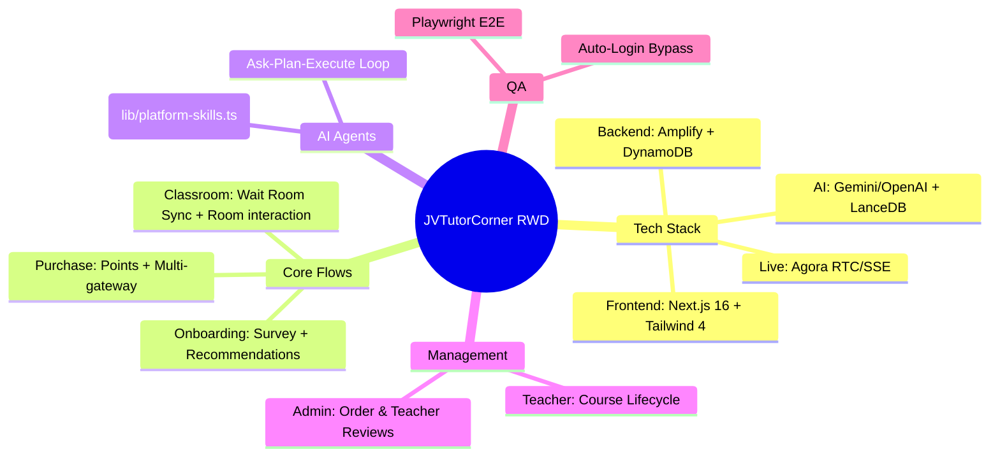
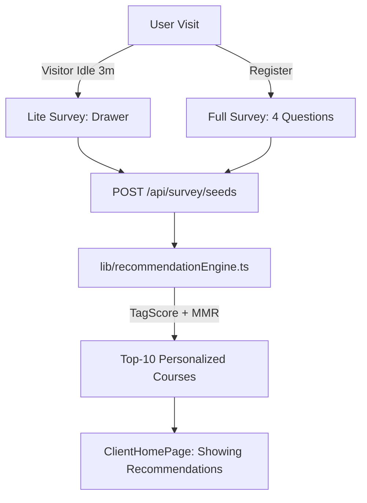
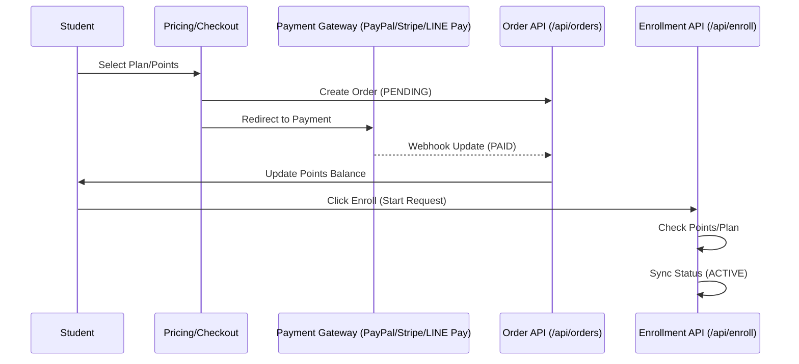
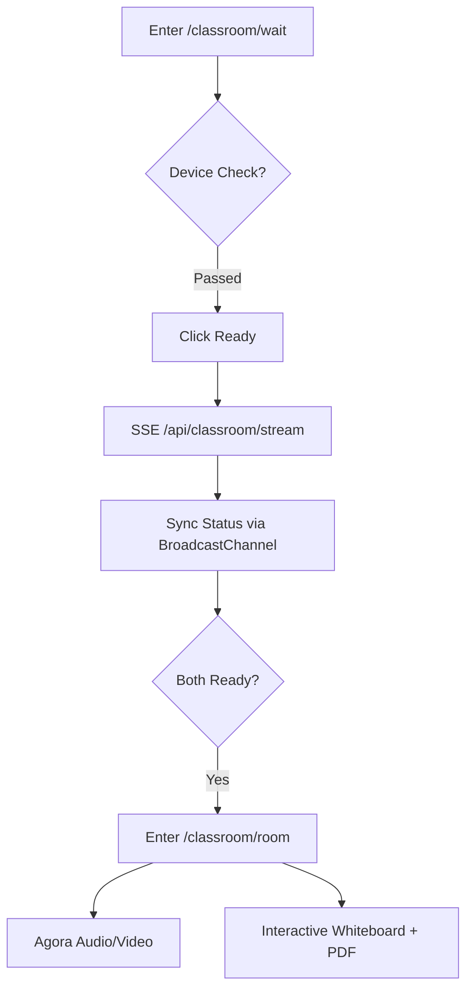
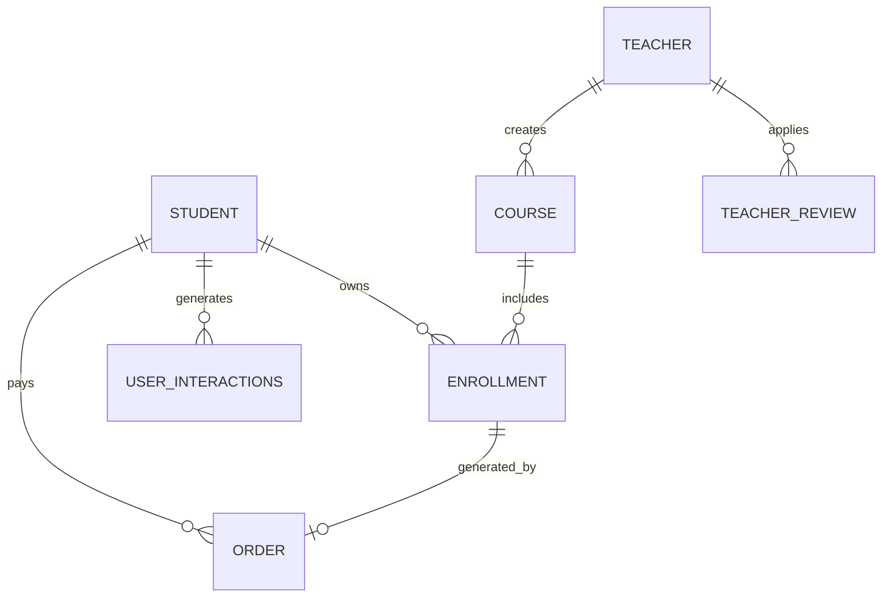

# Platform Architecture & Database Relationship Overview

## 0. High-Level System Overview (Mind Map)

This mind map provides a "Big Picture" view of the project components and technology stack as of 2026.



## 1. Core Operational Flows

### 2.1 Student: Onboarding & Recommendation flow
Captures the visitor idle survey and post-registration questionnaire that fuels the recommendation engine.



### 2.2 Student: Purchase & Enrollment Flow
Supports points-based and direct enrollment through multiple payment gateways.



### 2.3 Classroom: Wait Room & Session Flow
Ensures teacher and student synchronization before entering the classroom.



### 2.4 AI Chat: Agentic Tool Flow
Detailed Ask-Plan-Execute cycle with vector memory.

```mermaid
graph LR
    Input[User Message] --> API[/api/ai-chat]
    API --> Memory[LanceDB searchMemory]
    Memory --> AgentLoop[3-Agent Loop]
    AgentLoop --> Ask[Ask Agent]
    Ask --> Plan[Plan Agent]
    Plan --> Execute[Execute Agent]
    Execute --> Tools{Tool Call?}
    Tools -->|Yes| RealTools[lib/platform-skills.ts]
    RealTools --> Execute
    Tools -->|No| Store[LanceDB addMemory]
    Store --> Response[Display Reply + Tool Logs]
```

### 2.5 Admin: Management Flows
Covers teacher profile review and order status management.

```mermaid
graph TD
    Admin[Admin User] -->|Orders| OrderUI[/admin/orders]
    OrderUI --> ManualUpdate[Update Status / Export CSV]
    Admin -->|Teacher Profiles| ReviewUI[/admin/teacher-reviews]
    ReviewUI --> Diff[Levenshtein Diff Comparison]
    Diff -->|Approve| SyncTeacher[Sync to Teacher Profile]
    Diff -->|Reject| Notify[Keep original]
    Admin -->|Subscriptions| SubUI[/admin/subscriptions]
    SubUI -->|Config| TogglePlans[Manage Plans Lifecycle]
```

---

## 2. Core Entities & Database Models

The platform uses **AWS Amplify (AppSync/GraphQL)** and **DynamoDB** for data storage.

| Model | Description |
|-------|-------------|
| **Student** | Profiles, levels, and point balances. |
| **Teacher** | Bios, ratings, and in-职 status. |
| **Course** | Title, price, sessions, and status (Active/Pending Review). |
| **Enrollment** | Link between Students and Courses (ACTIVE/PAID). |
| **Order** | Financial records (PENDING, PAID, CANCELLED). |
| **UserInteractions** | Stores interaction data for recommendation engine. |
| **AppIntegrations** | AI Service config (Gemini/OpenAI) and LanceDB settings. |
| **TeacherReview** | Pending profile changes and historical review logs. |

---

## 3. System Relationships (ER Diagram)



## 4. Key Directory Structure
- `/app/api/`: REST endpoints and Webhooks.
- `/lib/`: Core service logic (Recommendation, AI Chat, LanceDB).
- `/.agents/skills/`: Verified operational procedures for AI and Devs.
- `/components/`: Reusable UI elements (Whiteboard, AI Widget).
