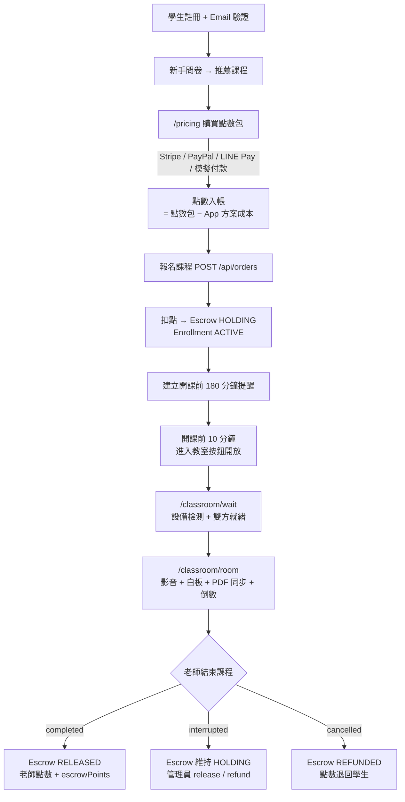
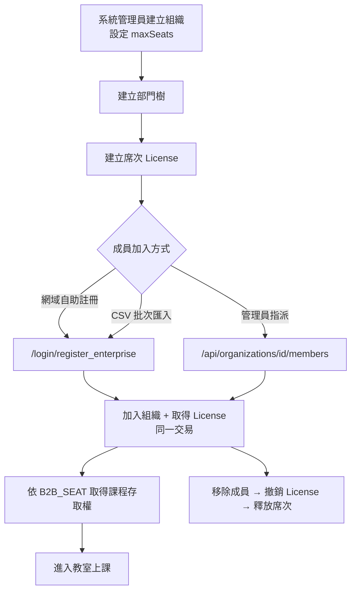

# JV Tutor Corner MVP 規格與驗收文件

**文件日期：** 2026-09-13　**最後更新：** 2026-09-19（CSV 匯入改為登入後限企業管理員；程式未部署、未在真實環境跑過 e2e）
**適用分支：** `integration/b2b-security-merge`
**依據：** 現有程式碼盤點 + [`.agents/skills`](../.agents/skills) 各技能檢查清單 + [`SKILLS_VERIFICATION_STATUS.md`](../.agents/skills/SKILLS_VERIFICATION_STATUS.md)
**文件性質：** 以「目前已實作的功能」界定 MVP 範圍，並訂出上線前必須通過的驗收條件。

> 狀態標記：✅ 已實作且有驗證 ⚠️ 已實作但驗證不完整或有已知限制 ❌ 未實作 / 有阻擋性缺口

---

## 目錄

1. [產品概述與 MVP 目標](#1-產品概述與-mvp-目標)
2. [角色與權限](#2-角色與權限)
3. [MVP 功能範圍 — B2C](#3-mvp-功能範圍--b2c)
4. [MVP 功能範圍 — B2B](#4-mvp-功能範圍--b2b)
5. [核心使用者流程](#5-核心使用者流程)
6. [驗收條件](#6-驗收條件acceptance-criteria)
7. [已知缺口與 MVP 風險](#7-已知缺口與-mvp-風險)
8. [測試環境與執行方式](#8-測試環境與執行方式)
9. [附錄](#9-附錄)

---

## 1. 產品概述與 MVP 目標

### 1.1 產品定位

JV Tutor Corner 是線上一對一家教平台（Next.js App Router + AWS Amplify + DynamoDB）。

- **B2C**：個人學生以點數購買課程，與老師在線上教室（影音 + 白板 + PDF 教材同步）上課；上課完成後點數由暫存（Escrow）釋放給老師。
- **B2B**：企業購買席次（License），以部門樹管理員工學員，員工透過席次取得課程存取權。

### 1.2 MVP 成功定義

| # | 目標 | 衡量方式 |
|---|------|---------|
| G1 | **10 組老師 + 學生同時完成 B2C 完整旅程** | 第 6.1 節全部項目 10/10 組通過 |
| G2 | B2C 各功能模組可用 | 第 6.2 節 MVP 必要項目全數通過 |
| G3 | B2B 企業可開通、配席、隔離租戶 | 第 6.3 節全數通過（獨立驗收，不計入 10 組） |
| G4 | 無阻擋性缺口 | 第 7 節標為 P0 的項目已修復或正式排除於 MVP |

### 1.3 不在 MVP 範圍

以下功能程式碼中已存在或部分存在，但**不列入 MVP 驗收**：

| 功能 | 位置 | 排除原因 |
|------|------|---------|
| AI 聊天助理 / 平台 Agent | `app/api/ai-chat`、`components/AIAssistantWidget.tsx` | 非核心交易流程，技能狀態 ❌ UNVERIFIED |
| AI Avatar、知識庫 RAG | `app/ai-avatar`、`knowledge-base-rag` | 評估中 |
| 學習內容圖像分析 | `/learning-content` | 輔助功能 |
| 藥品 / 商品辨識、Cyberbiz 聯盟報表 | `medicine-*`、`product-scan`、`cyberbiz-affiliate-report` | 非家教業務 |
| 工作流程引擎、Make.com 整合 | `/workflows`、`/admin/make-settings` | 營運自動化，上線後再納入 |
| 點數兌換商品 | `/redeem` | 非核心 |
| 企業學習路徑、測驗、作業、證書 | — | ❌ 未實作 |
| 企業自動化帳務（金流、依席次計價、逾期自動停用） | — | ❌ 僅有手動發票 |
| 企業 Google SSO 網域白名單、DSAR / GDPR 匿名化 | — | ❌ 未實作 |

---

## 2. 角色與權限

權限由 [`lib/auth/pageGuard.ts`](../lib/auth/pageGuard.ts)、[`lib/auth/apiGuard.ts`](../lib/auth/apiGuard.ts)、[`middleware.ts`](../middleware.ts) 把關；B2B 組織身分於每次請求由 [`lib/auth/orgAccess.ts`](../lib/auth/orgAccess.ts) 從資料庫重新載入（session 不帶組織資訊）。詳見 [page-permissions-matrix.md](./page-permissions-matrix.md)。

| 角色 | 識別方式 | 主要頁面 | 相關技能 |
|------|---------|---------|---------|
| 訪客 | 未登入 | `/`、`/courses`、`/teachers`、`/pricing`、`/about`、`/terms`、`/login` | `b2c-verification` |
| 學生 | `role=student`，B2C `tenantId='PUBLIC'` | `/student_courses`、`/orders`、`/refunds`、`/calendar`、`/classroom/*`、`/profile` | `student-courses-page` |
| 老師 | `role=teacher` | `/teacher_courses`、`/courses_manage`、`/teacher-escrow`、`/teacher/scanner` | `teacher-courses-page` |
| 管理員 | `role=admin` / `system` | `/admin/*`、`/dashboard`、`/settings/pricing`、`/teachers/manage` | `roles-page-permissions`、`server-auth-guards` |
| 企業管理員 | 成員 + `isOrgAdmin=true` + 相符 `orgId` | `/admin/organizations/<本組織 id>`（部門、成員、席次、帳務檢視；入口在頁首「企業管理」） | `b2b-core-modules` |
| 部門管理員 | `role=dept_admin` + `deptAdminUnitId` | `/admin/organizations/<本組織 id>` 的部門、成員分頁（API 限所屬部門及子部門） | `b2b-admin-ui-flow` |
| 企業學員 | `isB2B=true` + `orgId` + `licenseId` | 同學生；課程頁以「使用企業席次報名」預約時段 | `b2b-enterprise-registration` |

---

## 3. MVP 功能範圍 — B2C

狀態欄以程式碼現況及 `SKILLS_VERIFICATION_STATUS.md`（2026-09-11 批次驗證）為準。

### 3.1 帳號與身分驗證

| 功能 | 頁面 / API | 狀態 | 技能 |
|------|-----------|:----:|------|
| 註冊 + Email 驗證信 | `/login/register`、`/api/register`、`/api/auth/verify-email` | ✅ | `auth-sso`、`email-notification-testing` |
| 密碼登入 + 圖形驗證碼 | `/login`、`/api/login`、`/api/captcha` | ✅ | `auth-sso` |
| LINE Login / Google 登入 | `/api/auth/line-login/*`、`/api/auth/google/start` | ✅ | `auth-sso`、`app-integrations-line-make` |
| 忘記密碼 | `/api/forgot-password` | ✅ | `auth-sso` |
| 速率限制、停權 / 封鎖 | `lib/rateLimit.ts`、`lib/auth/accountStatus.ts`、`/admin/users` | ⚠️ | `abuse-prevention` |

### 3.2 首頁與新手引導

| 功能 | 頁面 / API | 狀態 | 技能 |
|------|-----------|:----:|------|
| 首頁輪播、語言切換（zh-TW / zh-CN / en） | `/`、`app/ClientHomePage.tsx` | ✅ | `homepage-verification`、`i18n-localization` |
| 新手問卷（註冊後 / 訪客閒置） | `components/OnboardingQuestionnaire.tsx`、`/api/survey/seeds` | ✅ | `recommendation-onboarding` |
| 個人化課程推薦 | `/api/recommendations`、`lib/recommendationEngine.ts` | ✅ | `recommendation-onboarding` |
| 行為追蹤 | `/api/tracking/*` | ⚠️ | `big-data-collection` |

### 3.3 課程與老師瀏覽

| 功能 | 頁面 / API | 狀態 | 技能 |
|------|-----------|:----:|------|
| 課程列表 / 詳情 | `/courses`、`/courses/[id]`、`/api/courses` | ✅ | `b2c-verification` |
| 老師列表 / 個人頁 | `/teachers`、`/teachers/[id]` | ✅ | `b2c-verification` |
| SEO（各頁標題、description、canonical、robots.txt、sitemap 含課程與老師頁） | `lib/seo.ts`、`app/robots.ts`、`app/sitemap.ts` | ⚠️ | `b2c-verification`（CDN 快取標頭未處理） |

### 3.4 定價與金流

| 功能 | 頁面 / API | 狀態 | 技能 |
|------|-----------|:----:|------|
| 點數包、訂閱方案、折扣、應用程式方案設定 | `/settings/pricing`、`/api/admin/pricing`、`/api/shared/pricing` | ✅ | `payment-pricing-configuration` |
| 點數包扣除 App 方案成本 | `/pricing`、`/api/plan-upgrades` | ✅ | `payment-fee-deduction-logic` |
| Stripe 付款 | `/api/stripe/{checkout,webhook}` | ✅ | `payment-gateway-stripe-verification` |
| PayPal 付款 | `/api/paypal/{create-order,capture-order}` | ✅ | `payment-infrastructure` |
| LINE Pay 付款 | `/api/linepay/{checkout,confirm}` | ⚠️ | `payment-simulation-linepay` |
| 綠界 ECPay 付款 | `/api/ecpay/*` | ⚠️ | `payment-infrastructure` |
| 模擬付款（測試用） | `NEXT_PUBLIC_PAYMENT_MOCK_MODE=true` | ✅ | `payment-flow-validation` |
| 訂閱升級（僅 HMAC 回調可設為 PAID） | `/api/plan-upgrades` | ✅ | `subscriptions-plan-upgrades` |

### 3.5 報名與點數暫存（Escrow）

| 功能 | 頁面 / API | 狀態 | 技能 |
|------|-----------|:----:|------|
| 以點數報名課程 | `components/EnrollButton.tsx`、`/api/orders`、`/api/enroll` | ✅ | `student-enrollment-flow` |
| 報名扣點 → Escrow `HOLDING` | `lib/pointsEscrow.ts` | ✅ | `points-escrow` |
| 老師結束課程 → `RELEASED` 給老師；取消 → `REFUNDED` | `/api/classroom/complete`（Agora 路徑）、`lib/livekit/webhookHandler.ts`（LiveKit） | ⚠️ | `points-escrow`（Agora 路徑 9/17 補上，待實機驗證） |
| 中途中斷 → 維持 `HOLDING`，管理員裁決 | `/api/points-escrow`、`/admin/teacher-escrow` | ✅ | `points-escrow` |

### 3.6 排課與提醒

| 功能 | 頁面 / API | 狀態 | 技能 |
|------|-----------|:----:|------|
| 行事曆 | `/calendar`、`components/Calendar.tsx` | ✅ | `course-scheduling-reminders` |
| 開課前 3 小時 Email 提醒 | `/api/calendar/reminders`、`/api/cron/process-reminders` | ✅ | `course-scheduling-reminders`、`scheduled-jobs` |
| 每日報表排程（EventBridge → Lambda） | `/api/cron/daily-report` | ✅ | `scheduled-jobs` |
| 寄信服務（Resend / Gmail SMTP + 白名單） | `lib/email/*` | ⚠️ | `email-service-integration` |

### 3.7 線上教室

| 功能 | 頁面 / API | 狀態 | 技能 |
|------|-----------|:----:|------|
| 設備檢測（麥克風 / 攝影機 / 喇叭） | `/checkDevices`、`/classroom/wait` | ✅ | `classroom-wait-device-permissions` |
| 等候室雙方就緒同步 | `/classroom/wait`、`/api/classroom/ready`、`/api/classroom/stream` | ✅ | `classroom-wait`、`classroom-ready` |
| 影音通話（Agora 預設；LiveKit / Cloudflare SFU 備援） | `lib/providers/rtc/useRTC.ts`、`NEXT_PUBLIC_RTC_PROVIDER` | ⚠️ | `classroom-rtc-providers` |
| 互動白板即時同步 | `/api/whiteboard/*`、`components/EnhancedWhiteboard.tsx` | ⚠️ | `classroom-room-whiteboard-sync` |
| PDF 教材上傳與翻頁同步 | `components/PdfViewer.tsx`、`/api/whiteboard/pdf` | ⚠️ | `classroom-room` |
| 上課倒數、老師結束課程 | `/classroom/room`、`/api/classroom/session` | ⚠️ | `classroom-room` |
| 教材預覽權限（禁止下載） | `/api/courses/[id]/materials/preview` | ⚠️ | `materials-pdf-preview` |
| QR 簽到 | `/ticket/[token]`、`/teacher/scanner`、`/api/attendance/checkin` | ⚠️ | `attendance-checkin-qr` |

### 3.8 退款

| 功能 | 頁面 / API | 狀態 | 技能 |
|------|-----------|:----:|------|
| 課程取消點數返還 | `/admin/refunds`、`lib/pointsEscrow.ts` | ✅ | `payment-restitution-logic` |
| 學員申請退款（24 小時限制、防重複）→ 管理員核准 / 駁回 | `/refunds`、`/admin/refunds`、`/api/admin/refunds`、`/api/orders/[orderId]` | ⚠️ | `payment-refund-orchestration` |
| 金流實際退款（Stripe / PayPal / LINE Pay） | 人工至金流商後台處理，於 `/admin/refunds` 回填退款編號 | ⚠️ | `payment-refund-gateway`（MVP 採人工退款） |

### 3.9 老師端

| 功能 | 頁面 / API | 狀態 | 技能 |
|------|-----------|:----:|------|
| 我的課程（學生姓名、剩餘堂數、進入教室） | `/teacher_courses` | ✅ | `teacher-courses-page` |
| 建立 / 編輯課程，上下架送審 | `/courses_manage`、`/courses_manage/new` | ⚠️ | `course-management-service` |
| 個人檔案修改送審 | `/teachers/[id]/edit`、`/api/teachers/[id]/review-request` | ⚠️ | `admin-teacher-management` |
| 暫存點數與收入 | `/teacher-escrow` | ✅ | `points-escrow` |

### 3.10 學生端

| 功能 | 頁面 / API | 狀態 | 技能 |
|------|-----------|:----:|------|
| 我的課程（進入教室按鈕時間窗） | `/student_courses` | ✅ | `student-courses-page` |
| 師生課程時間 / 標題一致 | `/student_courses` ↔ `/teacher_courses` | ✅ | `course-alignment` |
| 訂單紀錄 | `/orders`、`/orders/[orderId]` | ✅ | `admin-order-management` |

### 3.11 管理後台

| 功能 | 頁面 / API | 狀態 | 技能 |
|------|-----------|:----:|------|
| 使用者管理（停權 / 封鎖、建立帳號、補發點數） | `/admin/users`（頁首與 `/dashboard` 皆有入口）、`/api/admin/{users,create-user,grant-points}` | ⚠️ | `abuse-prevention` |
| 訂單 / 付款 / 訂閱管理、CSV 匯出 | `/admin/orders`、`/admin/payments`、`/api/admin/subscriptions` | ⚠️ | `admin-order-management` |
| 課程審核 | `/admin/course-reviews` | ⚠️ | `course-management-service` |
| 老師審核、在職狀態 | `/admin/teacher-reviews`、`/teachers/manage` | ⚠️ | `admin-teacher-management` |
| 角色與頁面權限（後台設定只能收緊內建預設） | `/admin/roles`、`/admin/settings/page-permissions` | ✅ | `roles-page-permissions` |
| 稽核日誌、Agora 品質日誌、前端錯誤 | `/admin/audit-logs`、`/api/admin/{key-logs,agora-logs}` | ✅ | `admin-observability` |

---

## 4. MVP 功能範圍 — B2B

資料模型：Organization → OrgUnit（部門樹）→ License（席次）→ 成員 Profile。型別見 [`lib/types/b2b.ts`](../lib/types/b2b.ts)，資料表定義見 [`scripts/lib/schema.mjs`](../scripts/lib/schema.mjs)。背景說明見 [b2b-b2c-architecture-boundary.md](./b2b-b2c-architecture-boundary.md)、[b2b-enterprise-seat-course-flow.md](./b2b-enterprise-seat-course-flow.md)。

| 功能 | 頁面 / API | 服務 | 狀態 | 技能 |
|------|-----------|------|:----:|------|
| 企業註冊（網域自助，公開頁）+ CSV 批次匯入成員（限企業管理員登入後，整批成功或整批失敗，單次 ≤ 200 筆） | `/login/register_enterprise`、`/api/organizations/public`、`/api/register`、`/admin/organizations/[id]` 成員分頁 → `/api/register/batch` | `orgMembershipService.ts`、`registerProfile.ts` | ✅ | `b2b-enterprise-registration` |
| 組織建立 / 編輯 / 停用（方案 starter / business / enterprise） | `/admin/organizations`、`/api/organizations` | `organizationService.ts` | ✅ | `b2b-core-modules`、`b2b-admin-ui-flow` |
| 企業管理員 / 部門管理員後台 | `/admin/organizations/[id]`（依身分顯示分頁） | `app/admin/organizations/orgViewerScope.ts` | ⚠️ | `b2b-admin-ui-flow`（9/17 新增，待實機驗證） |
| 部門樹建立、搬移 | `/admin/organizations/[id]`（部門分頁）、`/api/org-units`、`/api/org-units/[id]/move` | `orgUnitService.ts` | ✅ | `b2b-core-modules` |
| 席次（License）建立、指派、到期 | `/api/licenses`、`/api/licenses/[id]/assign`、`/api/licenses/expire` | `licenseService.ts`、`seatAccounting.ts` | ✅ | `b2b-http-license-routes` |
| 成員管理（加入 / 移除，移除即釋放席次） | `/api/organizations/[id]/members` | `orgMembershipService.ts` | ✅ | `b2b-core-modules` |
| 部門管理員權限範圍（含子部門） | `lib/auth/orgAccess.ts` | — | ✅ | `b2b-admin-ui-flow` |
| 手動發票、帳務狀態、續約 | `/api/organizations/[id]/{invoices,billing-status,renew}` | `orgBillingService.ts` | ⚠️ | `b2b-core-modules` |
| 稽核日誌 | `/admin/audit-logs`、`/api/admin/audit-logs` | `auditLogService.ts` | ✅ | `admin-observability` |
| 席次學員報名與上課（我的課程可見、可進教室，撤銷席次即失去存取） | `/api/enroll/seat`、`components/EnrollButton.tsx`、`lib/accessControl.ts`（`findValidSeatLicense`）、`lib/livekit/authorizeJoin.ts` | — | ⚠️ | `b2b-tenant-isolation`（9/17 新增，待實機驗證） |
| 租戶隔離（跨組織讀取拒絕） | 全部 B2B 路由 | — | ⚠️ | `b2b-tenant-isolation`（🔄 SCAFFOLD） |

---

## 5. 核心使用者流程

### 5.1 B2C 主流程（10 組驗收即依此流程）



### 5.2 B2B 主流程



### 5.3 關鍵狀態

| 實體 | 狀態 | 轉換時機 |
|------|------|---------|
| Order | `PENDING_PAYMENT` → `PAID` → `REFUNDED` | 建立訂單 / 金流回調（HMAC）/ 退款 |
| Enrollment | `ACTIVE` → `CANCELLED` / `POINT_RETURNED` | 報名成功 / 課程取消並退點 |
| Points Escrow | `HOLDING` → `RELEASED` / `REFUNDED` | 報名扣點 / 課程完成 / 課程取消 |
| Organization | `trial` / `active` / `suspended` / `cancelled` | 管理員操作（逾期不會自動停用） |
| License | `active` → `revoked` / `expired` | 指派 / 移除成員 / 到期排程 |

完整流程圖另見 [architecture_overview.md](../architecture_overview.md)。

---

## 6. 驗收條件（Acceptance Criteria）

### 6.1 主驗收：10 組老師學生並行完整流程（B2C）

**通過標準：10 / 10 組全數通過，不採百分比門檻。**

> 現有壓測 `e2e/classroom/07_room_pdf_sync_stress.spec.ts` 預設 `SUCCESS_THRESHOLD=0.75`（8/10 即通過），MVP 驗收必須以 `SUCCESS_THRESHOLD=1` 執行。

#### 測試資料

| 項目 | 規格 |
|------|------|
| 組數 | 10 組，`group-0` ~ `group-9`（`getStressGroupConfigs`，`CONCURRENT_GROUPS=10`） |
| 老師帳號 | `group-N-teacher@test.com` × 10 |
| 學生帳號 | `group-N-student@test.com` × 10 |
| 課程 | 每組 1 門獨立課程（每位老師各自開課並經管理員審核上架） |
| 上課時段 | 10 組**同一時段**開課，以驗證並行 |
| 課堂規格 | 1 老師 + 1 學生；驗收時長 ≥ 10 分鐘（對應 [mvp-cost-analysis](./mvp-cost-analysis-agora-alternatives.md) 的 10 組基準） |
| 付款 | 模擬付款（`NEXT_PUBLIC_PAYMENT_MOCK_MODE=true`） |

#### 每組必過檢查（10 組各自逐項）

**A. 帳號**
- [ ] A1 老師、學生完成註冊與 Email 驗證（收件者符合白名單），可正常登入
- [ ] A2 老師建立課程 → 狀態「待審核」→ 管理員核准後上架，出現在 `/courses`

**B. 購點與報名**
- [ ] B1 學生於 `/pricing` 購買點數包：`initialPoints + (pkgPoints − appCost) = finalPoints`
- [ ] B2 學生報名課程：`balanceBeforeEnroll − pointCost = finalBalance`（不得寫死數值）
- [ ] B3 產生 Escrow 紀錄 `status=HOLDING`，暫存點數不計入學生 `userPoints`
- [ ] B4 Enrollment 狀態為 `ACTIVE`，Order / Enrollment 狀態與第 5.3 節一致
- [ ] B5 產生提醒紀錄 `reminderMinutes=180`

**C. 課程頁**
- [ ] C1 `/student_courses` 與 `/teacher_courses` 同一堂課的開始時間、結束時間、標題一致
- [ ] C2 `/teacher_courses` 顯示學生姓名（非 ID）、時長格式如 `50 m`、剩餘堂數為數字
- [ ] C3 開課前 10 分鐘以外按鈕停用並顯示「(未開放)」；進入 10 分鐘內按鈕啟用

**D. 等候室**
- [ ] D1 未登入存取 `/classroom/wait` 導向 `/login?redirect=...`
- [ ] D2 麥克風、攝影機、喇叭權限通過
- [ ] D3 一方按「準備好」，另一方 ≤ 5 秒內看到狀態更新
- [ ] D4 同一教室已有同角色使用者時，再進入者顯示「房間已滿」

**E. 教室**
- [ ] E1 進入 `/classroom/room` 自動加入頻道，雙方影音連線成功
- [ ] E2 老師白板繪圖，學生端即時顯示
- [ ] E3 PDF 上傳成功（`check=1` 回傳 `found:true`），首頁 index=0，老師翻頁學生同步（至少 3 頁）
- [ ] E4 倒數初始值 ≤ 預期值 + 1 秒；12 秒後遞減 6~25 秒；師生倒數一致
- [ ] E5 上課全程（≥ 10 分鐘）無斷線

**F. 結束與結算**
- [ ] F1 老師結束課程出現確認對話框，確認後 session `status=completed`
- [ ] F2 Escrow 轉為 `RELEASED` 並寫入 `releasedAt`
- [ ] F3 老師點數餘額增加 `escrowPoints`，`/teacher-escrow` 可見該筆收入

#### 系統層級檢查（10 組整體）

- [ ] S1 10 間教室同時在線，全程 10/10 組影音、白板、PDF 同步正常
- [ ] S2 點數守恆：10 位學生報名扣點總和 = Escrow 總和 = 釋放給 10 位老師的點數總和
- [ ] S3 無串房：任一學生 / 老師進入非本組教室或讀取他組教材被拒（403）
- [ ] S4 10 組同時執行期間，API 無 5xx；`/admin/audit-logs`、Agora 品質日誌無異常錯誤
- [ ] S5 k6 API 效能基準（`api-performance-testing`）：記錄 p95 回應時間作為上線基準
- [ ] S6 測試結束後以清理腳本移除測試課程、訂單、報名資料

#### 現有測試對應

| 驗收項 | 現有測試 | 備註 |
|--------|---------|------|
| A1 | `e2e/register_and_email_test.spec.ts`、`e2e/email_verification_flow.spec.ts` | 單組 |
| A2 | `e2e/course_management_flow.spec.ts` | 單組 |
| B1 | `e2e/point_purchase_simulated.spec.ts`、`e2e/pricing_deduction.spec.ts`；07 `FULL_JOURNEY=1` | 07 為 10 組 |
| B2–B4 | `e2e/student_enrollment_flow.spec.ts`；07 `FULL_JOURNEY=1`（B2、B3） | 07 為 10 組 |
| B5 | `e2e/scheduled_jobs_verification.spec.ts` | 單組 |
| C1–C3 | `e2e/course_alignment_verification.spec.ts`、`e2e/student_courses_verification.spec.ts`、`e2e/teacher_courses_verification.spec.ts` | 單組 |
| D1–D4 | `e2e/classroom_wait_verification.spec.ts`、`e2e/classroom-wait-device-permissions.spec.ts` | 單組 |
| E1–E4, S1 | `e2e/classroom/07_room_pdf_sync_stress.spec.ts`、`e2e/classroom/06_room_pdf_sync_countdown.spec.ts` | **07 支援 10 組並行** |
| E5 | `e2e/classroom/03_duration_stability.spec.ts` | |
| F1–F3、S2 | 07 `FULL_JOURNEY=1`（Phase 9）；`scripts/verify-class-completion.mjs`（離線） | `points-escrow-classroom-flow.spec.ts` 只印出結果、不做斷言 |
| S3 | `e2e/server_auth_guards_verification.spec.ts` | 需補跨組案例 |

> **一次跑完 10 組完整旅程**：07 壓測加上 `FULL_JOURNEY=1` 後，每組改為模擬付款購點（B1）→ 以自己的點數報名並核對扣點與 Escrow `HOLDING`（B2、B3）→ 教室同步（E）→ 老師結束課程 → Escrow `RELEASED` 且老師餘額增加相同點數（F2、F3），最後斷言全體點數守恆（S2）。結算失敗的組視為未通過。執行方式見第 8.2 節。未帶 `FULL_JOURNEY` 時行為與原本相同（管理員補點、不驗證結算）。

### 6.2 B2C 功能驗收（依技能逐項）

以下為 10 組主流程之外、MVP 必須成立的功能條件。

**帳號與安全**
- [ ] 登入速率限制：同 IP 15 分鐘內超過 30 次被拒（`abuse-prevention`）
- [ ] 管理員停權 / 封鎖使用者後，該使用者既有 session 失效、無法登入；不能停權自己；停權其他管理員需 `system` 角色
- [ ] LINE Login、Google 登入可完成註冊與登入（`auth-sso`）
- [ ] 未登入存取受保護頁面不顯示內容；B2C 使用者讀取企業資料回傳 403/404（`b2c-verification`）

**首頁與推薦**
- [ ] 語言切換 zh-TW / zh-CN / en 正常，行動版選單可用（`homepage-verification`）
- [ ] 完成問卷後首頁顯示個人化推薦課程（`recommendation-onboarding`）

**金流與定價**
- [ ] `/settings/pricing` 儲存的點數包、折扣、App 方案、訂閱方案重新載入後一致，計算 100% 正確（`payment-pricing-configuration`）
- [ ] `/pricing` 顯示淨可用點數（例：「購買 100 點後可用 50 點」）（`payment-fee-deduction-logic`）
- [ ] Stripe 測試卡付款成功，點數入帳；管理員在 `/apps` Stripe 連線診斷通過（`payment-gateway-stripe-verification`）
- [ ] LINE Pay 模擬流程導向後成功返回並入帳（`payment-simulation-linepay`）
- [ ] 使用者無法自行將訂單 / 升級設為 `PAID`（非 HMAC 回調回傳 403）；替他人建立升級回傳 403（`subscriptions-plan-upgrades`）
- [ ] 同一筆付款回調重複送達不重複入點（冪等）（`payment-infrastructure`）

**報名與 Escrow**
- [ ] 老師中途離開（`status=interrupted`）Escrow 維持 `HOLDING`，老師餘額不變；管理員可 `release` 或 `refund`（`points-escrow`）
- [ ] 課程取消 → Escrow `REFUNDED`，點數退回學生並寫入 `refundedAt`

**排程與通知**
- [ ] cron 路由未帶 `Bearer CRON_SECRET` 回傳 401（`scheduled-jobs`）
- [ ] 提醒信主旨含「將於 3 小時 後開始」，寄送前檢查白名單（`course-scheduling-reminders`）

**教室與教材**
- [ ] 教材預覽：訪客 401、未報名學生 403、跨課程 key 400；已報名學生取得 `application/pdf`、`inline`、`no-store`，無下載按鈕（`materials-pdf-preview`）
- [ ] 單頁 PDF 不顯示下一頁按鈕；iOS Safari 與 Android Chrome 版面正常（`classroom-room`）
- [ ] QR 簽到：3 小時內重複掃描回傳 `duplicate:true`；未登入 401、竄改 token 400、他課老師 403（`attendance-checkin-qr`）
- [ ] `NEXT_PUBLIC_RTC_PROVIDER` 切換為 `livekit` 時單組上課可正常進行（備援驗證，`classroom-rtc-providers`）

**退款**
- [ ] 課程取消由管理員按「點數退回」：原子性退回 `pointsUsed`，Enrollment 轉 `CANCELLED` / `POINT_RETURNED`，寫入 `action:"RETURN"` 紀錄（`payment-restitution-logic`）
- [ ] 學員只能「申請」退款，自行把訂單設為 `REFUNDED` 回傳 403；管理員核准才退回資產，重複核准不重複處理；點數不足扣回或方案訂單轉人工審核；企業席次訂單不可退款（`payment-refund-orchestration`）
- [ ] 刷卡 / 錢包訂單核准後標記 `gatewayRefund.status=PENDING_MANUAL`，管理員於金流商後台退款後回填退款編號轉 `DONE`（`payment-refund-gateway`）
- [ ] 使用者建立訂單時送 `status:'PAID'` 無效：非點數訂單一律 `PENDING`，待金流回調

**老師與管理**
- [ ] 老師申請上架 / 下架 → 「待審核」；管理員核准套用新狀態、駁回維持原狀態，兩者皆從審核列表移除（`course-management-service`）
- [ ] 老師修改個人檔案送審，管理員核准後才生效；`/teachers/manage` 批次設定在職 / 離職（`admin-teacher-management`）
- [ ] `/admin/orders` 可篩選、檢視訂單並匯出 CSV（`admin-order-management`）
- [ ] 角色頁面權限矩陣生效：無權限角色存取 `/admin/*` 導向 `/dashboard?forbidden=1`；後台取消勾選「頁面可見」可收緊預設，勾選不能放寬（`roles-page-permissions`）
- [ ] 頁首管理選單可進入 `/admin/users`（`abuse-prevention`）

### 6.3 B2B 獨立驗收

B2B 不計入 10 組主驗收，以下列項目獨立驗收。示範資料以 `scripts/seed-demo-org.mjs` 建立。

**組織與席次**
- [ ] 系統管理員建立組織並設定 `maxSeats`；`maxSeats` 不得調低至 `usedSeats` 以下
- [ ] 建立部門樹並搬移部門；部門仍有成員或席次時不可刪除
- [ ] 每位成員最多 1 個有效 License；`usedSeats` 等於有效 License 數

**成員加入**
- [ ] 企業網域自助註冊：加入組織並取得 License（同一交易），個人 `plan` 暫存於 `planBeforeOrg`
- [ ] CSV 匯入多筆成員，每筆皆取得 License；任一列錯誤或席次不足時整批不寫入（`/api/register/batch`）
- [ ] CSV 匯入入口只有企業管理員看得到；未登入 401、非本組織管理員 403（`scripts/verify-register-batch-authz.mjs`）
- [ ] 席次用罄時再加入被拒
- [ ] 註冊時加入組織失敗，不留下孤兒 profile（`scripts/verify-register-batch.mjs`）
- [ ] 移除成員 → License 撤銷、席次釋放、`planBeforeOrg` 還原

**權限與隔離**
- [ ] 部門管理員只能管理所屬部門及子部門成員；搬移部門後權限範圍自動更新
- [ ] 僅學生可升為部門管理員；解除後還原 `previousRole`
- [ ] 組織 A 的管理員 / 成員讀取組織 B 的成員、席次、發票回傳 403/404
- [ ] B2C 使用者（`tenantId='PUBLIC'`）讀取任何企業資料回傳 403/404
- [ ] 席次學員在課程頁「使用企業席次報名」後，課程出現在 `/student_courses` 並可進教室；撤銷席次後即失去存取（`scripts/verify-seat-enrollment.mjs`）
- [ ] 企業管理員從頁首「企業管理」進入本組織管理頁；進入其他組織的頁面被導回 `/dashboard?forbidden=1`；部門管理員只看到部門與成員分頁

**帳務與稽核**
- [ ] 系統管理員建立發票、更新付款狀態；逾期狀態於讀取時正確顯示
- [ ] 組織建立、成員異動、席次指派 / 撤銷、停權操作皆寫入稽核日誌，可於 `/admin/audit-logs` 查詢

**現有測試對應**

| 驗收項 | 腳本 | E2E |
|--------|------|-----|
| 組織與席次 | `scripts/verify-b2b-seat-membership.mjs`、`scripts/verify-b2b-http-routes.mjs` | `e2e/b2b_admin_ui_flow.spec.ts`、`e2e/b2b_license_panel_ui_flow.spec.ts` |
| 部門樹 | `scripts/verify-b2b-access-orgunits.mjs` | `e2e/b2b_admin_ui_flow.spec.ts` |
| 成員加入 | `scripts/verify-b2b-enterprise-registration.mjs` | `e2e/b2b_enterprise_registration_ui_flow.spec.ts` |
| 部門管理員 | `scripts/verify-b2b-dept-admin-scope.mjs` | `e2e/b2b_dept_admin_scope.spec.ts`、`e2e/b2b_dept_admin_ui_flow.spec.ts` |
| 租戶隔離 | `scripts/verify-b2c-b2b-course-access.mjs` | `e2e/b2b_cross_tenant_isolation.spec.ts`、`e2e/enterprise_general_security_contract.spec.ts` |
| 帳務 | `scripts/verify-b2b-org-billing.mjs` | `e2e/b2b_dept_admin_and_billing_ui_flow.spec.ts` |
| 稽核 | `scripts/verify-b2b-audit-log-viewer.mjs` | `e2e/b2b_audit_log_viewer_ui_flow.spec.ts` |

---

## 7. 已知缺口與 MVP 風險

P0 = 阻擋 MVP 驗收，須修復或正式排除；P1 = 上線前應處理；P2 = 可上線後處理。

> **2026-09-17 修正狀態**：「已修正」代表程式已改、型別檢查與離線測試通過，但**尚未 commit、未部署、未在真實環境跑過 e2e**。依第 8 節實機驗證後，再把狀態改為「已驗證」。

| # | 等級 | 缺口 | 修正內容 | 狀態 |
|---|:----:|------|---------|:----:|
| R1 | P0 | B2B 席次課程在學生端看不到：沒有程式建立 `B2B_SEAT` 報名；LiveKit 加入檢查也不認席次 | 新增 `POST /api/enroll/seat`（驗證席次後以同一交易寫入報名與訂單）；`EnrollButton` 顯示「使用企業席次報名」；`findValidSeatLicense` 統一席次判斷，席次報名列本身不給存取權；`authorizeJoin` 補席次判斷；`repair-b2b-data.mjs` 不再改寫帶 `licenseId` 的席次列 | 已修正 |
| R2 | P0 | 企業管理員無可用後台（`role=student` 被 `/admin` 擋下；部門管理員預設頁不存在） | `/admin` layout 對 `/admin/organizations/<orgId>` 改查 profile，只放行本組織的企業管理員與部門管理員；組織頁由伺服器決定可見分頁；頁首新增「企業管理」入口 | 已修正 |
| R3 | P0 | 無單一測試涵蓋 10 組 × 完整旅程；07 壓測預設門檻 75% | 07 新增 `FULL_JOURNEY=1`（購點、自有點數報名、結束課程結算、點數守恆）；驗收以 `SUCCESS_THRESHOLD=1` 執行（第 8.2 節） | 已修正（未實跑） |
| R14 | P0 | **Agora 路徑老師結束課程後點數永遠不撥款**：教室頁從未呼叫 `/api/agora/session`，只有 LiveKit webhook 與管理員手動會 `releaseEscrow`（9/17 發現） | 新增 `POST /api/classroom/complete`（限課程老師 / 管理員，開課前 10 分鐘起才可結算，冪等）；`ClientClassroom` 結束課程時呼叫；無時區的訂單時間視為台北時間 | 已修正 |
| R4 | P1 | 金流原路退款沒有程式；學員可自行把訂單設為 `REFUNDED` 並自動退點；`/admin/refunds` 為隨機模擬；使用者可建立 `status:'PAID'` 的刷卡訂單 | MVP 採人工退款：學員只能申請，管理員於 `/admin/refunds` 核准 / 駁回並回填金流退款編號；`PATCH /api/orders/[orderId]` 依角色限制可改欄位；建立訂單的狀態改由伺服器決定；`payment-refund-gateway` skill 改為 ⚠️ PARTIAL | 已修正 |
| R5 | P1 | `b2b-tenant-isolation` 技能狀態 🔄 SCAFFOLD；訂單等資料的跨租戶檢查未補齊 | — | 未處理（需實跑 `e2e/b2b_cross_tenant_isolation.spec.ts`） |
| R6 | P1 | 教室相關技能為 ⚠️ PARTIAL，`classroom-ready` ❌ UNVERIFIED | — | 未處理（依 10 組實跑結果更新） |
| R7 | P1 | CSV 匯入非原子性；同 IP 第 6 列起被註冊限流擋下；匯入頁為公開頁，驗證碼可重用 → 單一 IP 每小時可灌入 5 批 × 200 筆 | 新增 `POST /api/register/batch`：整批驗證後以交易寫入（≤ 49 列單一交易，更多列分段並補償）；頁面改用可處理引號的 CSV 解析；**匯入改為登入後限企業管理員**（`requireOrgAccess` 'write'：系統管理員或該組織 `isOrgAdmin`，dept_admin 與一般成員 403），入口從公開頁 `/login/register_enterprise` 移到 `/admin/organizations/[id]` 成員分頁（`components/org/OrgCsvImportPanel.tsx`），驗證碼移除、保留 `registerBatchPerIp` 作為爆量上限 | 已修正 |
| R8 | P1 | `abuse-prevention` ❌ UNVERIFIED；`/admin/users` 未出現在後台選單 | 頁首管理選單與 `/dashboard` 新增「使用者管理」；`lib/adminRoutes.ts` 路徑改為實際路由 | 部分修正（功能仍待驗證；正式環境限流表尚未建立） |
| R9 | P2 | B2B 帳務僅手動發票，逾期不自動停用 | — | 排除於 MVP（1.3 節） |
| R10 | P2 | 頁面權限 DB 覆寫無效（`RolePathIndex` 查詢不會命中） | 改以路徑前綴讀取 PageConfig；**DB 設定只能收緊內建預設，不能放寬**（後台「重新整理」會替所有角色寫入可見，若允許放寬會讓部門管理員進入 `/admin/settings`） | 已修正 |
| R11 | P2 | SEO：無個別頁面 `<title>`、sitemap 只有靜態頁、公開頁 `no-store` | 各公開頁 title / description / canonical / Open Graph；課程與老師詳情頁動態 metadata；sitemap 加入課程與老師頁 | 部分修正（CDN 快取標頭需改渲染策略，未處理；`e2e/b2c_verification.spec.ts` 的 `FALLBACK_TITLE` 與 `homepage-verification` skill 已同步為新標題） |
| R12 | P2 | 註冊失敗補償刪除 profile 若再失敗會留下孤兒資料 | 企業註冊改為 profile、席次、席次計數同一交易寫入，失敗時不留任何資料 | 已修正 |
| R13 | P2 | [b2b-b2c-module-matrix.md](./b2b-b2c-module-matrix.md) 部分過時 | 兩份模組盤點文件改為現況並同步 | 已修正（`scripts/audit-enterprise-general-module-matrix.mjs` 內建狀態仍舊） |

### 7.1 本輪修正後的待辦

| 項目 | 說明 |
|------|------|
| 部署 | 新 API 沿用既有資料表；`lambda/livekit-token` 需要 licenses、organizations 表的讀取權限 |
| 席次報名 | 不會建立開課前 3 小時提醒；兩個不同但重疊的時段同時送出仍可能都成功（同一時段重複送出已擋下） |
| 企業 CSV 批次 | 已改為登入後限企業管理員（9/19 決定）。剩餘風險：同一組織的管理員仍可在席次上限內一次建立 200 筆；`registerBatchPerIp` 為 5 批/小時/IP |
| 退款 | 以 `plan-upgrades` 購買的點數包 / 方案尚未接入退款流程；列出退款申請為全表掃描 |
| 管理後台 | 企業管理員在組織頁經前端連結切到其他 `/admin` 頁時 layout 不會重跑（資料仍受各 API 權限保護） |
| 舊元件 | `components/EnrollmentManager.tsx`、`SimulationButtons.tsx` 仍送使用者端 `REFUNDED`（未被任何頁面使用，現回 403） |

---

## 8. 測試環境與執行方式

### 8.1 環境注意事項

- `.env.local` 為 `APP_ENV=production` 並指向**正式 AWS**。本機跑測試寫入的是正式 DynamoDB，每次執行前都要確認。
- Playwright 一律帶完整前綴（`DISABLE_RATE_LIMIT` 只在非 production 生效；兩個 BASE_URL 缺一會打到正式站）：
  ```bash
  APP_ENV=local NEXT_PUBLIC_PAYMENT_MOCK_MODE=true DISABLE_RATE_LIMIT=true QA_TEST_BASE_URL=http://localhost:3000 PLAYWRIGHT_TEST_BASE_URL=http://localhost:3000 npx playwright test <spec> --project=chromium
  ```
- 獨立腳本：`APP_ENV=local node --env-file=.env.local --import ./scripts/lib/register-ts-resolve.mjs scripts/<x>.mjs`（腳本會 import `lib/*.ts`，repo 沒有 tsx）。
- 需要常駐 dev server 的腳本，以 `.claude/launch.json` 的 `next-dev-e2e` 設定啟動（已帶好上述環境變數）。
- **不要用 `npm run test:stress`**：`e2e/scripts/run-stress-test.ps1` 開始前會強制結束本機所有 `node` / `chrome` 程序，結束後直接執行 `e2e/cleanup-database-direct.mjs`（未帶 `--dry-run`，會刪除資料）。
- **禁止**對正式資料做批次清理；清理只針對本次測試產生、能列出 id 的資料，先 `--dry-run` 預覽再經確認刪除。
- 驗證碼以 `LOGIN_BYPASS_SECRET` 繞過（僅 local / e2e），見 `auto-login` 技能。
- 執行前先確認資料表與索引：`npm run db:verify`（唯讀，腳本自行讀取 `.env.local`）。

### 8.2 10 組主驗收執行步驟

1. 確認資料表：`npm run db:verify`
2. 離線回歸（不連網、不寫資料）：
   ```bash
   node --import ./scripts/lib/register-ts-resolve.mjs scripts/verify-class-completion.mjs
   ```
   同樣方式可跑的離線測試（9/17 全數通過）：`verify-seat-enrollment`、`verify-refund-authz`、`verify-register-batch`、`verify-page-permissions`、`verify-strip-tabid`、`verify-escrow-settlement`。
3. 先跑 1 組完整旅程，確認購點、報名扣點、結束課程撥款都正常（PowerShell）：
   ```powershell
   $env:APP_ENV='local'; $env:NEXT_PUBLIC_PAYMENT_MOCK_MODE='true'; $env:DISABLE_RATE_LIMIT='true'; $env:NEXT_PUBLIC_BASE_URL='http://localhost:3000'; $env:QA_TEST_BASE_URL='http://localhost:3000'; $env:PLAYWRIGHT_TEST_BASE_URL='http://localhost:3000'; $env:CONCURRENT_GROUPS='1'; $env:SUCCESS_THRESHOLD='1'; $env:FULL_JOURNEY='1'; $env:SKIP_CLEANUP='1'; npx playwright test e2e/classroom/07_room_pdf_sync_stress.spec.ts --project=chromium --reporter=line
   ```
4. 10 組並行完整旅程（門檻 100%）：同上，改 `$env:CONCURRENT_GROUPS='10'`。單機資源不足時改用分散式 5 + 5（`e2e/scripts/run-distributed-stress.ps1`，兩台各設 `GROUP_OFFSET`）。
   - `FULL_JOURNEY=1` 會讓每組：模擬付款購點（B1）→ 以自己的點數報名並核對 `before − pointsUsed = after`、Escrow `HOLDING`（B2、B3）→ 教室同步 → 老師結束課程 → Escrow `RELEASED` 且老師餘額增加相同點數（F2、F3）→ 全體點數守恆斷言（S2）。結算失敗的組視為未通過。
5. API 效能基準（S5）：依 `api-performance-testing` 技能執行 k6
6. 清理：07 未帶 `SKIP_CLEANUP` 時，只會以 API 刪除本次產生的課程與訂單（依 `courseId`）。帶了 `SKIP_CLEANUP=1` 者，先 `node e2e/cleanup-database-direct.mjs --dry-run` 預覽，確認清單只含本次資料後再刪除。

### 8.3 B2B 驗收執行步驟

會寫入正式 DB 的步驟（`seed-demo-org.mjs`、各 `verify-b2b-*.mjs`、B2B e2e）執行前都要取得確認。

```bash
APP_ENV=local node --env-file=.env.local --import ./scripts/lib/register-ts-resolve.mjs scripts/seed-demo-org.mjs
```

```bash
APP_ENV=local node --env-file=.env.local --import ./scripts/lib/register-ts-resolve.mjs scripts/verify-b2b-seat-membership.mjs
```

```bash
APP_ENV=local NEXT_PUBLIC_PAYMENT_MOCK_MODE=true DISABLE_RATE_LIMIT=true QA_TEST_BASE_URL=http://localhost:3000 PLAYWRIGHT_TEST_BASE_URL=http://localhost:3000 npx playwright test e2e/b2b_ --project=chromium
```

其餘 `scripts/verify-b2b-*.mjs` 依第 6.3 節對應表逐一執行；`verify-b2b-http-routes`、`verify-b2b-audit-log-viewer`、`verify-b2b-enterprise-registration` 需先以 `next-dev-e2e` 啟動 dev server。

### 8.4 驗收紀錄

每次驗收於 [`SKILLS_VERIFICATION_STATUS.md`](../.agents/skills/SKILLS_VERIFICATION_STATUS.md) 對應技能更新狀態與日期，並在本文件第 6 節勾選通過項目、註明執行日期與結果。

---

## 9. 附錄

### 9.1 相關文件

| 文件 | 內容 |
|------|------|
| [JVTutorCorner_使用者手冊.md](./JVTutorCorner_使用者手冊.md) | 各角色操作手冊 |
| [b2b-b2c-module-matrix.md](./b2b-b2c-module-matrix.md) / [企業功能與一般學員老師功能整理.md](./企業功能與一般學員老師功能整理.md) | 模組六層盤點（部分過時，見 R13） |
| [b2b-b2c-architecture-boundary.md](./b2b-b2c-architecture-boundary.md) | B2B / B2C 邊界 |
| [b2b-enterprise-seat-course-flow.md](./b2b-enterprise-seat-course-flow.md) | 企業註冊到上課流程與缺口 |
| [b2b-seat-membership-manual-test-guide.md](./b2b-seat-membership-manual-test-guide.md) | 席次與成員手動測試 |
| [enterprise-lms-implementation-plan.md](./enterprise-lms-implementation-plan.md) | 企業 LMS 路線圖 |
| [mvp-cost-analysis-agora-alternatives.md](./mvp-cost-analysis-agora-alternatives.md) | 10 組並行成本分析 |
| [page-permissions-matrix.md](./page-permissions-matrix.md) | 角色頁面權限 |
| [api_registry.md](./api_registry.md) | API 清單 |
| [architecture_overview.md](../architecture_overview.md) | 核心流程與資料模型 |
| [e2e/classroom/README.md](../e2e/classroom/README.md) | 教室壓測套件說明 |

### 9.2 技能對照與狀態

| 範圍 | 技能 | 狀態 |
|------|------|:----:|
| 帳號 | `auth-sso` / `abuse-prevention` / `auto-login` | ✅ / ❌ / ✅ |
| 首頁 | `homepage-verification` / `recommendation-onboarding` / `i18n-localization` | ✅ / ✅ / ⚠️ |
| 金流 | `payment-infrastructure` / `payment-pricing-configuration` / `payment-fee-deduction-logic` / `payment-gateway-stripe-verification` | ✅ |
| 金流 | `payment-flow-validation` / `payment-simulation-linepay` | ⚠️ |
| 訂閱 | `subscriptions-plan-upgrades` | ✅ |
| 報名 | `student-enrollment-flow` / `points-escrow` | ✅ |
| 退款 | `payment-restitution-logic` / `payment-refund-orchestration` / `payment-refund-gateway` | ✅ / ⚠️ / ⚠️（MVP 採人工退款，見 R4） |
| 排程 | `course-scheduling-reminders` / `scheduled-jobs` / `email-service-integration` / `email-notification-testing` | ✅ / ✅ / ⚠️ / ⚠️ |
| 教室 | `classroom-wait` / `classroom-wait-device-permissions` | ✅ |
| 教室 | `classroom-room` / `classroom-room-whiteboard-sync` / `classroom-rtc-providers` / `classroom-ready` | ⚠️ / ⚠️ / ⚠️ / ❌ |
| 教材 | `materials-pdf-preview` / `attendance-checkin-qr` / `object-storage-uploads` | ⚠️ / ⚠️ / ✅ |
| 課程頁 | `student-courses-page` / `teacher-courses-page` / `course-alignment` | ✅ |
| 管理 | `course-management-service` / `admin-teacher-management` / `admin-order-management` | ⚠️ / ⚠️ / 🔄 |
| 管理 | `roles-page-permissions` / `server-auth-guards` / `admin-observability` | ✅ |
| B2C 整體 | `b2c-verification` | ⚠️ |
| B2B | `b2b-core-modules` / `b2b-admin-ui-flow` / `b2b-enterprise-registration` / `b2b-http-license-routes` | ✅ |
| B2B | `b2b-tenant-isolation` / `enterprise-general-test-coverage` | 🔄 / ✅ |
| 效能 | `api-performance-testing` | ❌ |
