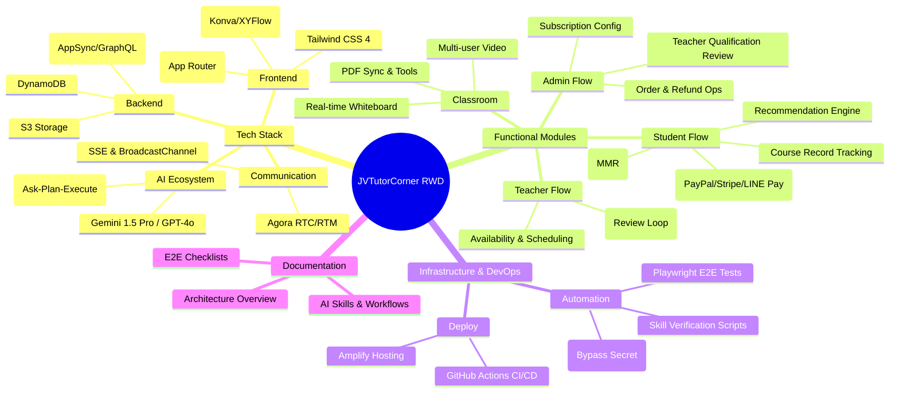

# JVTutorCorner RWD Project Architecture Mindmap

This document provides a visualization and a structured overview of the project architecture, tech stack, and core functionalities.

## 1. 核心技術棧 (Tech Stack)
- 前端框架：Next.js 16 (App Router), React 18, TypeScript
- 樣式處理：Tailwind CSS 4
- 後端服務：AWS Amplify (AppSync, Cognito, Lambda, S3)
- 資料庫：DynamoDB (NoSQL)
- 即時通訊：Agora RTC/RTM (視訊、通訊、白板)
- 視覺化工具：Konva, XYFlow (React Flow), Monaco Editor

## 2. 功能模組視圖 (Functional View)
- 學生端功能：
    - Onboarding 問卷與推薦系統 (MMR + TagScore)
    - 方案購買與點數扣減流轉 (PayPal, Stripe, LINE Pay)
    - 課程報名與上課紀錄 (CourseRecord)
    - 學習滿意度評價與學員見證
- 教師端功能：
    - 課程上架與修改審核流程 (Pending -> Approve)
    - 課程時間管理與預約系統
- 行政管理端：
    - 訂單與退款管理 (CSV Export, Manual Status)
    - 教師資格與資料修改審核 (Levenshtein Diff)
    - 訂閱方案配置 (Active/Inactive toggle)
- 即時教學系統：
    - 多人視訊教學與訊息同步 (Agora)
    - 互動式白板功能 (Konva + PDF Sync)
    - 教室等待頁同步 (SSE + BroadcastChannel)

## 3. AI 服務架構 (AI Ecosystem)
- 3-Agent 決策模型：Ask-Plan-Execute
- 平台工具：lib/platform-skills.ts (自動化工具呼叫)
- 整合類型：Gemini 1.5 Pro (預設), OpenAI GPT-4o

## 4. 自動化與 DevOps (Infrastructure)
- 持續整合：GitHub Actions (自動化構建與測試)
- 測試體系：Playwright (E2E 端到端測試), Bypass Captcha Secret
- 指令工具：
    - 資料庫初始化與 Seed Data 腳本
    - 技能驗證 (Skill Validation) 自動化腳本
- 部署平台：Amplify Hosting

## 5. 專案文件體系 (Documentation)
- Architecture Overview：系統架構、ER 圖與核心流程
- AI Skills：各功能模組的 AI 開發技能文件 (.agents/skills)
- Workflows：Git Commit 規範、CI/CD 與業務流程說明
- 心智圖匯入指南：支援 Xmind 匯入的專用格式 (MD/OPML)
