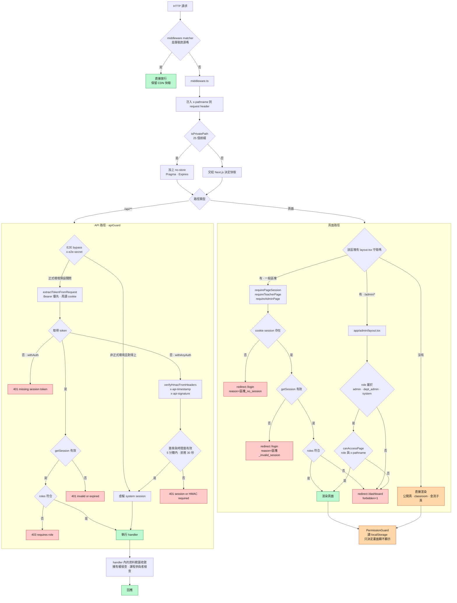
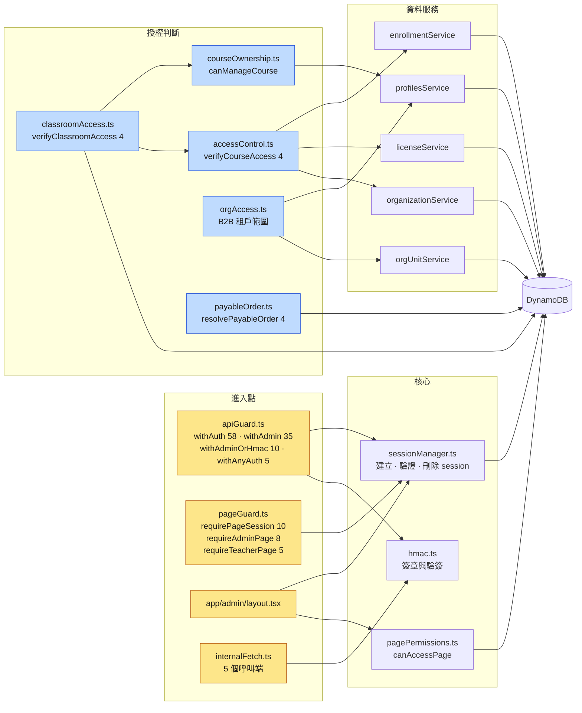

# 權限架構關聯圖（Auth &amp; Authorization Architecture）

> **定位**：這份文件回答「**一個請求要過幾道關、每道關看什麼、擋不過會怎樣**」，以及授權 helper 之間
> 誰依賴誰。系統整體的元件關聯（外部服務、資料表、金流鏈）見
> [system-architecture-diagram.md](./system-architecture-diagram.md)。
>
> **最後對照程式碼時間：2026-09-09**（commit `bd85fe7` 之後）。
>
> ⚠️ [page-permissions-matrix.md](./page-permissions-matrix.md) 第 0 節與第 5 節描述的機制缺陷
> （`x-pathname` 未注入、`PermissionGuard` 掛在 `<main>` 旁邊而非包住它、`/carousel` 任何登入者可進、
> `/settings/pricing` 無守衛）**都已修復**，該文件的那兩節已過期，現況以本文件為準。

---

## 1 · 三層守衛的分工

| 層 | 位置 | 判斷依據 | 擋得住嗎 |
|---|---|---|---|
| **邊界層** | [middleware.ts](../middleware.ts) | 路徑前綴 | 不做認證。只注入 `x-pathname` 與設定 `no-store` |
| **頁面層** | 23 個 `app/**/layout.tsx` + [app/admin/layout.tsx](../app/admin/layout.tsx) | httpOnly `session` cookie → DynamoDB 查表 | **擋得住**，伺服器端 `redirect()`，渲染前就攔下 |
| **UI 層** | [components/auth/PermissionGuard.tsx](../components/auth/PermissionGuard.tsx) | `localStorage` 角色 | **擋不住**，只控制可見度 |
| **API 層** | [lib/auth/apiGuard.ts](../lib/auth/apiGuard.ts) | `session` cookie／Bearer，或 HMAC 簽章 | **擋得住**，最終的安全邊界 |

一句話心法：**畫面看不看得到是 UX，資料拿不拿得到才是權限。** 驗證權限一律以 API 回應為準。

---

## 2 · 圖 A：一個請求的生命週期

**重點**

- `withAuth` 沒有 token 直接 401；`withAnyAuth` 才會落到 HMAC 支線。這就是為什麼
  金流回調必須用 `internalFetch` 而不能用裸 `fetch`。
- HMAC 簽章的訊息是 `METHOD\n路徑含 query\ntimestamp\nbody`，且**路徑從 `req.url` 推導**
  而非採信呼叫端宣告的字串——所以帶 query string 的請求也無法用簽好的別條路徑冒名。
- E2E bypass（`x-e2e-secret` → `role: 'system'`）在 `NODE_ENV === 'production'` 時預設關閉，
  除非明確設定 `ALLOW_E2E_BYPASS_IN_PRODUCTION=true`。

---

## 3 · 圖 B：授權 helper 依賴關係

邊＝實際的 `import`（已逐檔對照）。右側數字＝目前有多少個 `app/api/**` 或 `app/**` 檔案在用。

**各 helper 負責的問題**

| Helper | 回答的問題 | 判斷方式 |
|---|---|---|
| `sessionManager` | 你是誰？ | token `<32 bytes>.<HMAC>` → DynamoDB sessions 表，24h TTL |
| `hmac` | 這是不是我自己發出的內部呼叫？ | `METHOD + path?query + timestamp + body` 簽章，5 分鐘窗 |
| `pagePermissions` | 這個角色能看 `/admin` 的哪些子路徑？ | 內建矩陣，可被 DynamoDB `RolePathIndex` 覆寫（最長前綴優先） |
| `courseOwnership` | 這位老師是不是這堂課的擁有者？ | 比對 `profile.teacherId` / `roid_id` / `id` 三個識別碼 |
| `accessControl` | 這位學生有沒有這堂課的權利？ | B2C 報名（GSI `byUserId`）或 B2B 授權席次 |
| `classroomAccess` | 這個人能不能進這間教室、是不是主持人？ | admin/system → 主持；課程老師 → 主持；有報名／授權 → 參與者 |
| `orgAccess` | B2B 的人能碰哪個組織／部門子樹？ | `dept_admin` 限自己 `orgUnitId` 子樹 |
| `payableOrder` | 這張訂單能不能付、該付多少？ | 從資料庫讀金額與擁有者，**不採信前端傳的 amount** |

---

## 4 · 圖 C：角色 × 資源存取矩陣

圖例：✅ 允許｜❌ 擋下｜🟡 允許但資料範圍自動收斂｜— 不適用

### 4.1 頁面

| 區塊 | 訪客 | student | teacher | dept_admin | admin | 守衛 |
|---|:--:|:--:|:--:|:--:|:--:|---|
| `/`、`/about`、`/terms`、`/courses`、`/teachers`、`/pricing`、`/login` | ✅ | ✅ | ✅ | ✅ | ✅ | 無（公開） |
| `/dashboard`、`/profile`、`/settings`、`/orders`、`/enrollments`、`/plans`、`/redeem`、`/calendar`、`/student_courses`、`/learning-content` | ❌ | ✅ | ✅ | ✅ | ✅ | `requirePageSession` |
| `/teacher`、`/teacher_courses`、`/teacher-escrow`、`/courses_manage`、`/my-courses` | ❌ | ❌ | ✅ | ❌ | ✅ | `requireTeacherPage` |
| `/apps`、`/add-app`、`/workflows`、`/carousel`、`/refunds`、`/settings/pricing`、`/teachers/manage`、`/cyberbiz-affiliate-report` | ❌ | ❌ | ❌ | ❌ | ✅ | `requireAdminPage` |
| `/admin/*` | ❌ | ❌ | ❌ | 🟡 | ✅ | admin layout + `canAccessPage` |
| `/classroom/*`、`/checkDevices` | ✅ 殼 | ✅ 殼 | ✅ 殼 | ✅ 殼 | ✅ 殼 | **無頁面守衛**，邊界在 API |
| `/ecpay/*`、`/paypal/*`、`/stripe/*` | ✅ | ✅ | ✅ | ✅ | ✅ | 無（金流返回頁，刻意可達） |

`dept_admin` 進 `/admin/*` 的子路徑限制由 `DEFAULT_PAGE_PERMISSIONS['dept_admin']` 決定。
現在 `x-pathname` 已正確注入，這份設定**真的會生效**了——先前因為 header 缺失，判斷恆等於用字面 `/admin`。
需要注意的是該清單目前指向 `/admin/learners`、`/admin/learning-paths/assign` 等**尚不存在的路由**，
等於 `dept_admin` 實際上進不了任何 `/admin` 子頁；這份清單需要重新盤點。 `[Known Gap]`

### 4.2 API 群組

| 群組 | 訪客 | student | teacher | admin | system（HMAC） | 守衛 |
|---|:--:|:--:|:--:|:--:|:--:|---|
| `auth/*`、`login`、`register`、`captcha` | ✅ | ✅ | ✅ | ✅ | — | 公開，自帶 captcha |
| `courses` GET、`teachers` GET、`shared/pricing` GET、`organizations/public` | ✅ | ✅ | ✅ | ✅ | ✅ | 公開讀取 |
| `courses` 寫入、`teachers/[id]` PATCH | ❌ | ❌ | 🟡 本人 | ✅ | ✅ | `withAuth` + 擁有權 |
| `orders/[id]` GET·PATCH、`enroll` | ❌ | 🟡 自己的 | 🟡 自己的 | ✅ | ✅ | `withAuth` / `withAnyAuth` + 擁有權 |
| `points-escrow` GET | ❌ | 🟡 自己 userId | 🟡 自己 teacherId | ✅ 全部 | ✅ | `withAuth` + 範圍收斂 |
| `points-escrow` POST（釋出／退款） | ❌ | ❌ | ❌ | ✅ | ✅ | `withAdmin` |
| `stripe`·`paypal`·`linepay`·`ecpay` checkout | ❌ | ✅ | ✅ | ✅ | — | `withAuth` + `payableOrder` |
| 金流回調 `webhook`·`return` | — | — | — | — | ✅ | 閘道自帶簽章 |
| `payments/webhook`（模擬付款） | ❌ | ❌ | ❌ | ✅ | — | `withAdmin` |
| `agora`·`netless`·`whiteboard`·`signaling`·`classroom`·`livekit` | ❌ | 🟡 參與者 | 🟡 主持人 | ✅ | ✅ | `withAuth` + `verifyClassroomAccess` |
| `admin/*`、`carousel` 寫入、`ai-chat/generate-workflow` | ❌ | ❌ | ❌ | ✅ | ✅ | `withAdmin` |
| `workflows/*` | ❌ | ❌ | ❌ | ✅ | ✅ | `withAdminOrHmac` |
| `organizations`·`org-units`·`licenses` | ❌ | 🟡 | 🟡 | ✅ | ✅ | `withAuth` + `orgAccess` |
| `ai-chat`·`chat` | ❌ | ✅ | ✅ | ✅ | — | `withAuth` |
| `cron/*` | ❌ | ❌ | ❌ | ✅ | ✅ | `CRON_SECRET` / `withAdmin` |

**資料範圍收斂的實例**（🟡 的具體含義）

- `GET /api/orders/[orderId]`：非 staff 角色必須 `item.userId === session.userId`，否則 403。
- `PATCH /api/orders/[orderId]`：只有 `admin`/`system` 能把 `status` 設成 `PAID`。
- `GET /api/points-escrow`：非管理員只看得到 `userId`（學生）或 `teacherId`（老師）等於自己的紀錄。
- 教室端點：`verifyClassroomAccess` 回傳 `{granted, isHost}`，`isHost` 決定白板房間發
  `admin` 還是 `writer` token——**權限由伺服器依課程擁有者判定，不採信呼叫端傳的 `role`**。

---

## 5 · 已知缺口 `[Known Gap]`

| # | 項目 | 位置 | 說明 |
|---|---|---|---|
| 1 | LINE `channelSecret` 明文儲存 | [app/api/app-integrations/route.ts](../app/api/app-integrations/route.ts) | 第三方憑證以明文存在 `app-integrations` 表。需先決定 KMS 或應用層加密，以及既有資料的遷移方式 |
| 2 | `SESSION_SECRET` 可回退為 `API_HMAC_SECRET` | [lib/auth/sessionManager.ts](../lib/auth/sessionManager.ts) | 兩個信任域（使用者 session／服務間 HMAC）會塌縮成同一把金鑰。正式環境兩者皆未設定時已改為啟動失敗，但回退路徑仍在 |
| 3 | SSE 端點無守衛 | `app/api/classroom/stream`、`app/api/whiteboard/stream` | 前者在正式環境直接回 503（改用輪詢），後者仍開放 |
| 4 | Agora 遙測三支無守衛 | `agora/connection-event`、`connection-log`、`quality-event` | 純遙測寫入，無敏感讀取 |
| 5 | 自訂 secret 而非 `withAdmin` | `admin/email-verification`、`admin/grant-points` | 前者正式環境 fail-closed；後者限定 `@test.com` 帳號。風險有限但寫法不一致 |
| 6 | 自帶 `requireAdmin()` | `integration/make-config`、`make-sync` | 有驗證，只是沒走 `apiGuard` |
| 7 | `dept_admin` 頁面清單指向不存在的路由 | [lib/auth/pagePermissions.ts](../lib/auth/pagePermissions.ts) | 見 4.1 說明 |
| 8 | 教室 session 過期後續發 token 會 401 | [app/classroom/room/page.tsx](../app/classroom/room/page.tsx) | 該頁刻意註解掉 redirect 以免上課中被踢出。建議延長 session TTL 或加滑動續期，而非移除守衛 |
| 9 | `isOrgAdmin` 無對應頁面 | `lib/types/b2b.ts` | 該旗標在 API 層有組織範圍權限，但 `/admin/*` 只認 `role ∈ {admin, dept_admin, system}`，這類使用者沒有可用的管理介面 |

---

## 6 · 相關文件

- [system-architecture-diagram.md](./system-architecture-diagram.md) — 全系統元件關聯與金流鏈
- [page-permissions-matrix.md](./page-permissions-matrix.md) — 逐頁測試矩陣（第 0、5 節已過期，見本文件開頭）
- [b2b-request-path-diagram.md](./b2b-request-path-diagram.md) — B2B 請求路徑與租戶隔離
- [b2b-access-orgunit-manual-test-guide.md](./b2b-access-orgunit-manual-test-guide.md) — `dept_admin` 子樹範圍手動驗證
