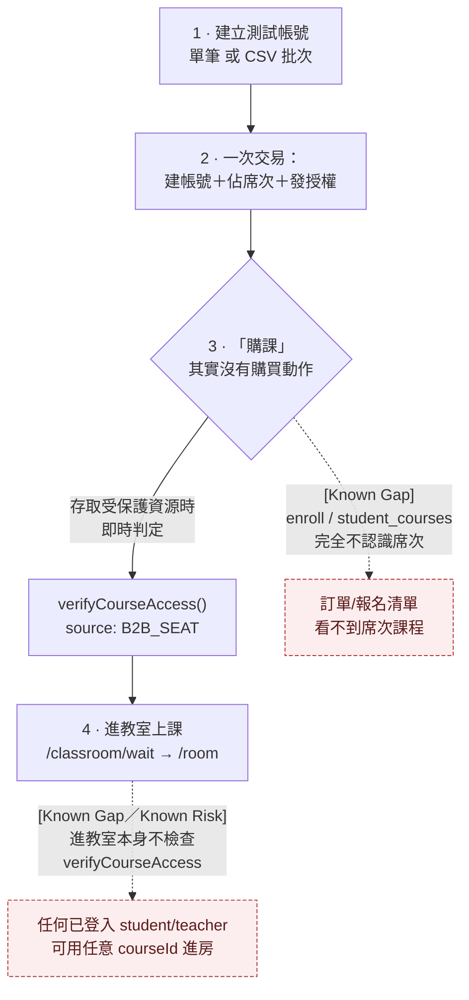

# 企業授權席次購課流程（Enterprise Seat-Based Course Access Flow）

> 本文件是 [`docs/b2b-request-path-diagram.md`](./b2b-request-path-diagram.md)（V2.4）的延伸——該文件涵蓋 Organization/OrgUnit/License/Member 的 CRUD 請求生命週期，本文件則沿著使用者視角，逐步走過「**建立企業會員測試帳號 → CSV 批次匯入 → 用組織席次取得課程 → 進教室上課**」這條完整路徑，並沿用同一套標籤與驗證方法。
>
> **標籤說明**：`Existing`＝已在程式碼中確認存在；`[Recommended]`＝尚未實作的建議；`[Known Risk]`＝已存在的安全或一致性風險；`[Known Gap]`＝目前缺少的功能；`[Verify]`＝尚未完全確認（本輪僅以程式碼閱讀／關鍵字搜尋驗證，未逐分支手動追蹤或實際開瀏覽器操作）。
>
> 驗證方式：全程直接讀取原始碼（`app/login/register_enterprise/page.tsx`、`app/api/register/route.ts`、`lib/orgMembershipService.ts`、`lib/accessControl.ts`、`app/api/enroll/route.ts`、`app/student_courses/page.tsx`、`app/classroom/wait/page.tsx`），並交叉比對既有的 `scripts/verify-b2c-b2b-course-access.mjs`（席次比對邏輯已有腳本測試佐證）與 `docs/enterprise-lms-implementation-plan.md`（獨立佐證「B2B 鷹架已就位但未貫通」的結論）。

---

## 流程總覽



---

## 1 · 建立測試帳號

### 1.1 單筆企業註冊（`Existing`）

- 頁面：[`app/login/register_enterprise/page.tsx`](../app/login/register_enterprise/page.tsx)
- API：`POST /api/register`，body 帶 `orgId`（必要時帶 `orgUnitId`）
- [`app/api/register/route.ts`](../app/api/register/route.ts) 對有 `orgId` 的請求額外執行：
  1. 查組織是否存在、`status` 必須是 `active` 或 `trial`（否則 400）
  2. 若組織設定了 `domain`，Email 網域必須相符（否則 400「此 Email 網域不屬於該組織」）
  3. `org.usedSeats >= org.maxSeats` 時提前擋（409「組織席次已滿」）——**這只是前置 advisory 檢查**，真正把關仍在後面 §2 的交易條件式上
  4. 若帶 `orgUnitId`，驗證該單位確實屬於此組織

### 1.2 CSV 批次匯入（`Existing`）

- 同一個頁面（[`app/login/register_enterprise/page.tsx:426-583`](../app/login/register_enterprise/page.tsx)），**沒有獨立的批次匯入 API**——CSV 匯入是前端把整份檔案解析成多筆記錄後，**逐列呼叫同一支 `POST /api/register`**（`Existing`，不是猜測，程式碼第 552 行清楚可見）。
- 必要欄位（缺一即整批擋下，不會匯入到一半才發現）：`email,password,firstName,lastName,role,birthdate,gender,country`。頁面提供「下載範例 CSV」按鈕產生符合格式的樣板。
- 匯入前的三道前置檢查（皆在瀏覽器端，送出 API 前完成）：
  - CSV 內部 email 重複 → 直接擋（避免打到一半才收到 409）
  - 即時重新抓取組織剩餘席次（`freshOrg.availableSeats`），CSV 筆數超過剩餘席次 → 整批拒絕，不送出任何一筆
  - 每列都重用同一顆已通過驗證的 captcha token（因為 `/api/register` 每筆都要求 captcha，重新逐列出驗證碼不合理）
- **`[Known Risk]`**：CSV 匯入的「剩餘席次足夠」檢查只在**開始匯入前**做一次快照比對；匯入過程是逐列 sequential 送出 `POST /api/register`，每一列各自在 §2 的交易中重新檢查即時席次。若同一組織在匯入期間有另一個並行請求也在消耗席次，批次匯入到中途仍可能有部分列因「即時已無席次」而失敗（`csvSuccess.results` 會標示每列成功/失敗），不是原子性的整批操作——UI 已经誠實地把「成功 X 筆／失敗 Y 筆」的逐列結果列出來，但沒有整批回滾機制。

---

## 2 · 帳號 → 席次 → 授權：一次原子交易（`Existing`）

`orgId` 存在時，[`app/api/register/route.ts:140-164`](../app/api/register/route.ts) 在寫入 Profile 之後呼叫 [`orgMembershipService.assignMemberWithLicense()`](../lib/orgMembershipService.ts#L129)，以單一 `TransactWriteCommand` 跨三張表：

| 表 | 動作 |
|---|---|
| `Organizations` | `usedSeats + 1`（條件式 `usedSeats < maxSeats`，真正的把關點） |
| `Licenses` | 新建一筆 `status:'active'`、`userId:<新帳號>` 的授權記錄 |
| `Profiles` | `orgId`／`orgUnitId`／`isB2B:true`／`isOrgAdmin:false`／`licenseId`／`plan:null` |

**關鍵發現**：`app/api/register/route.ts` 呼叫 `assignMemberWithLicense` 時**沒有傳入 `courseId`**（[`route.ts:142-147`](../app/api/register/route.ts)）。對照 [`orgMembershipService.ts:198`](../lib/orgMembershipService.ts#L198)，新建的 License 物件其 `courseId` 欄位因此是 `undefined`。這代表**透過註冊／CSV 匯入拿到的授權預設是「組織席次」（org-wide），不綁定任何特定課程**——見 §3 的存取判定邏輯如何解讀這個 `undefined`。

交易失敗（席次已滿、併發衝突重試耗盡等）時，`route.ts` 會刪除剛才建立的 Profile 做補償——這條路徑與已存在於主文件的 `[Known Risk：Severe：Orphan Profile]` 是同一個機制，不重複展開，詳見 [`b2b-request-path-diagram.md` 第 4、5 節](./b2b-request-path-diagram.md)。

---

## 3 ·「用企業席次購課」其實沒有「購買」這個動作 —— `[Known Gap]`

這是本文件最重要的發現：**企業會員沒有任何「選課→結帳→取得課程」的顯式流程**。授權在 §2 建帳號當下就已經發完，之後每次存取受保護資源時才**即時**判定「這個人現在有沒有資格」，判定函式是 [`lib/accessControl.ts` 的 `verifyCourseAccess(userId, courseId)`](../lib/accessControl.ts#L41)：

```text
1. 先查 Enrollments 表：userId+courseId 是否有 status ∈ {PAID, ACTIVE} 的紀錄
   → 有 → granted:true, source:'B2C'
2. 沒有 B2C 紀錄才查 Licenses（listLicensesByUser）：
   是否存在 status:'active' 且未過期、且 (courseId 為空 或 courseId 相符) 的授權
   → 有，且該授權所屬 Organization 的 status 為 active/trial
   → granted:true, source:'B2B_SEAT'
3. 兩者皆無 → granted:false
```

- 空 `courseId` 的授權（§2 註冊/匯入預設產生的那種）在第 2 步會對**任何** `courseId` 都比對成功，也就是真正的「組織席次可上任何課」——這條邏輯已經有既有腳本 [`scripts/verify-b2c-b2b-course-access.mjs`](../scripts/verify-b2c-b2b-course-access.mjs) 實測驗證過（org-wide 授權對課程 A、B 都放行；有指定 `courseId` 的授權則只對該課程放行、對其他課程拒絕），不是本輪新猜測。

**但這個判定函式目前只接在少數幾個「附加功能」端點，不是主要的選課/報名流程**：

| 呼叫端點 | 用途 |
|---|---|
| [`app/api/courses/[id]/materials/route.ts`](../app/api/courses/[id]/materials/route.ts) | 課程教材列表 |
| [`app/api/courses/[id]/materials/preview/route.ts`](../app/api/courses/[id]/materials/preview/route.ts) | 教材 PDF 預覽 |
| [`app/api/whiteboard/room/route.ts`](../app/api/whiteboard/room/route.ts) | 加入協作白板房間 |
| [`app/api/learning-content-analysis/route.ts`](../app/api/learning-content-analysis/route.ts) | AI 學習內容分析 |
| [`app/api/scan-product/route.ts`](../app/api/scan-product/route.ts) | 掃描辨識工具 |

（以上為全 repo `grep verifyCourseAccess` 的完整呼叫清單，`Existing`，非抽樣。）

對照 B2C 的「報名」路徑：

- **`app/api/enroll/route.ts` POST**（[route.ts:77-90](../app/api/enroll/route.ts#L77)）建立 Enrollment 記錄時**硬編碼 `sourceType: 'B2C'`**，全函式完全沒有讀取 `session`／`profile` 的 `isB2B`、`licenseId`，也沒有任何 `orgId` 分支。`EnrollmentRecord.sourceType` 的型別雖然宣告了 `'B2B_SEAT'` 這個選項（[route.ts:32](../app/api/enroll/route.ts#L32)），但**沒有任何程式碼路徑真正把這個值寫進資料庫**——它只在 `verifyCourseAccess()` 的回傳值（判定結果，不是資料庫欄位）裡被用到。換句話說：企業會員用席次取得課程存取權時，**Enrollments 表裡完全不會留下任何紀錄**。`[Known Gap]`

- **`app/student_courses/page.tsx`**（學生端「我的課程」清單頁）的資料來源是 `fetch('/api/orders?courseId=...')`（[page.tsx:101](../app/student_courses/page.tsx#L101)），也就是**訂單／付款紀錄**，不是 Enrollments、更不是 Licenses（全檔案 grep `licenseId|isB2B|enrollment` 零命中）。**一個只靠組織席次（沒有下單、沒有報名紀錄）的企業會員，在這個頁面上完全看不到自己有權限的課程**——除非他已經知道確切的 courseId，直接手動輸入網址去存取上表列出的那幾個附加功能端點。`[Known Gap]`

- 獨立佐證：[`docs/enterprise-lms-implementation-plan.md`](./enterprise-lms-implementation-plan.md) 第 20 行明白寫著「B2B 鷹架…已就位但**未貫通**」，與本節從程式碼實測得到的結論一致（非本文件單方面推論）。

---

## 4 · 上課（進教室）—— `[Known Gap／Known Risk]`

- 頁面：`app/classroom/wait/page.tsx` → `app/classroom/room/page.tsx`
- 對 `app/classroom/**` 全目錄 grep `verifyCourseAccess|getSession|403|Forbidden` 完全零命中。實際讀取 [`app/classroom/wait/page.tsx`](../app/classroom/wait/page.tsx#L89) 確認：進教室前唯一做的檢查是「有沒有登入」＋「角色是 teacher/student/admin 其中之一」（透過 `getStoredUser()`／session 有效性），**沒有任何一步去問「這個使用者對這個 `courseId` 是否有存取權」**——不論是查 Enrollments（B2C 已付款）、Orders，還是 §3 的 Licenses（B2B 席次）。
- 也就是說：**§3 描述的 `verifyCourseAccess()` 判定，完全沒有接在「進教室」這個核心動作上**。它只保護教材預覽、白板加入等次要功能；真正的「上課」（視訊教室本身）目前只要求「已登入且角色正確」，`courseId` 是從網址參數帶入、不做擁有權驗證。
- `[Verify]`：本結論是關鍵字 grep＋直接讀取 `classroom/wait/page.tsx` 得出，並未逐一手動追蹤 `classroom/room/page.tsx` 及其呼叫的所有下游 API（例如 Agora token 簽發路由）的每一個分支，也未實際開瀏覽器以兩個不同帳號互相嘗試進入對方課程房間做端到端確認。若需要 100% 確定性，建議用瀏覽器實測：用一個「沒有任何授權/報名紀錄」的乾淨帳號，直接帶任意 `courseId` 造訪 `/classroom/wait`，觀察是否真的能進房。
- 若上述結論成立，其影響範圍不只是「企業席次購課流程缺一塊」——它同時是一個橫跨 B2C／B2B 的存取控制缺口（任何已登入的 student/teacher 帳號都可能用任意 `courseId` 進入視訊教室），所以同時標記 `[Known Gap]`（缺少「進教室前驗權」這個功能）與 `[Known Risk]`（未授權的教室存取）。

---

## 5 · 小結：四階段的「已驗證」與「缺口」對照

| 階段 | 狀態 |
|---|---|
| 1. 建立測試帳號（單筆／CSV） | `Existing`，運作正常，CSV 匯入有已知的非原子性風險（§1.2） |
| 2. 帳號＋席次＋授權（一次交易） | `Existing`，已有交易保護，授權預設 org-wide（不綁課程） |
| 3. 用席次「購課」 | 沒有購買動作——`verifyCourseAccess()` 即時判定，但只接在教材/白板/AI分析/掃描等次要端點；企業會員在「我的課程」頁完全不可見 `[Known Gap]` |
| 4. 進教室上課 | 完全沒有課程層級的存取檢查，僅檢查登入與角色 `[Known Gap／Known Risk]` |

### `[Recommended]`（供後續規劃參考，本文件不涉及實作）

- 在 `app/classroom/wait` 或其後端 API 補上 `verifyCourseAccess()` 呼叫，讓「進教室」與「教材/白板」用同一套判定，補上 §4 的缺口。
- 讓 `app/student_courses` 頁面（或另開一個「企業課程」頁籤）改為同時查詢 Orders/Enrollments 與 Licenses，讓組織席次持有者能實際「看到」自己有權限的課程，而不必已知確切 `courseId` 才能手動存取。
- 若要讓 `EnrollmentRecord.sourceType:'B2B_SEAT'` 這個已宣告但從未寫入的型別選項真正有意義，需要在 `POST /api/enroll` 加上 `isB2B`／授權判定分支（或改為由 §3 判定成功時另外寫一筆記錄），而不是維持目前「宣告了但沒有程式碼路徑會賦值」的狀態。
