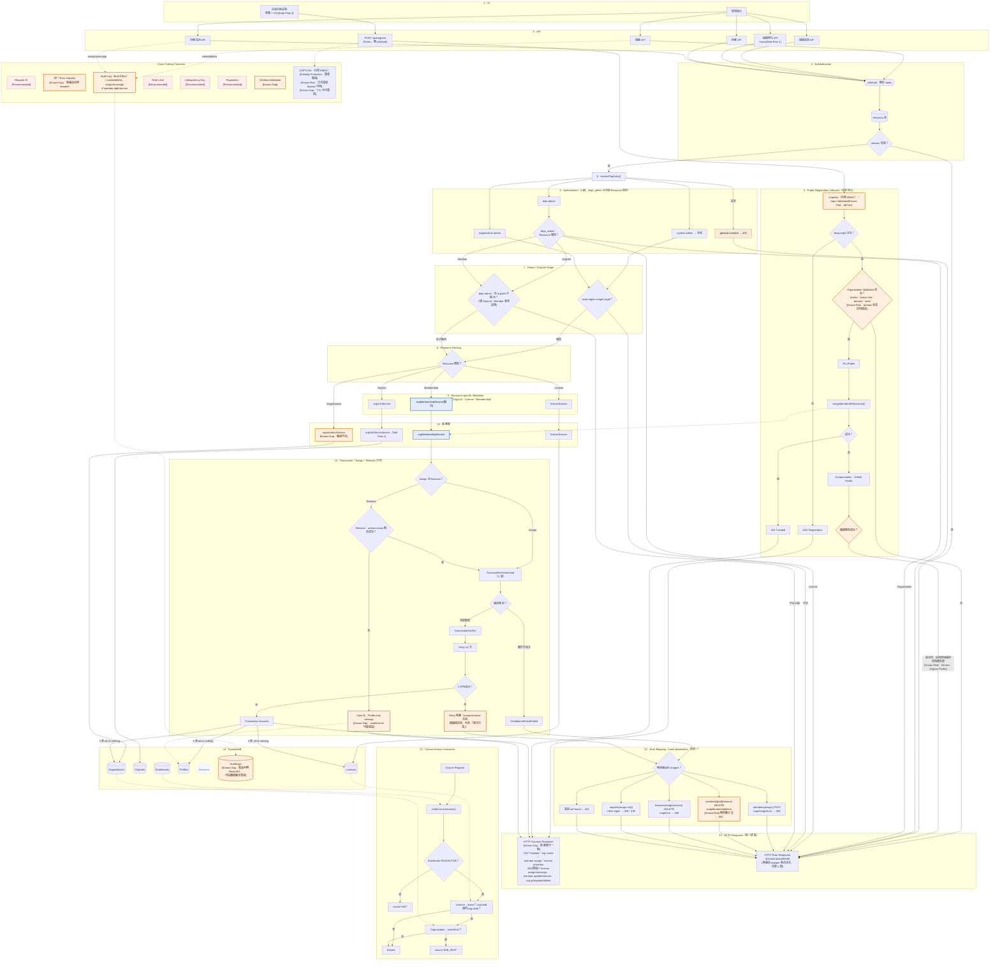

# 企業（B2B）功能請求路徑架構圖 V2.4

> 技術架構的表格式總覽請見 [B2B / B2C / Shared 架構邊界與共用層](./b2b-b2c-architecture-boundary.md)；本文件是同一套架構的**視覺化請求路徑圖**。
>
> 對應驗證技能：[.agents/skills/b2b-core-modules](../.agents/skills/b2b-core-modules/SKILL.md)、[.agents/skills/b2b-http-license-routes](../.agents/skills/b2b-http-license-routes/SKILL.md)。最後對照程式碼時間：**2026-08-22**（V2.4，Request Lifecycle Closure + Security Enforcement Final Review）。
>
> **定位**：**Code-Verified B2B Request Flow & Authorization Architecture**。Code Truth > Actual Runtime Behavior > Security Boundary > Consistency > Diagram Completeness > Ideal Architecture。`Existing` 必有程式碼依據；`[Recommended]` 尚未實作；`[Known Risk]` 已存在風險；`[Known Gap]` 功能缺口；`[Verify]` 無法完全確認。

## 1 · V2.4 修正摘要

- **Main Request Lifecycle 真正閉合**：V2.3 的文字版流程與 Mermaid 實際畫法不一致（Success/Error 散落各處，沒有真正接回 HTTP Response）。V2.4 讓所有 Success（`X9`）與所有 Failure（401/403/404/409/500）都畫出明確箭頭連到統一的 HTTP Response 層。
- **補上先前三輪都沒查過的成功狀態碼盤點，發現真實不一致**：`register`/組織建立/成員 assign（透過 members 路由）/license provision 明確回 **201**；但 license assign/unassign（透過 licenses/assign 路由）、成員 update/remove、組織 get/update/delete **沒有明確設定狀態碼，預設落 200**。`[Known Gap]`。
- **Public Registration Lifecycle 完整閉合**：依巢狀決策樹補上「B2C 直接成功」「Organization Validation 失敗」「assign 成功」「assign 失敗→Compensation 成功/失敗」四種結局各自的 HTTP Response，不再讓 Compensation 是個沒有終點的旁路。
- **CAPTCHA 拆成三個獨立且互不混淆的標籤**：`Existing Protection`（HMAC 簽章伺服器端驗證）／`Known Risk：High`（正式環境 bypass 無環境判斷，新增 T27）／`Known Gap`（token 無單次使用限制，可在 TTL 內重放，新增 T26）。
- **Organization Enumeration 正式化為 T28**，附上 5 種 orgId 狀態的狀態碼／訊息／response body 結構比較表（body 結構確認皆為 `{message:string}`，無額外欄位差異）。
- **新增 T29 Seat Counter Integrity**：依 Remove Case B 的既有邏輯推演 stale `usedSeats`／`License` 狀態可能造成的後續影響（此為程式碼邏輯推論，非執行期測試結果，明確標註）。
- **dept_admin 視覺邊界修正**：改成「dept_admin → 先判斷 Resource 類型 → Organization/License 直接 403，OrgUnit/Member 才進子樹 scope」，避免誤讀成「所有請求都先經過子樹範圍判斷」。
- **AuditLog 描述精確化**：不再寫「完全沒有任何方式能稽核」，改為「產品內無 Read API/管理介面；可由資料庫層或離線驗證腳本 `scripts/verify-b2b-http-routes.mjs` 查詢」。

## 2 · 完整 V2.4 Mermaid



## 3 · Main Request Lifecycle

```text
Request → API Route → Authentication → Actor Resolution → Authorization
   → Tenant/OrgUnit Scope（dept_admin 先判斷 Resource 類型，
     Organization/License 直接 403，不經過子樹 scope）
   → Resource Routing → Resource Validation（Organization 無此步驟）
   → Service → Transaction/DB Operation
   → Success → HTTP Success Response（201 或預設 200，見第 1 節不一致說明）
或
   → 任一階段 Failure → Error Mapping（route-dependent）→ HTTP Error Response
```

## 4 · Public Registration Lifecycle

```text
Public → Captcha/Input Validation
   → body.orgId？
      ├─ 否 → B2C Registration → HTTP 201
      └─ 是 → Organization Validation
              ├─ 失敗 → HTTP 400 Error（見第 6 節 Enumeration 差異表）
              └─ 成功 → Put Profile → assignMemberWithLicense()
                        ├─ 成功 → HTTP 201
                        └─ 失敗 → Compensation：Delete Profile
                                  ├─ 補償成功 → HTTP 400/409（回原始 assign 錯誤）
                                  └─ 補償失敗 → HTTP 400/409（同上訊息，
                                     但實際留下 orphan Profile）
                                     [Known Risk：Severe：Orphan Profile]
```

無論補償成功或失敗，客戶端收到的 HTTP 回應**完全相同**（都是原始 assign 錯誤訊息）——差別只在資料庫裡是否留下孤兒紀錄，客戶端無從得知。

## 5 · Transaction Boundary

### Assign（恆一次三表交易）→ 201（透過 members 路由）或無明確 status/預設 200（透過 licenses/assign 路由）
`Organizations.usedSeats+1` ＋ `Licenses.status='active',userId=profileId` ＋ `Profiles.orgId/orgUnitId/isB2B=true/isOrgAdmin/licenseId/plan=null`。

### Remove（兩條路徑）
- **Case A**（`activeLicense` 解析成功）→ 三表交易（`usedSeats-1`／`status='revoked'`／Profile 清空）
- **Case B**（解析失敗）→ 只清 Profile，Organizations/Licenses 完全不參與 `[Known Gap]`

### Transaction Error → HTTP Response（route-dependent）

```text
ConditionalCheckFailed
  ├─ Assign（"組織席次已滿"）→ 409（已確認）
  └─ Remove（三種訊息之一）→ 走 mapMembershipError（僅認 'not found'/'does not belong'）
       → [Verify：本輪未逐訊息窮舉，"seat count underflow" 訊息不含此字樣，
          依 mapper 邏輯將落 500，其餘兩則含"not found"可能判 404]

TransactionConflict → Retry ≤3
  ├─ 成功 → Continue → Success → HTTP 201/200
  └─ 失敗（耗盡）→ 依路由 mapper：
       ├─ members(assign) POST → 409
       ├─ members/[pid](remove) DELETE → [Known Risk] 500
       ├─ licenses/assign(remove) DELETE → 409
       └─ register(assign only) → 409 或 400
```

**`[Known Risk：409/500 classification inconsistency]`** 維持成立：同一個 `removeMemberFromOrg` 的 `TransactionConflict` 耗盡錯誤，依呼叫路徑不同回傳 500 或 409。

### Seat Counter Integrity（T29，程式碼邏輯推演，非執行期測試）

```text
初始：usedSeats = N（已用滿或接近滿）
   ↓
Remove Member，但 activeLicense 解析失敗（Case B）
   ↓
Profile 已清空（isB2B=false, orgId REMOVE），
但 Organizations.usedSeats 沒有 -1，License.status 也未被改成 revoked
   ↓
[Known Risk] usedSeats 相對「實際仍隸屬組織的成員數」偏高，
新的 Assign 請求可能提前遇到 usedSeats>=maxSeats 而被判「席次已滿」，
即使實際上有名額可用；反向地，該筆 License record 若仍是 active 狀態，
也可能被其他流程誤判為仍在使用中
```

此為根據 Case B 已確認的程式碼行為（Organizations/Licenses 交易項目被完全跳過）推演的邏輯後果，本輪未實際執行併發測試驗證，标記為 `[Known Risk]` 而非 `Existing`。

## 6 · Security Boundary

### Domain Matching（維持 V2.3 結論）
目前已針對 exact domain、subdomain、suffix attack、look-alike boundary 進行程式碼／測試驗證，未發現繞過；但 `org.domain` 未設定時會跳過 domain validation（`[Existing Protection]` domain matching implementation；`[Known Risk：Critical]` org.domain 未設定時跳過 domain validation）。

### CAPTCHA（三個標籤明確分離）
- **`Existing Protection`**：`verifyCaptcha` 是真正的伺服器端驗證——重算 HMAC 簽章比對、檢查 payload 過期時間、比對使用者輸入答案。
- **`[Known Risk：High]`**：`isBypassAllowed()` 寫死回傳 `true`，沒有任何環境判斷（如 `NODE_ENV!=='production'`），正式環境一樣可以用 bypass secret 跳過整個 CAPTCHA 驗證。
- **`[Known Gap]`**：驗證邏輯完全無狀態，沒有實作單次使用限制，同一個 token+value 在 5 分鐘 TTL 內可重複提交，每次都會驗證成功（T26 CAPTCHA Replay）。

### Organization Enumeration（T20 General Risk；T28 為其 Response Differential 詳細證據，非另一個獨立漏洞）

| `orgId` 狀態 | HTTP 狀態碼 | 錯誤訊息 | Response Body 結構 |
|---|---|---|---|
| 不存在 | 400 | `無效的組織` | `{message:string}` |
| `active` | — | 進入 domain/席次檢查 | 與 `trial` 不可分辨 |
| `trial` | — | 進入 domain/席次檢查 | 與 `active` 不可分辨 |
| `suspended` | 400 | `此組織目前無法接受新成員註冊` | 與 `cancelled` 不可分辨 |
| `cancelled` | 400 | `此組織目前無法接受新成員註冊` | 與 `suspended` 不可分辨 |

Body 結構在所有情境下都是 `{message: string}`，沒有額外欄位差異；差異只來自狀態碼與訊息文字本身。**`[Known Risk]`**：攻擊者可用任意 email + 候選 `orgId` 探測組織存在性與狀態分組。

### IDOR／Tenant／OrgUnit Scope
維持已驗證結論：4 條檢查路由皆從 DB 記錄衍生 scope，無 IDOR（`Existing Protection`）。dept_admin 對 Organization/License **完全無存取權**（第 2 節 `DAR` 節點直接 403，不經過子樹判斷）。

## 7 · Course Access

```text
Course Request → verifyCourseAccess()
   → Enrollment(PAID/ACTIVE，恆先查)
   → License(status==='active'，courseId 相符或 org-wide[null/undefined])
   → Organization(active/trial，條件性查)
   → Access Decision
```

`courseId` 為 `null`/`undefined` 時代表 org-wide；否則需完全相符。`revoked`/`expired`/`pending` license、`suspended`/`cancelled` 組織一律拒絕。確認不查 Profiles。

## 8 · Audit Boundary

- **Write**：`writeAuditLog()`，best-effort（內部 try/catch 吞錯，只 `console.error`）。覆蓋 org create/delete、license assign/unassign；不覆蓋 member add/remove。
- **Product Read**：**不存在**——產品內沒有任何 API 或管理介面可以讀取 AuditLogs。
- **Offline Read**：存在——`scripts/verify-b2b-http-routes.mjs` 可直接對 DynamoDB 的 `byTargetId` GSI 發送 `QueryCommand`，但這是離線驗證腳本，不是產品功能。
- **`[Known Gap]`**：產品內沒有 AuditLog Read API/管理介面；AuditLogs 只能由資料庫層或離線驗證腳本查詢（T24 = Not Implemented，指「產品內」不存在，而非「完全無法查詢」）。

## 9 · QA Test Points

| # | 測試點 | 現況 |
|---|---|---|
| T1 | Authentication | Existing |
| T2 | Authorization（4 級） | Existing |
| T3 | Tenant Isolation | Existing |
| T4 | OrgUnit Scope | Existing |
| T5 | Business Validation | Existing（resource-specific；Organization = Known Gap） |
| T6 | Transaction Atomicity | Existing |
| T7 | TransactionConflict Retry ≤3 | Existing |
| T8 | Resource/Operation Permission | Existing |
| T9 | Error Classification（409 混淆成因） | `[Known Risk]` |
| T10 | Audit Coverage | Existing + `[Known Gap]` |
| T11 | Course Access | Existing |
| T12 | moveOrgUnit Cross-Batch Failure | Existing + `[Known Risk]` |
| T13 | Idempotency | `[Recommended]` |
| T14 | CSV Batch Import | Existing + `[Known Gap]` |
| T15 | B2B License / Organization State | Existing |
| T16 | Audit Payload Integrity | Existing（欄位有限） |
| T17 | Concurrent Seat Assignment | Existing + `[Known Risk]`（TOCTOU） |
| T18 | IDOR / Cross-Tenant Access | Existing Protection |
| T19 | Registration Compensation Failure | `[Known Risk：Severe]` |
| T20 | Registration Organization Enumeration（General Risk 陳述） | `[Known Risk]`：詳細差異證據見 T28 |
| T21 | CSV Concurrent Import | `[Known Risk]` |
| T22 | Domain Matching Boundary | Existing Protection + `[Known Risk：Critical]`（未設定時） |
| T23 | License Course Scope | Existing |
| T24 | Audit Log Access Control | `[Known Gap]`：產品內 Not Implemented（離線可查） |
| T25 | CAPTCHA Server-side Enforcement | Existing Protection |
| T26 | **CAPTCHA Replay** | `[Known Gap]`：TTL 內可重放 |
| T27 | **Production CAPTCHA Bypass** | `[Known Risk：High]`：無環境判斷 |
| T28 | **Enumeration Response Differential**（T20 之深度驗證） | `[Known Risk]`：與 T20 為同一風險的詳細證據，見第 6 節結果表 |
| T29 | **Seat Counter Integrity** | `[Known Risk]`：邏輯推演，非執行期測試 |

## 10 · Existing / Recommended / Known Risk / Known Gap / Verify

### Existing
Authentication、4 級 Authorization（dept_admin 對 Organization/License 直接 403）、Tenant/OrgUnit Scope、`orgMembershipService` 融合式 Condition+Transaction、`TransactionConflict` 重試≤3、併發席次原子保護、`moveOrgUnit` 批次機制、Course Access 三道關卡、License Course Scope、IDOR 防護、CAPTCHA 簽章驗證（`Existing Protection`）、Audit Log write（best-effort）、Domain matching 演算法（`Existing Protection`）、離線 AuditLog 查詢腳本。

### Recommended
Request ID、統一 Error Handler、422、Rate Limit、Idempotency Key、Pagination、統一 Schema Validation、宣告式 Permission Matrix。

### Known Risk
1. `[Critical]` domain 未設定時跳過授權
2. `[Severe]` Registration Compensation Failure → orphan Profile
3. Organization Enumeration（T20 為風險陳述，T28 為其詳細差異證據——同一風險，非兩個獨立漏洞）
4. 409/500 Error Classification 路由不一致
5. Org 狀態/OrgUnit 封存 TOCTOU
6. `moveOrgUnit` 跨批次非原子
7. CSV pre-flight 快照 race
8. `[High]` Production CAPTCHA bypass 無環境判斷（T27）
9. Request-level Idempotency 未實作
10. Seat Counter staleness（Remove Case B，T29，邏輯推演）

### Known Gap
- Remove Case B：Organizations/Licenses 不參與
- `organizationService` 驗證不足（無 duplicate/格式/刪除限制）
- AuditLog member add/remove 缺失；產品內無 Read API（可離線查）
- Audit Payload 欄位有限
- Schema Validation／Error Mapper 不統一
- `moveOrgUnit` partial failure 無結構化回應
- Domain matching 無 `.trim()`
- CAPTCHA 無單次使用限制（T26）
- **`[新]` 成功狀態碼不一致**：201（register/org create/member assign/license provision）vs 預設 200（license assign/unassign、member update/remove、org CRUD）

### Verify
- Remove 的 `ConditionalCheckFailed`（非 TransactionConflict）在 `mapMembershipError` 下是否也有類似不一致，未逐訊息窮舉
- `EnrollmentStatus` 的 `REFUNDED` 是否實際被寫入

## 11 · 文件與程式碼差異

| 項目 | V2.3 描述 | 實際程式碼/本輪修正 | 結論 |
|---|---|---|---|
| Main Lifecycle | 文字版與 Mermaid 不一致，Success/Error 未真正接回 HTTP Response | 本輪全部節點明確連到 RESP1/RESP2 | 已閉合 |
| 成功狀態碼 | 未查證 | 201 vs 預設 200 不一致，先前三輪皆未發現 | 新增 `[Known Gap]` |
| Public Registration | 缺少 Compensation 後的 Response 終點 | 補償成功/失敗皆回同一段錯誤，客戶端無從分辨 | 已閉合，Orphan Risk 更清楚 |
| dept_admin 視覺 | 先進 OrgUnit scope 再判斷 resource，易誤解為所有請求都先進子樹 | 實際 Organization/License 直接 403，不經過子樹 | Mermaid 改為 Resource 類型優先判斷 |
| AuditLog 描述 | 「沒有任何方式能稽核」（過於絕對） | 產品內無 API，但離線腳本可直接查 DynamoDB/GSI | 措辭修正為「產品內 Not Implemented」 |
| CAPTCHA 標籤 | 三個結論混寫在一段 | 拆成 Existing Protection／Known Risk／Known Gap 三個獨立標籤，新增 T26/T27 | 已分離 |
| Seat Counter | 未系統性推演 Case B 後果 | 新增 T29，明確標註為邏輯推演非執行期測試 | 新增 |

---

## Architecture Boundary

### 本圖涵蓋
B2B Request Flow、Authentication、Authorization、Tenant/OrgUnit Scope、Business Validation（含缺口）、Transaction、DynamoDB、Audit（write/offline read）、Course Access、CSV、moveOrgUnit、Registration Compensation、CAPTCHA、HTTP Response Lifecycle、QA Boundary。

### 本圖不涵蓋
SSO、SCIM、Notification、Email Service、Billing Platform、Background Worker、Deployment、Infrastructure、Monitoring、CI/CD、自建 Permission Matrix、Idempotency、Rate Limit、Audit Read API（以上僅能維持 `[Recommended]`，不可畫成 Existing）。

---

## 最終反向驗證（40 題）

**Security**：1. 未登入怎麼走？→ 只有 `/api/register` 公開，其餘 401。2. Public registration 怎麼走？→ 第 4 節。3. CAPTCHA 是否 server-side？→ 是，`Existing Protection`。4. Production 是否可 bypass？→ 可以，`[Known Risk：High]`。5. Token 是否可 replay？→ 可以，TTL 內，`[Known Gap]`。6. 一般 member？→ `Z4` 403。7. Org admin scope？→ 限自己 orgId。8. Dept admin scope？→ Organization/License 直接 403，OrgUnit/Member 限子樹。9. Cross-tenant？→ `T1` 403。10. IDOR？→ 不存在。11. Enumeration？→ 存在，第 6 節。12. Domain 未設定？→ 整段跳過，任意 email 可加入。

**Request Lifecycle**：13. Success 如何回 HTTP？→ 201 或預設 200（不一致，見第 1 節）。14. Validation failure？→ 400/404，經 Error Mapping 到 RESP2。15. Transaction failure？→ 409（部分路由 500，見第 5 節）。16. Retry exhausted？→ 依路由 mapper，非一律 409。17. Public Registration failure？→ 400/409，回 RESP2。18. Compensation failure？→ 仍回同一段錯誤，額外標 Orphan Risk。

**Consistency**：19. Assign 三表？→ 一次交易。20. Remove Case A？→ 三表交易。21. Remove Case B？→ 只清 Profile。22. Seat counter 可能 stale？→ 可能，T29。23. License 可能 stale？→ 可能，Case B 下 license 未被 revoke。24. moveOrgUnit atomic 範圍？→ 單批次。25. CSV atomic 範圍？→ 每列各自交易。

**Concurrency**：26. Seat 超賣？→ 不會，原子保護已證實。27. TransactionConflict retry？→ ≤3 次。28. CSV concurrent？→ pre-flight 僅 advisory。29. Org status TOCTOU？→ 存在。30. Client retry idempotency？→ 無 request-level 保證。

**Access**：31. B2C/B2B 優先？→ B2C 優先。32. License course scope？→ `courseId`，null=org-wide。33. suspended/cancelled org？→ 拒絕。34. expired/revoked license？→ 拒絕。

**Audit**：35. 哪些 mutation 有 Audit？→ org create/delete、license assign/unassign。36. 哪些沒有？→ member add/remove。37. Best-effort？→ 是。38. 產品內可讀？→ 不行。39. Offline 可讀？→ 可以，離線腳本。40. Payload 足夠？→ 有限，無 requestId/orgId/before/after。

以 2026-08-22 這輪 V2.4 Request Lifecycle Closure + Security Enforcement Final Review 掃描到的實際程式碼路徑為準。跨租戶 SSO 仍未實作，不在本圖範圍內。
