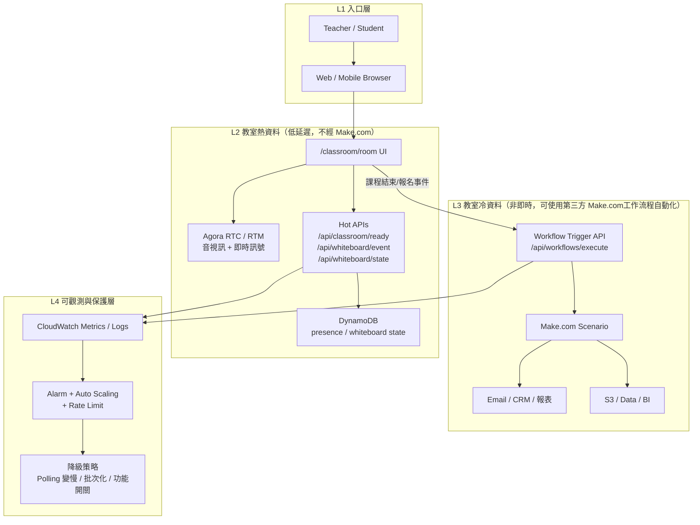
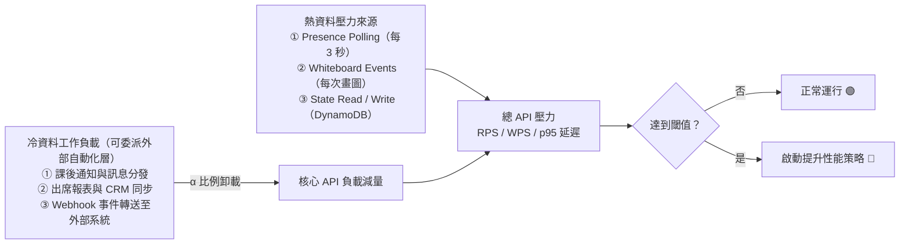
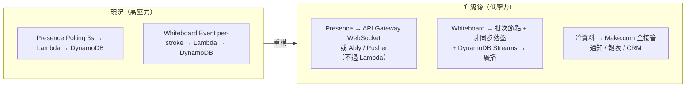
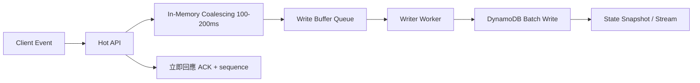

# 教室熱資料 vs Make.com 冷資料 分層架構

> 文件版本：2026-05-24｜適用系統：JV Tutor Corner（AWS Amplify Serverless）

---

## 一、分層架構圖

### 1-A 整體分層（熱資料 / 冷資料）



---

### 1-B 壓力來源與冷資料卸載範圍



> **重點**：外部自動化編排主要降低冷資料負載，對熱資料 RPS 的直接改善有限。  
> 教室體感延遲的核心解法仍在熱資料本身的事件批次化與同步機制重構。

---

## 二、流量估算公式

### 2-A 參數定義

| 符號 | 說明 | 建議預設值 |
|---|---|---|
| $G$ | 同時上課組數 | 依實際情況 |
| $P$ | 每組平均在線人數 | 2 |
| $r_p$ | 每人 presence 輪詢頻率（次/秒） | 1/3（每 3 秒一次） |
| $d$ | 每組同時畫圖的活躍人數 | 1 |
| $e$ | 每個活躍畫圖者每秒產生白板事件數 | 8 |
| $b$ | 白板批次係數（1 = 未批次，10 = 批次化） | 1（未優化）/ 10（已優化） |
| $m$ | 每組其他熱資料 API（次/秒） | 0.1 |
| $\alpha$ | 冷資料使用第三方 Make.com 的比例 | 0.8 |

---

### 2-B 核心公式

**熱資料總 RPS（隨 G 線性增長）：**

$$
R_{hot}(G) = G \cdot \left(P \cdot r_p + d \cdot \frac{e}{b} + m\right)
$$

**每增加 5 組課程的壓力增量：**

$$
\Delta RPS_{+5} = 5 \cdot \left(P \cdot r_p + d \cdot \frac{e}{b} + m\right)
$$

**Make.com 介入後的總壓力：**

$$
R'_{total} = R_{hot} + (1 - \alpha) \cdot R_{cold}
$$

**DynamoDB 每秒寫入量（WPS）：**

$$
WPS(G) = G \cdot d \cdot \frac{e}{b}
$$

---

### 2-C 快速試算範例

#### 情境一：未批次化（$b=1$）

$$
\Delta RPS_{+5} = 5 \cdot \left(2 \times \frac{1}{3} + 1 \times \frac{8}{1} + 0.1\right) \approx \mathbf{43.8 \text{ RPS}}
$$

#### 情境二：已批次化（$b=10$）

$$
\Delta RPS_{+5} = 5 \cdot \left(2 \times \frac{1}{3} + 1 \times \frac{8}{10} + 0.1\right) \approx \mathbf{7.8 \text{ RPS}}
$$

> 白板事件批次化可讓每 +5 組的壓力增量降低約 **82%**。

---

## 三、強化版指標（Server API + 第三方）

### 3-A Server API 指標（第一優先，直接反映教室體感）

| 分類 | 指標 | 🟢 正常 | 🟡 預警 | 🔴 危險 | 建議資料來源 |
|---|---|---:|---:|---:|---|
| 延遲 | `/api/classroom/ready` p95 | < 200 ms | 200–500 ms | > 500 ms | CloudWatch Logs Insights + EMF |
| 延遲 | `/api/whiteboard/event` p95 | < 250 ms | 250–600 ms | > 600 ms | CloudWatch Logs Insights + EMF |
| 延遲 | `/api/whiteboard/state` p95 | < 200 ms | 200–500 ms | > 500 ms | CloudWatch Logs Insights + EMF |
| 錯誤 | 熱資料 API 5xx Rate | < 0.5% | 0.5–2% | > 2% | CloudWatch Metric Filter |
| 吞吐 | 熱資料 API RPS | < 300 | 300–600 | > 600 | API Gateway / Lambda Invocations |
| 飽和 | Lambda ConcurrentExecutions 使用率 | < 60% | 60–80% | > 80% | Lambda Metrics |
| 飽和 | Lambda Throttles | 0 | > 0 持續 1 min | 持續 > 3 min | Lambda Metrics |
| 冷啟動 | Init Duration p95 | < 300 ms | 300–800 ms | > 800 ms | REPORT logs / Telemetry API |
| DB 延遲 | DynamoDB SuccessfulRequestLatency p95（Write） | < 20 ms | 20–60 ms | > 60 ms | DynamoDB Metrics |
| DB 寫入 | DynamoDB WPS | < 800 | 800–1500 | > 1500 | DynamoDB ConsumedWriteCapacityUnits |
| DB 節流 | DynamoDB ThrottledRequests | 0 | > 0 持續 1 min | 持續 > 3 min | DynamoDB Metrics |
| 佇列 | Write Buffer Lag p95（ms） | < 300 ms | 300–1500 ms | > 1500 ms | SQS ApproximateAgeOfOldestMessage |
| 品質 | 白板事件遺失率 | < 0.1% | 0.1–1% | > 1% | client ack / sequence gap |
| 品質 | Presence 狀態過期率 | < 1% | 1–3% | > 3% | ready heartbeat timeout rate |

### 3-B 第三方服務監控指標（避免外部依賴拖垮主流程）

| 第三方 | 指標 | 🟢 正常 | 🟡 預警 | 🔴 危險 | 建議動作 |
|---|---|---:|---:|---:|---|
| Agora RTC/RTM | Join Success Rate | > 99.5% | 98–99.5% | < 98% | 切區域/重試策略/降畫質 |
| Agora RTC/RTM | RTT p95 | < 250 ms | 250–400 ms | > 400 ms | 啟用自適應碼率、限制高頻畫面更新 |
| Agora RTC/RTM | Packet Loss p95 | < 3% | 3–8% | > 8% | 降碼率、改語音優先、提示網路切換 |
| Make.com | Scenario 成功率 | > 99% | 95–99% | < 95% | 啟動重送佇列與 dead-letter 流程 |
| Make.com | Webhook 延遲 p95 | < 3 s | 3–10 s | > 10 s | 非關鍵任務改批次、降低觸發頻率 |
| Email(SMTP/Resend) | 送達成功率 | > 98% | 95–98% | < 95% | 切備援信道、啟用重送策略 |
| Stripe/PayPal | Webhook 驗證失敗率 | < 0.1% | 0.1–1% | > 1% | 檢查簽章/時鐘偏差/重送重放防護 |
| Qdrant | Query p95 | < 300 ms | 300–800 ms | > 800 ms | 降低即時查詢、啟用快取層 |
| Gemini/ChatGPT/Claude | API 5xx/429 Rate | < 1% | 1–5% | > 5% | 指數退避、模型降級、切換供應商 |

### 3-C 伺服器監控指標與告警分級（建議）

#### 3-C.1 伺服器監控指標（Server Health）

| 主題 | 指標 | 🟢 正常 | 🟡 預警 | 🔴 危險 | 監控來源 |
|---|---|---:|---:|---:|---|
| 計算資源 | Lambda ConcurrentExecutions 使用率 | < 60% | 60–80% | > 80% | Lambda Metrics |
| 計算資源 | Lambda Throttles | 0 | > 0 持續 1 min | 持續 > 3 min | Lambda Metrics |
| 計算資源 | Lambda Duration p95 | < 300 ms | 300–800 ms | > 800 ms | Lambda Metrics |
| 記憶體 | Memory Utilization p95（MaxMemoryUsed / MemorySize） | < 65% | 65–85% | > 85% | REPORT logs（Max Memory Used） |
| 記憶體 | Memory Headroom（MemorySize - MaxMemoryUsed） | > 256 MB | 128–256 MB | < 128 MB | REPORT logs |
| CPU 等效 | CPU Saturation Proxy（Duration p95 / Timeout） | < 40% | 40–70% | > 70% | Lambda Duration + Timeout |
| 啟動成本 | Cold Start Init Duration p95 | < 300 ms | 300–800 ms | > 800 ms | REPORT logs / Telemetry API |
| API 健康 | API 5xx Rate | < 0.5% | 0.5–2% | > 2% | API Gateway / Metric Filter |
| API 健康 | API 4xx Rate | < 2% | 2–5% | > 5% | API Gateway |
| 儲存健康 | DynamoDB SuccessfulRequestLatency p95（Write） | < 20 ms | 20–60 ms | > 60 ms | DynamoDB Metrics |
| 儲存健康 | DynamoDB ThrottledRequests | 0 | > 0 持續 1 min | 持續 > 3 min | DynamoDB Metrics |
| 緩衝健康 | Write Buffer Lag p95（ms） | < 300 ms | 300–1500 ms | > 1500 ms | SQS ApproximateAgeOfOldestMessage |

#### 3-C.2 AWS Amplify 對應規格與升級條件

> 在 Amplify Serverless 架構下，CPU/Memory 以「Lambda 實際配置」為準。CPU 不獨立設定，會隨 MemorySize 同步提升。
> 因此不建議使用固定「每 512MB」步進，而應依實測指標跨檔位升級。

| Amplify 對應檔位 | Lambda MemorySize（MB） | CPU 等效容量（相對） | 建議適用情境 | 升級觸發條件（任一符合） |
|---|---:|---|---|---|
| S（基準） | 1024–1536 | 低至中低 | 一般課程流量、低白板事件密度 | Memory Utilization p95 > 85%（5 分鐘） |
| M（加強） | 2048–3072 | 中 | 白板事件中高峰、多人同時操作 | Duration p95 > 500 ms 且 Write Latency p95 > 40 ms |
| L（高峰） | 4096–6144 | 中高至高 | 尖峰時段、多組同時上課 | ConcurrentExecutions 使用率 > 80%（3 分鐘） |
| XL（尖峰保護） | 7168–10240 | 高 | 大型活動/促銷尖峰/壓測窗口 | Throttles > 0 且 Queue Lag p95 > 1500 ms |

Amplify 環境建議的升級判斷順序：

1. 先看 `Memory Utilization p95` 與 `Memory Headroom` 是否長時間逼近紅線。
2. 再看 `Duration p95` 是否被 `DynamoDB Write Latency p95` 同步拉高。
3. 最後看 `ConcurrentExecutions` 與 `Throttles` 判斷是否需要升到下一檔位。

升級後觀察 24 小時，至少滿足以下兩項才視為升級有效：

- `Duration p95` 下降 >= 20%。
- `Memory Utilization p95` 回落至 65–75%。
- `API 5xx Rate` 與 `Throttles` 沒有再觸發紅線。

#### 3-C.3 告警分級與升級條件

| 等級 | 觸發條件（任一符合） | 處置目標 |
|---|---|---|
| P0（重大） | 教室 Join Success Rate < 95% 或 API 5xx > 5% 持續 5 分鐘 | 啟動事件指揮流程與功能降級 |
| P1（高優先） | 任一核心 API 指標進入 🔴 且持續 3 分鐘 | 5 分鐘內啟動立即降載策略 |
| P2（預警） | 連續 5 分鐘有 2 個以上指標進入 🟡 | 15 分鐘內完成降載，避免進入 P1 |


建議增加以下兩個聚合指標，避免只看單點數據：

$$
SLI_{classroom} = 1 - \max(\text{API 5xx Rate},\ \text{Join Failure Rate},\ \text{Whiteboard Loss Rate})
$$

$$
Burn\ Rate = \frac{1 - SLI_{classroom}}{1 - SLO_{target}}
$$

若 $Burn\ Rate > 2$（15 分鐘視窗）或 $> 1$（1 小時視窗），建議直接升級處置層級。

---

## 四、遇到異常或性能不足時的提升策略

### 策略一：立即降載（5–15 分鐘內可執行）

| 動作 | 對應指標 | 預期效果 |
|---|---|---|
| presence 輪詢從 3 秒調為 5–8 秒 | Lambda 並發 / 熱資料 RPS | 降低 presence RPS 約 40–60% |
| 開啟白板事件節流合併（100–200 ms 批次） | 白板事件 RPS / DynamoDB WPS | 降低白板壓力約 80% |
| 非必要即時 UI 更新頻率降低 | Cold Start / p95 延遲 | 降低請求數 10–20% |
| 冷資料全部改走 Make.com Webhook | 熱資料 Lambda 並發 | 釋放約 20–30% 冷資料占用 |

### 策略二：短期優化（1–3 天）

- **白板批次寫入 + 非同步落盤**：先回應客戶端，再非同步寫 DynamoDB，避免寫入阻塞 Lambda。
- **熱資料與冷資料 API 限流分離**：確保通知/報表 API 不影響教室 API 的 Lambda 並發配額。
- **DynamoDB 分區鍵策略調整**：避免 hot partition，例如加入 `sessionId` 或時間分片前綴。
- **CloudWatch Alarm → SNS → Webhook**：異常自動通知至 LINE Bot（利用現有 Workflow 節點）。

### 策略三：結構性升級（1–2 週）



### 策略四：DynamoDB 寫入延遲抑制（建議優先導入）

#### 4-D.1 寫入路徑重構原則

- **同步路徑只做必要動作**：API 先回傳成功與事件序號，避免把完整寫入時間暴露給前端。
- **重寫為 write-behind**：熱路徑事件先進入緩衝佇列（如 SQS/Kinesis），由背景 worker 批次落盤。
- **以批次代替逐筆**：白板事件採 100–200 ms 聚合，使用 `BatchWriteItem` 或單筆聚合紀錄，降低往返次數。
- **寫入去重與冪等**：每個事件附 `eventId`，以 `ConditionExpression` 防重覆寫入。
- **熱鍵分散**：partition key 加入 `sessionId#bucket`（例如每 5–10 秒 bucket）避免 hot partition。

#### 4-D.2 目標架構（降低體感延遲）



#### 4-D.3 可量化的改善目標

| 指標 | 現況風險 | 導入後目標 |
|---|---|---|
| API p95（whiteboard event） | 被 DynamoDB 寫入拖高 | 降到 < 250 ms |
| DynamoDB 寫入次數 | per-stroke 高頻寫入 | 降低 60–90%（視批次係數） |
| Lambda 併發尖峰 | 寫入阻塞造成堆積 | 尖峰下降 30–50% |
| 使用者體感 | 畫筆卡頓/延遲 | 以 ACK 先行，體感接近即時 |

#### 4-D.4 觸發條件與自動切換

- 當 `SuccessfulRequestLatency p95 (Write) > 60 ms` 持續 3 分鐘：
    - 自動把批次視窗從 100 ms 拉到 200 ms。
    - 將非必要欄位改為延後寫入（lazy persistence）。
- 當 `ThrottledRequests > 0` 持續 1 分鐘：
    - 提升重試退避等級（exponential backoff + jitter）。
    - 暫時啟用更粗粒度 snapshot（例如每 1 秒一筆聚合狀態）。

---

## 五、試算表模板（可貼入 Google Sheets / Excel）

> 複製以下 CSV，在試算表中選 A1，貼上「純文字」即可。  
> 修改 D 欄（你的值）後，計算表會自動更新。

```csv
參數,說明,預設值,你的值
P,每組平均在線人數,2,
r_p,每人 presence 輪詢頻率（次/秒）,0.333,
d,每組同時畫圖活躍人數,1,
e,畫圖者每秒產生白板事件數,8,
b,白板批次係數（1=未批次 10=批次化）,1,
m,每組其他熱資料 API（次/秒）,0.1,
G_base,基準起始組數,1,
,,,,
同時上課組數G,每組 RPS,累積熱資料 RPS,每增加5組壓力 ΔRPS,Lambda並發使用率(%),DynamoDB WPS,風險等級
=(D7),=(D2*D3)+(D4*D5/D6)+D7,=B11*A11,=B11*5,=C11/500*100,=A11*D4*D5/D6,=IF(E11>80,"🔴高",IF(E11>60,"🟡中","🟢低"))
=A11+5,=B11,=B12*A12,=B12*5,=C12/500*100,=A12*D4*D5/D6,=IF(E12>80,"🔴高",IF(E12>60,"🟡中","🟢低"))
=A12+5,=B11,=B13*A13,=B13*5,=C13/500*100,=A13*D4*D5/D6,=IF(E13>80,"🔴高",IF(E13>60,"🟡中","🟢低"))
=A13+5,=B11,=B14*A14,=B14*5,=C14/500*100,=A14*D4*D5/D6,=IF(E14>80,"🔴高",IF(E14>60,"🟡中","🟢低"))
=A14+5,=B11,=B15*A15,=B15*5,=C15/500*100,=A15*D4*D5/D6,=IF(E15>80,"🔴高",IF(E15>60,"🟡中","🟢低"))
=A15+5,=B11,=B16*A16,=B16*5,=C16/500*100,=A16*D4*D5/D6,=IF(E16>80,"🔴高",IF(E16>60,"🟡中","🟢低"))
=A16+5,=B11,=B17*A17,=B17*5,=C17/500*100,=A17*D4*D5/D6,=IF(E17>80,"🔴高",IF(E17>60,"🟡中","🟢低"))
=A17+5,=B11,=B18*A18,=B18*5,=C18/500*100,=A18*D4*D5/D6,=IF(E18>80,"🔴高",IF(E18>60,"🟡中","🟢低"))
,,,,
指標,黃色預警門檻,紅色危險門檻,對應動作,
累積熱資料 RPS,300,600,開啟白板批次(b=10)+presence輪詢拉長到5s,
Lambda並發使用率(%),60%,80%,啟用 Provisioned Concurrency,
DynamoDB WPS,800,1500,切換 PAY_PER_REQUEST 或增加 WCU,
p95 API 延遲(ms),200,500,啟動降載：輪詢變慢+冷資料改 Make.com,
```

---

> **注意**：試算表中 `E` 欄 Lambda 並發使用率的分母 `500` 代表「500 RPS ≈ Lambda 並發上限 1000 × p50 0.5s 估算」。  
> 請依 CloudWatch 實測的 `ConcurrentExecutions` 最大值更新此數字。
