# 雲端平台比較：AWS 現況 vs GCP vs Cloudflare（成本與適配性）

> **定位**：回答「如果未來要換平台或混搭，AWS、GCP、Cloudflare 各要花多少錢、哪些東西搬得動、哪些搬不動」。
> 涵蓋運算／部署、儲存、資料庫、知識庫（向量）、網路頻寬、排程、郵件、即時影音。
>
> **基準**：沿用 [mvp-cost-analysis-agora-alternatives.md](./mvp-cost-analysis-agora-alternatives.md) 的
> 10 / 50 / 100 堂·天三檔規模（50 分鐘·堂，1 師 1 生）。**沒有真實帳單**，全部以 2026-09 公開定價（東京區 / 台灣區）推估，
> 每個數字都標了假設；適合比較「量級與相對關係」，不適合當預算精確值。
>
> **最後對照程式碼時間：2026-09-10**（commit `bd85fe7` 之後）。元件關聯見
> [system-architecture-diagram.md](./system-architecture-diagram.md)。標籤：`[Verify]` 定價或事實需再確認；`[Known Gap]` 現況缺口。

---

## 0 · 一頁結論

| 問題 | 答案 |
|---|---|
| 現在最貴的是什麼？ | **Agora RTC，佔月費 80–90%**（50 堂·天約 $559）。AWS 本身（Amplify + DynamoDB + S3）在 50 堂·天約 **$110**，不是成本問題。 |
| 換成 GCP 會比較便宜嗎？ | **不會。** 同等架構（Cloud Run + Firestore + GCE 跑 LiveKit）在 50 堂·天約 **$355**，與「AWS + LiveKit EC2」的 **$340** 相當；但要重寫 32 張表的資料層與 94 個 Scan，遷移成本 3–6 人週。唯一實質優點是 **台灣區（asia-east1）** 對台灣使用者延遲最低。 |
| 換成 Cloudflare 會比較便宜嗎？ | **全遷最便宜**（50 堂·天約 **$70–90**），但**遷移成本與風險最高**：`isolated-vm`、nodemailer SMTP、5 支寫本機磁碟的路由、AWS SDK bundle、D1 單庫 10 GB 上限，估 6–10 人週；而且 D1 是 SQL，等於資料層全部重寫。 |
| 那該怎麼做？ | **AWS 留著當核心，把 Cloudflare 放在前面（混合架構）**：R2 接手 PDF／圖片（零 egress）、Cloudflare CDN/WAF、**Cloudflare Realtime SFU 取代 Agora**。50 堂·天約 **$135**，比現況省 80%，比 LiveKit EC2 再省 60%，而且不動資料層。詳見第 9 節路線圖。 |
| 有沒有跟平台無關、現在就該做的？ | 有三件，任何平台都省：**(1)** 94 個 `ScanCommand` 改 Query（資料庫成本主因）、**(2)** 教材／頭像改由物件儲存直出而非經 SSR 代理、**(3)** Qdrant 目前**根本沒部署**（`QDRANT_URL` 預設 localhost），知識庫功能在正式環境是壞的。 |

---

## 1 · 規模假設

三檔規模皆以「每堂 50 分鐘、1 師 1 生」推算，並外推出非教室維度的假設（教室以外的量目前無實測，取保守中間值）：

| 項目 | S1 · 10 堂/天 | S2 · 50 堂/天 | S3 · 100 堂/天 | 推算方式 |
|---|:--:|:--:|:--:|---|
| 月堂數 | 300 | 1,500 | 3,000 | ×30 天 |
| 月活躍使用者（MAU） | ~60 | ~300 | ~600 | 每位學生每週 2 堂 + 老師 |
| 頁面瀏覽／天 | 2k | 10k | 20k | 每堂前後各 ~10 頁 + 瀏覽流量 |
| API 請求／月 | 0.9M | 4.5M | 9M | 每頁 ~5 次 API + 教室心跳每 15 秒 |
| SSR 平均執行 | 250 ms · 1 GB | 同 | 同 | Amplify SSR Lambda 預設 |
| DynamoDB 讀（現況 Scan 為主） | 4.5M RRU | 22.5M | 45M | 每請求平均 5 RRU（Scan 放大） |
| DynamoDB 讀（改 Query 後） | 0.9M | 4.5M | 9M | 每請求 1 RRU |
| DynamoDB 寫 | 0.3M | 1.5M | 3M | |
| DynamoDB 儲存 | 2 GB | 10 GB | 20 GB | |
| 教材 PDF／圖片儲存 | 5 GB | 25 GB | 50 GB | 每堂 ~15 MB 教材，保留 |
| 網頁／檔案 egress／月 | 30 GB | 150 GB | 300 GB | 每 PV ~1.5 MB + 教材下載 |
| **影音媒體 egress／月** | **225 GB** | **1,125 GB** | **2,250 GB** | 每堂 0.75 GB：2 人 × 1 Mbps 平均（720p 視訊 + 音訊）× 50 min，SFU 對每人各送一份 |
| 白板事件／月 | 7M | 36M | 72M | 畫圖時 ~8 次/秒 × 50 min × 堂數（沿用壓測數據） |

> 影音 egress 是**自架 SFU（LiveKit）才會付的錢**；用 Agora 時這筆包在每分鐘費率裡。這是三家平台差異最大的一條線。

---

## 2 · 現況 AWS 元件盤點與成本歸屬

以下是程式碼裡實際存在的東西（不是架構圖上「應該有」的東西）：

| 元件 | 實際狀況 | 成本線 |
|---|---|---|
| **運算** | Amplify Hosting（Gen 1）SSR，Next.js 16 `output: 'standalone'`；build 時刪 `.next/cache` → **每次都是冷 build**。19 支路由宣告 `runtime='nodejs'`，**沒有任何 edge runtime**。 | SSR 請求 $0.30/M（50 萬免費）、SSR 時長 $0.20/GB-h（100 GB-h 免費）、傳出 **$0.15/GB**（15 GB 免費）、build $0.01/min（1,000 min 免費） |
| **資料庫** | DynamoDB **26 張表全 PAY_PER_REQUEST**（程式碼引用 32 個表名變數）；**94 個 `ScanCommand` vs 30 個 `QueryCommand`**——`/courses`、`/teachers` 頁面每次渲染都全表掃描；8 張表開 PITR、7 張開 Streams 但**沒有任何消費者**。 | 東京區約 us-east-1 ×1.14：寫 ~$0.71/M WRU、讀 ~$0.14/M RRU、儲存 ~$0.285/GB（25 GB 永久免費）`[Verify 東京倍率]` |
| **物件儲存** | 單一 S3 bucket：PDF 教材（**無大小上限**）、頭像（5 MB）、輪播圖（20 MB）。頭像／輪播在正式環境 302 到 presigned URL；白板 PDF 經需要登入的 `/api/whiteboard/pdf` 由伺服器從 S3 讀出再回傳——**PDF 位元組全數經過 SSR Lambda**，計入 Amplify 傳出與執行時間。 | 東京 $0.025/GB；傳出 $0.114/GB（全帳號 100 GB/月免費） |
| **即時影音（現行）** | Agora RTC + RTM + Netless 白板。Token 路由先前把 **Agora App Certificate 寫死在原始碼**（已移除，仍需輪替，見第 10 節）。 | Agora $3.99/1,000 user-min（10,000 免費）；Netless 依房間小時 |
| **即時影音（備援）** | LiveKit 自架 EC2 **c6i.large** + 30 GB gp3 + Elastic IP，單機無 Redis 不能水平擴展，內建 TURN，**無錄影**。 | 東京 c6i.large 隨需 ~$0.107/h ≈ $78/月 + EBS $3 + EIP $3.6；媒體 egress $0.114/GB |
| **知識庫** | Gemini `gemini-embedding-2-preview`（768 維）+ Qdrant——**Qdrant 沒有任何部署檔，`QDRANT_URL` 預設 `localhost:6333`**。`cloudformation/dynamodb-rag-tables.yml` 兩張 RAG 表已建但 Streams 無消費者。 | 現況 $0（因為沒跑）；**任何平台都要補一個向量庫** `[Known Gap]` |
| **排程** | 1 支 Lambda + 3 條 EventBridge 規則打 `/api/cron/daily-report`；`process-reminders` **沒有任何排程規則** `[Known Gap]` | EventBridge/Lambda 免費額度內 |
| **郵件** | 全部 nodemailer over SMTP：Resend 走 `smtp.resend.com:465`（不是 HTTP API）、備援 Gmail SMTP。**沒有 SES**。 | Resend 免費 3k 封/月，$20/月 50k 封 |
| **身分** | Amplify 建了 Cognito user pool，但應用實際用自己的 session 表 + LINE/Google OAuth。 | Cognito 50k MAU 免費 |
| **祕密管理** | 25 個變數在 **build 時內嵌**（含 `SESSION_SECRET`、`AGORA_APP_CERTIFICATE`）→ **換祕密要重 build**；SSM 只有 LiveKit EC2 開機時在用。 | SSM 標準參數免費 |
| **其他** | `profilesService` 若設 `PROFILES_LAMBDA_NAME` 會 **Lambda 呼叫 Lambda**（每次讀寫 profile 雙重計費）；`lib/workflowEngine.ts` 建了 LambdaClient 但從未 Invoke（死碼）。 | |

---

## 3 · 元件對照表：三家平台各用什麼

| 元件 | AWS（現況） | GCP | Cloudflare | 適配性備註 |
|---|---|---|---|---|
| Next.js 16 SSR | Amplify Hosting（Lambda） | **Cloud Run**（容器，零改碼） | **Workers via `@opennextjs/cloudflare`**（官方支援 Next 16 全版本） | Cloud Run 相容性最高；Workers 需清掉 Node-only 用法（第 6 節） |
| NoSQL 資料庫 | DynamoDB | **Firestore**（模型最接近，GSI → 複合索引） | **D1**（SQLite，**單庫 10 GB 上限**）或 KV/DO | 換 DB 都是全部 32 張表重寫；D1 還多一層 NoSQL→SQL 的範式轉換 |
| 物件儲存 | S3 | Cloud Storage | **R2（零 egress）** | R2 可用 S3 API，**現有 `lib/s3.ts` 幾乎不用改**，是混合架構的切入點 |
| CDN／WAF | Amplify 內建 CDN；WAF $15/app/月 | Cloud CDN + Cloud Armor | **Cloudflare CDN/WAF 免費～$20/月** | Amplify 傳出 $0.15/GB 是三者最貴 |
| 即時影音 SFU | Agora（SaaS）／LiveKit EC2 | LiveKit on Compute Engine（asia-east1 台灣） | **Cloudflare Realtime SFU + TURN**：$0.05/GB，**1 TB/月免費**，無伺服器 | Workers/Cloud Run 都**不能跑 UDP 媒體**，SFU 一定是 VM 或託管服務 |
| 白板即時狀態 | 記憶體 Map（**多實例下本來就錯**） | 同樣錯，需 Memorystore | **Durable Objects**——正好解這個問題 | 這是 Cloudflare 唯一在架構上優於現況的點 |
| 向量庫 | 自架 Qdrant（未部署）／Qdrant Cloud | Vertex AI Vector Search（最低 ~$65/月）或 Cloud SQL pgvector | **Vectorize**（含在 Workers Paid 內） | Qdrant Cloud 對三家都中立（免費 1 GB 叢集） |
| 嵌入模型 | Gemini API（跨雲呼叫） | **Gemini 同雲、同區** | Gemini API 或 Workers AI | 只有 GCP 讓嵌入呼叫在區內 |
| 排程 | EventBridge + Lambda | Cloud Scheduler（3 個免費） | **Cron Triggers（免費）** | 三者都幾乎免費 |
| 郵件 | Resend/Gmail over SMTP | 同（GCP 只封 port 25） | **必須改 Resend HTTP API**；Gmail SMTP 路徑不可移植 | Workers 無法開 SMTP socket |
| 祕密 | build 時內嵌 + SSM | Secret Manager（$0.06/版本/月） | Workers Secrets（免費） | 三家都應改「執行期讀取」，現況內嵌是缺陷不是平台差異 |
| CI/CD | Amplify build（冷）+ GitHub Actions | Cloud Build 120 min/天免費 | Workers Builds 3,000 min/月 | 現況 CI 最後一步壞的（第 10 節） |
| 台灣使用者延遲 | 東京 ~35 ms；**AWS 台北區 ap-east-2 已開** `[Verify 定價]` | **台灣區 asia-east1 ~5 ms** | 台北 PoP（Workers 在邊緣執行） | 對 RTC 媒體最有感的是 SFU 所在地 |

---

## 4 · 月費推估（USD，三檔規模）

五種組合，每格都是「該組合在該規模的月費」。粗體為該欄最低。

### 4.1 總表

| 組合 | S1 · 10 堂/天 | S2 · 50 堂/天 | S3 · 100 堂/天 | 遷移成本 |
|---|:--:|:--:|:--:|---|
| **A. AWS 現況（Agora）** | ~$95 | ~$690 | ~$1,415 | — |
| **B. AWS + LiveKit EC2**（備援方案轉主力） | ~$115 | ~$340 | ~$590 | 低：provider 已寫好，切環境變數 |
| **C. GCP 全遷**（Cloud Run + Firestore + GCS/CDN + GCE LiveKit） | ~$130 | ~$355 | ~$630 | **高**：資料層重寫 3–6 人週 |
| **D. Cloudflare 全遷**（Workers + D1 + R2 + DO + Realtime） | **~$20** | **~$75** | **~$180** | **最高**：6–10 人週 + D1 10 GB 上限 |
| **E. 混合：AWS 核心 + Cloudflare 邊緣／R2／Realtime** | ~$30 | ~$135 | ~$310 | **中低**：不動資料層，1–3 人週 |

### 4.2 明細（S2 · 50 堂/天 為例）

| 成本線 | A 現況 | B +LiveKit EC2 | C GCP | D Cloudflare | E 混合 |
|---|--:|--:|--:|--:|--:|
| SSR 運算 | $42 ⁽¹⁾ | $42 | $35 ⁽²⁾ | $8 ⁽³⁾ | $42 |
| 網頁／檔案 egress 150 GB | $20 ⁽⁴⁾ | $20 | $18 | **$0** | **$0** ⁽⁵⁾ |
| 資料庫（現況 Scan 為主） | $35 ⁽⁶⁾ | $35 | $75 ⁽⁷⁾ | $5 ⁽⁸⁾ | $35 |
| 資料庫（改 Query 後） | ($8) | ($8) | ($10) | ($5) | ($8) |
| 物件儲存 25 GB | $1 | $1 | $1 | $0.4 | $0.4 |
| 即時影音 | **$559** Agora | $85 EC2 + $128 egress ⁽⁹⁾ | $60 GCE + $135 egress ⁽¹⁰⁾ | **$6** Realtime ⁽¹¹⁾ | **$6** Realtime |
| 白板 Netless | $19 | $19 | $19 | $19 ⁽¹²⁾ | $19 |
| 白板即時狀態 | $0（壞的） | $0 | $0 | $13 DO ⁽¹³⁾ | $0 |
| 向量庫（補上） | $0–30 Qdrant Cloud | 同 | $0–25 Qdrant Cloud／pgvector | $0 Vectorize | $0–30 |
| 郵件 | $0–20 Resend | 同 | 同 | $20 Resend HTTP | $0–20 |
| CDN/WAF | 含 | 含 | $5 | $20 Pro | $20 Pro |
| 排程／祕密／日誌雜項 | $10 | $10 | $10 | $5 | $10 |
| **合計** | **~$690** | **~$340** | **~$355–380** | **~$75–95** | **~$135** |

註：
1. Amplify SSR：4.5M 請求 → (4.5−0.5)M × $0.30 = $1.2；時長 4.5M × 0.25 s × 1 GB ÷ 3600 = 312 GB-h − 100 免費 = 212 × $0.20 = **$42**。時長是 Amplify 的主要費用，不是請求數。
2. Cloud Run 請求制：(4.5−2)M × $0.40 = $1；vCPU 4.5M × 0.25 s = 1.125M vCPU-s − 180k 免費 = 0.945M × $0.000024 = $23；記憶體 512 MiB ≈ $0.5；加 1 個 min-instance 避免冷啟動 ~$10。
3. Workers Paid $5 含 10M 請求 + 30M CPU-ms；SSR 每請求 ~40 ms CPU → 180M − 30M = 150M × $0.02/M = $3。
4. Amplify 傳出 (150−15) GB × $0.15 = $20。若改走 CloudFront：1 TB/月免費額度內 → $0，但 Amplify Hosting 不能直接掛 CloudFront，要拆出靜態資源。
5. R2 零 egress + Cloudflare CDN 快取 SSR 頁面。
6. 22.5M RRU × $0.14 = $3.2 + 1.5M WRU × $0.71 = $1.1 + 儲存免費 ≈ $4.3 純計量；但 `/courses`、`/teachers` 等頁面每次渲染全表 Scan，隨表長線性放大；以現況表大小估 **$35**，此數字不確定性最高，**真實帳單是唯一解**。
7. Firestore 以 us-central1 費率估（讀 $0.03/100K、寫 $0.09/100K、儲存 $0.15/GiB）：Scan 等價讀 225M × $0.03/100K = $67 + 寫 $1.4 + 儲存 $1.5 ≈ $70–75；**asia-east1 費率待驗證** `[Verify]`。Firestore 對「掃描」比 DynamoDB 更貴，因為按文件數計費。
8. D1 $5 方案含 25B 列讀、50M 列寫、5 GB；S2 在額度內。**單一資料庫 10 GB 硬上限**，S3 的 20 GB 要分庫。
9. LiveKit EC2：c6i.large $78 + EBS $3 + EIP $3.6 ≈ $85；媒體 egress 1,125 GB × $0.114 = $128（100 GB 免費已扣）。
10. GCE e2-standard-2 asia-east1 ~$49 + 磁碟 $3 + 固定 IP $7 ≈ $60；Premium Tier egress Asia $0.12/GB × 1,125 = $135。
11. Cloudflare Realtime SFU：$0.05/GB，**前 1 TB/月免費**，TURN 搭配 SFU 免費 → 1,125 GB − 1,000 = 125 × $0.05 = **$6**。S3 規模 2,250 GB → $62。
12. Netless 是第三方 SaaS，與平台無關；tldraw + Durable Objects 是 Cloudflare 上的自然替代，但要重寫白板（原文件 Phase 3b）。
13. Durable Objects：36M 白板請求 × $0.15/M = $5.4 + 時長 1,500 堂 × 3,000 s × 0.128 GB = 576k GB-s × $12.50/M = $7.2。

### 4.3 讀法

- **A → B 省的是 Agora，不是 AWS**。AWS 本身三檔都在 $110–220，換平台對這塊最多省幾十美元，付不起遷移成本。
- **C（GCP）與 B 幾乎同價**：Cloud Run 略便宜於 Amplify、Firestore 略貴於 DynamoDB、GCE 略便宜於 EC2、egress 略貴——互相抵銷。GCP 的價值不在錢，在**台灣區**與 **Gemini 同雲**。
- **D（Cloudflare 全遷）便宜 4–5 倍**，來源有三：零 egress、Realtime SFU 1 TB 免費、Workers 按 CPU 時間而非 wall-clock 計費（SSR 大多時間在等 DynamoDB，Lambda 照算、Workers 不算）。代價是第 6 節的重寫清單。
- **E（混合）拿到 D 的大部分省錢**（egress 與 Realtime 兩條線就是 A 與 D 之間 90% 的差距），**而不碰資料層**。

---

## 5 · 頻寬：錢實際上從哪裡流出去

| 流量類型 | 現況走哪裡 | 月量（S2） | 現況成本 | 最便宜的改法 |
|---|---|:--:|--:|---|
| SSR HTML / RSC payload | Amplify CDN → 使用者 | ~60 GB | $0.15/GB ≈ $9 | Cloudflare 前置快取公開頁；私有頁本來就 `no-store` |
| 靜態資源 `_next/static` | Amplify CDN | ~40 GB | ≈ $6 | 同上；現在 middleware 已把靜態資源排除在 `no-store` 之外，可被快取 |
| 教材 PDF 下載 | 正式環境：`/api/whiteboard/pdf` 由伺服器從 S3 讀出再回傳（經 SSR Lambda） | ~40 GB | Amplify 傳出 $0.15/GB ≈ $6 + Lambda 執行時間 | 教材需登入才能讀，**不能放公開網域**；改為授權後 302 到短效 presigned GET，位元組直接由 R2 送出（egress $0） |
| 頭像／輪播圖 | 302 → S3 presigned | ~10 GB | ≈ $0 | R2 |
| **影音媒體** | Agora（包在分鐘費）／LiveKit EC2 egress | **1,125 GB** | Agora $559／EC2 $128 | **Cloudflare Realtime $6**；或 LiveKit 改部署在有免費 egress 額度的地方 |
| 白板事件 | Netless（SaaS）+ DynamoDB 寫入 | 小 | 含在 Netless | — |

兩個容易被忽略的點：
- **Amplify 的 $0.15/GB 是 CloudFront $0.085–0.114 的 1.3–1.8 倍**，而且 Amplify Hosting 不吃 CloudFront 的 1 TB 免費額度。放 Cloudflare 在前面（免費方案就能快取）是最便宜的修法。
- **媒體 egress 與 SFU 位置綁定**：東京 EC2 的媒體到台灣要繞一趟；Cloudflare Realtime 走台北 PoP，GCE 走彰化。這不只是錢，是通話品質。

---

## 6 · 適配性與遷移障礙（逐項對程式碼）

「能不能搬」的判斷依據是**現在的程式碼**，不是理想架構。

| 障礙 | 位置 | Cloud Run | Workers | 修法與工時 |
|---|---|:--:|:--:|---|
| `isolated-vm` 原生模組（LINE webhook 自訂腳本） | `app/api/line/webhook/[integrationId]/route.ts:618` | ✅ 容器內可裝 | ❌ 不可能 | Workers 上改用 Workers 自己的隔離（子 Worker）— 重寫，~1 週 |
| nodemailer SMTP（11 個檔案） | `lib/email/*`、`app/api/{chat,forgot-password,cron,workflows}/**` | ✅ | ❌ 無 SMTP socket | Resend 改 HTTP API ~10 行/檔；Gmail SMTP 路徑**放棄**，~2 天 |
| 寫本機磁碟（上傳 fallback、`.agents/workflows`） | `avatar/upload`、`carousel/upload`、`whiteboard/pdf`、`uploads/{avatar,carousel}`、`ai-chat/generate-workflow` | ⚠️ 能跑但每實例各自為政（現況在 Lambda 也是壞的） | ❌ | 全部改 R2/S3-only，~3 天；**這是現況 bug，任何平台都該修** |
| `uploads/whiteboard` 只讀本機磁碟 | `app/api/uploads/whiteboard/[...path]/route.ts` | ✅ 只服務本機開發的檔案 | ❌ | 正式環境不會產生指向它的網址；**刻意不加物件儲存 fallback**（這支沒有登入保護）。遷 Workers 時直接移除 |
| 執行期讀 `process.cwd()` | `api/i18n`（locales）、`api/admin/settings`（遞迴讀 `app/`）、`lib/captcha.ts`（讀 `.env.production`）、`lib/platformRiskAnalyzer.ts` | ✅ | ❌ | locales 改 import；settings 改靜態清單；captcha 拿掉檔案讀取，~2 天 |
| 三支路由在請求時重讀 `.env.local` | `avatar/upload`、`carousel/{upload,presign}` | ✅（無害） | ❌ | 刪掉，半天 |
| 記憶體跨請求狀態（白板 `roomStates`、`classroomSSE`） | `app/api/whiteboard/stream`、`lib/classroomSSE.ts` | ❌ 多實例錯（需 Memorystore） | ✅ **Durable Objects 正解** | 現況在 Lambda 也錯；Cloudflare 反而最容易修好 |
| `@aws-sdk/*` 7 個套件 | 全站 | ✅（需長期 IAM 金鑰） | ⚠️ 可用 `nodejs_compat`，但撐大 bundle（Workers 10 MB 壓縮上限） | 不遷 DB 就得留著；遷 D1 就整批拿掉 |
| Next.js 16 | — | ✅ 原生 | ✅ OpenNext 官方支援 16 全版本 | — |
| 長連線 SSE | `classroom/stream`（正式環境已回 503）、`whiteboard/stream` | ✅ | ⚠️ Workers 可，但應改 DO + WebSocket | — |
| UDP 媒體（LiveKit） | `cloudformation/livekit-ec2.yml` | ❌ Cloud Run 無 UDP → GCE VM | ❌ → Realtime SFU | 兩家都不能「無伺服器」跑 SFU |
| DynamoDB → 新 DB | 32 表、94 Scan、30 GSI、`lib/*Service.ts` ×20 | Firestore：模型接近，3–6 人週 | D1：NoSQL→SQL，6–10 人週 | **不遷 DB 時，Cloud Run/Workers 跨雲呼叫東京 DynamoDB 每次 +40–60 ms，Scan 頁面會很慢** |

**總結**：
- **Cloud Run 沒有硬障礙**——容器什麼都能跑；問題全在「要不要一起搬 DB」與 AWS 金鑰管理。
- **Workers 有 7 個硬障礙**，但其中 5 個（磁碟寫入、cwd 讀取、`.env.local`、記憶體狀態、SMTP→HTTP）**本來就是該修的技術債**；真正只為 Cloudflare 而做的是 `isolated-vm` 替換與 DB 遷移。

---

## 7 · 知識庫（向量）

現況：`lib/embeddings.ts` 用 Gemini `gemini-embedding-2-preview`（768 維，Cosine），`lib/qdrant.ts` 指向 `localhost:6333`，**沒有任何部署檔**——`app/api/workflows/qdrant-knowledge-base` 在正式環境一定失敗。`cloudformation/dynamodb-rag-tables.yml` 的兩張 RAG 表已建、Streams 已開、**沒有消費者**。

| 選項 | 月費（S2 規模，< 10 萬向量） | 適配 |
|---|--:|---|
| **Qdrant Cloud**（免費 1 GB 叢集；付費 ~$25–30/2 GB） | $0–30 | 三家中立，**現有程式碼零改動**，推薦先用這個把功能救活 |
| AWS 自架 Qdrant（t4g.small）| ~$12 + 運維 | 要自己顧 |
| GCP Vertex AI Vector Search | 最低 ~$65（index endpoint 常駐） | 貴，小規模不划算 |
| GCP Cloud SQL pgvector（db-g1-small） | ~$25 | 換 client 程式碼 |
| Cloudflare Vectorize | 含在 Workers Paid | 只在全遷 Cloudflare 時有意義 |

嵌入呼叫走 Gemini API，在 GCP 上是區內流量，其他兩家是跨雲 HTTPS——量小（每筆文件一次），成本差異可忽略，延遲差異 <100 ms。

---

## 8 · 部署與 CI/CD

| 面向 | AWS Amplify（現況） | GCP Cloud Run | Cloudflare Workers |
|---|---|---|---|
| Build | Amplify 標準機 $0.01/min，1,000 min 免費；**每次冷 build**（postBuild 刪 `.next/cache`）約 8–12 min；30 次部署/月 ≈ 300 min，免費內 | Cloud Build 120 min/天免費；可用 Docker layer cache | Workers Builds 3,000 min/月含；OpenNext build 快 |
| 部署單位 | `.next` 標準輸出，**有 SSR 產物大小上限**（repo 內有 4 份文件在對付這件事） | 容器映像，無大小焦慮 | Worker bundle **10 MB 壓縮上限**——現有 7 個 AWS SDK + 兩套 RTC SDK 會頂到 |
| 祕密輪替 | 內嵌在 build → **要重 build** | Secret Manager 掛載，改了重啟即可 | Workers Secrets，即時 |
| 回滾 | Amplify 版本回滾 | Cloud Run revision 秒級回滾、流量分割 | Workers 版本 + gradual rollout |
| 預覽環境 | 分支自動部署 | 需自建 | Preview URL 內建 |
| 觀測 | CloudWatch | Cloud Logging/Trace（免費額度大） | Workers Logs / Analytics |

**現況 CI 有一步是壞的**：`.github/workflows/ci.yml:54` 執行 `npm run check:bundle-secrets`，但 `package.json` 沒有這個 script（`scripts/check-bundle-secrets.mjs` 存在）。每次 CI 最後一步都會 fail，紅燈沒有意義——換平台前先修這個，否則沒有可信的門檻。

---

## 9 · 建議路線圖

```mermaid
flowchart LR
  subgraph NOW["Phase 0 · 平台無關的技術債（先做，任何平台都省）"]
    N1["94 個 Scan 改 Query<br/>資料庫成本主因"]
    N2["上傳路由拿掉磁碟 fallback<br/>教材改授權後 302 直出"]
    N3["Qdrant 部署（Qdrant Cloud）<br/>知識庫從壞的變能用"]
    N4["祕密改執行期讀取<br/>拿掉寫死的 Agora 憑證"]
  end

  subgraph A["Phase A · Cloudflare 前置（1–2 週，不動資料層）"]
    A1["DNS + CDN + WAF<br/>免費～Pro $20"]
    A2["R2 接手 PDF／頭像／輪播<br/>lib/s3.ts 改 endpoint 即可<br/>egress 歸零"]
  end

  subgraph B["Phase B · 影音（省最多的一步）"]
    B1["lib/providers 加第四個 provider<br/>Cloudflare Realtime SFU"]
    B2["或：LiveKit EC2 先切主力<br/>Agora 降為備援"]
  end

  subgraph C["Phase C · 只在有業務理由時"]
    C1["GCP：需要台灣區／資料在地<br/>或 Gemini 深度整合"]
    C2["Cloudflare 全遷：規模到 S3<br/>且願意重寫資料層"]
  end

  NOW --> A --> B --> C

  classDef now fill:#fde68a,stroke:#b45309,color:#1c1917
  classDef a fill:#bbf7d0,stroke:#15803d,color:#1c1917
  classDef b fill:#bfdbfe,stroke:#1d4ed8,color:#1c1917
  classDef c fill:#e5e7eb,stroke:#6b7280,color:#1c1917
  class N1,N2,N3,N4 now
  class A1,A2 a
  class B1,B2 b
  class C1,C2 c
```

| 階段 | 做什麼 | S2 月費從 → 到 | 工時 | 風險 |
|---|---|:--:|:--:|---|
| **0** | Scan→Query、物件儲存直出、Qdrant 上線、祕密執行期化 | $690 → ~$650 | 2–3 週 | 低；全是修 bug |
| **A** | Cloudflare DNS/CDN/WAF + R2 | → ~$625 | 1–2 週 | 低；`lib/s3.ts` 換 endpoint，S3 API 相容 |
| **B** | Realtime SFU 取代 Agora（`lib/providers/rtc` 已有抽象層） | → **~$135** | 3–5 週（新 provider + 測試） | 中；`[Verify]` Cloudflare RealtimeKit SDK 是否涵蓋現有 `useRTC` 介面（螢幕分享、裝置切換、品質分級） |
| **B'** | 若 B 的 SDK 不合：LiveKit EC2 轉主力 | → ~$340 | 1 週（已寫好） | 低；但單機無 HA |
| **C** | 全遷 GCP 或 Cloudflare | 見第 4 節 | 6–10 人週 | 高；需要業務理由 |

**為什麼不推薦現在遷 GCP**：同價、要重寫資料層、唯一優勢（台灣區延遲）用 Phase A+B 的 Cloudflare 邊緣也拿得到大半。若日後有「資料必須在台灣境內」的合規需求，再評估 GCP asia-east1 或 **AWS 台北區 ap-east-2**（同雲搬區比跨雲便宜得多）`[Verify ap-east-2 定價與服務清單]`。

**為什麼不推薦現在全遷 Cloudflare**：省的錢在 S2 是每月 ~$60（E 與 D 的差距），付不起 6–10 人週；且 D1 10 GB 上限在 S3 規模就會撞到。等規模到 S3、資料層本來就要重構時再看。

---

## 10 · 盤點時順帶發現、需要另外處理的問題

這些不是平台比較的一部分，但影響上面每一個選項的前提：

| # | 問題 | 位置 | 嚴重度 |
|---|---|---|---|
| 1 | **Agora App Certificate 寫死在原始碼**（`agora/token` 與 `agora/rtm-token` 兩處），App Certificate 是簽發 token 的祕密。2026-09-10 已從程式碼移除，缺環境變數時改為直接失敗 | `app/api/agora/token/route.ts`、`app/api/agora/rtm-token/route.ts` | **高**——曾出現在 6 個 commit 中，**仍需在 Agora Console 輪替** |
| 2 | CI 最後一步 `npm run check:bundle-secrets` 的 script 不存在，每次 CI 都失敗。2026-09-10 已補上 `package.json` script | `.github/workflows/ci.yml:54`、`package.json` | 已處理 |
| 3 | **更正**：先前寫「`uploads/whiteboard` 在 Lambda 上必定 404、功能壞」不正確——這支只服務本機開發寫到磁碟的檔案，正式環境本來就不會產生指向它的網址。2026-09-10 已補上它的路徑穿越檢查漏洞 | `app/api/uploads/whiteboard/[...path]/route.ts` | 已處理 |
| 4 | Qdrant 未部署，知識庫功能在正式環境不可用 | `lib/qdrant.ts`（無部署檔） | 中 |
| 5 | `profilesService` 可設定為 Lambda 呼叫 Lambda（每次 profile 讀寫雙重計費），且該 Lambda 用 Scan 找 email | `lib/profilesService.ts:6`、`amplify/functions/profilesHandler/index.js:27` | 低（確認 `PROFILES_LAMBDA_NAME` 在正式環境是否有設） |
| 6 | 7 張表的 DynamoDB Streams 開著沒有消費者；8 張表 PITR | `cloudformation/*.yml` | 低（Streams 讀取免費但佔額度；PITR 依儲存量計費） |
| 7 | `process-reminders` cron 沒有任何排程規則 | `cloudformation/`、`amplify/` | 低（功能可能從未自動執行） |

---

## 11 · 定價來源與待驗證清單

推估用的單價（2026-09 查詢）：

| 服務 | 單價 | 來源 |
|---|---|---|
| DynamoDB on-demand（us-east-1） | 寫 $0.625/M WRU、讀 $0.125/M RRU、儲存 $0.25/GB、25 GB 永久免費 | [aws.amazon.com/dynamodb/pricing/on-demand](https://aws.amazon.com/dynamodb/pricing/on-demand/) |
| Amplify Hosting | build $0.01/min（1,000 免費）；儲存 $0.023/GB；傳出 **$0.15/GB**（15 GB 免費）；SSR $0.30/M 請求（50 萬免費）、$0.20/GB-h（100 GB-h 免費） | [aws.amazon.com/amplify/pricing](https://aws.amazon.com/amplify/pricing/) |
| AWS 傳出 | $0.09/GB（美東）；東京約 $0.114/GB；全帳號 100 GB/月免費；CloudFront 1 TB/月免費 | [egresscost.com/aws](https://egresscost.com/aws/) |
| Cloud Run | $0.000024/vCPU-s、$0.0000025/GiB-s、$0.40/M 請求；免費 180k vCPU-s、360k GiB-s、2M 請求 | [cloud.google.com/run/pricing](https://cloud.google.com/run/pricing) |
| Firestore | 免費 50k 讀／20k 寫／天、1 GiB；付費以 us-central1 $0.03/100K 讀、$0.09/100K 寫、$0.15/GiB 估 | [firebase.google.com/pricing](https://firebase.google.com/pricing) |
| GCP 網路 | Premium Tier egress 首 1 TB $0.12/GB；Asia 區 +15%；2026-05 起 peering 費率 Asia $0.085/GB | [cloud.google.com/network-tiers/pricing](https://cloud.google.com/network-tiers/pricing) |
| Cloudflare Workers | $5/月含 10M 請求 + 30M CPU-ms；超出 $0.30/M、$0.02/M CPU-ms | [developers.cloudflare.com/workers/platform/pricing](https://developers.cloudflare.com/workers/platform/pricing/) |
| Cloudflare R2 | $0.015/GB-月；Class A $4.50/M、Class B $0.36/M；**egress $0**；10 GB 免費 | [developers.cloudflare.com/r2/pricing](https://developers.cloudflare.com/r2/pricing/) |
| Cloudflare D1 | $5 方案含 25B 列讀、50M 列寫、5 GB；超出 $0.001/M 讀、$1/M 寫、$0.75/GB | 同 Workers 定價頁 |
| Cloudflare Durable Objects | $0.15/M 請求 + $12.50/M GB-s | 同上 |
| Cloudflare Realtime SFU/TURN | **$0.05/GB，1 TB/月免費**，TURN 搭 SFU 免費 | [developers.cloudflare.com/realtime/sfu/pricing](https://developers.cloudflare.com/realtime/sfu/pricing) |
| OpenNext Cloudflare | 支援 Next.js 16 全部 minor/patch | [opennext.js.org/cloudflare](https://opennext.js.org/cloudflare) |
| Agora / Netless | 沿用 [mvp-cost-analysis](./mvp-cost-analysis-agora-alternatives.md) 的 $3.99/1,000 user-min | — |

待驗證 `[Verify]`（會影響數字但不影響結論）：
1. DynamoDB／S3 東京區對 us-east-1 的實際倍率（本文用 1.14）。
2. Firestore asia-east1 每 10 萬次讀寫費率（本文用 us-central1）。
3. AWS 台北區 ap-east-2 的服務清單與定價（是否有 Amplify Hosting）。
4. Cloudflare RealtimeKit SDK 對現有 `lib/providers/rtc` 介面的涵蓋度（螢幕分享、裝置切換、品質分級、iOS Safari H.264）。
5. 現況 DynamoDB Scan 放大倍率——**唯一解是看真實帳單**，Cost Explorer 依 UsageType 拆 `ReadRequestUnits` 即可。
6. Amplify SSR 實際平均執行時間與記憶體（CloudWatch `Duration` 指標），本文用 250 ms · 1 GB。

---

## 12 · 相關文件

- [hybrid-architecture-plan.md](./hybrid-architecture-plan.md) — 本文件建議方案 E（混合架構）的執行規劃
- [mvp-cost-analysis-agora-alternatives.md](./mvp-cost-analysis-agora-alternatives.md) — Agora 替代方案與 10/50/100 堂基準（本文沿用）
- [livekit-migration/](./livekit-migration/) — LiveKit 自架的架構與為何用 EC2
- [system-architecture-diagram.md](./system-architecture-diagram.md) — 現況元件關聯
- [auth-architecture-diagram.md](./auth-architecture-diagram.md) — 權限層（遷移時 `withAuth` 家族與 HMAC 內部呼叫要一起搬）
