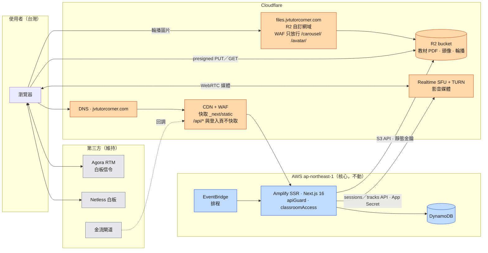
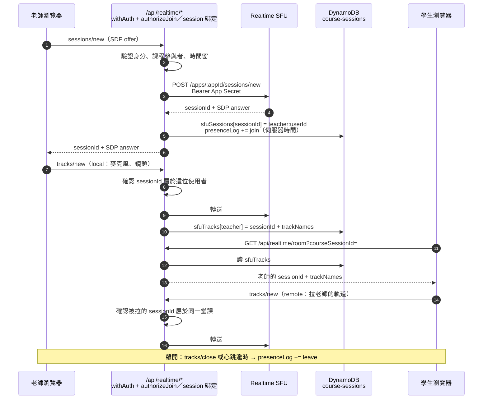

# 混合架構規劃：AWS 核心 + Cloudflare 邊緣／R2／Realtime SFU

> **定位**：[cloud-platform-comparison-aws-gcp-cloudflare.md](./cloud-platform-comparison-aws-gcp-cloudflare.md)
> 建議的方案 E 的執行規劃——做什麼、改哪些檔案、怎麼切換、怎麼回滾、怎麼驗收。
>
> **決策前提（2026-09-10 確認）**
> - 即時影音走 **Cloudflare Realtime SFU（原生 WebRTC）**，不用 RealtimeKit。
> - 網域 `jvtutorcorner.com` 目前 DNS 在 **Route 53 或網域註冊商**，需要先搬到 Cloudflare。
> - **資料層（DynamoDB）、SSR（Amplify）、金流、排程留在 AWS 不動。**
>
> **最後對照程式碼時間：2026-09-10**。標籤：`[Verify]` 需上線前實測確認；`[Done]` 本次已在程式碼完成。

---

## 0 · 一頁摘要

| 階段 | 做什麼 | S2（50 堂/天）月費 | 工時 | 回滾 |
|---|---|:--:|:--:|---|
| **0** | 平台無關技術債：寫死憑證、儲存抽象層、Scan→Query、Qdrant 上線、祕密執行期化 | $690 → ~$650 | 2–3 週（部分已完成） | 各自獨立 |
| **A1** | DNS 搬到 Cloudflare，開 CDN + WAF | ~$690（Free 方案 $0） | 2–3 天 | 單筆記錄切回 DNS only；或把 NS 改回 Route 53 |
| **A2** | 物件儲存換成 R2 | → ~$670 | 1 週 | 拿掉 `STORAGE_*` 重新部署 |
| **A3** | 教材 PDF 改「授權後 302 到短效網址」 | → ~$650 | 3–5 天 | 還原兩支路由 |
| **B** | 影音從 Agora 換成 Realtime SFU（**程式已完成、預設關閉**，待 Cloudflare 憑證實測，見 §6.10） | → **~$135** | 剩 3–5 週 | `NEXT_PUBLIC_RTC_PROVIDER=agora` 重新部署 |

**錢幾乎全在 B**（Agora $559 → SFU ~$6）。A1–A3 省得少，但 B 需要 A1（Cloudflare zone）才能順利做，而且 A 階段的改動風險低、可以先上線累積信心。

---

## 1 · 目標架構



**不變的東西**：所有授權仍在 Amplify 上的 `apiGuard` / `classroomAccess`（見 [auth-architecture-diagram.md](./auth-architecture-diagram.md)）。
Cloudflare 只負責「送得快、擋得早」，**不是**權限邊界——`*.amplifyapp.com` 預設網域仍可直連 Amplify、繞過 Cloudflare。

---

## 2 · Phase 0 — 平台無關的技術債

### 2.1 本次已完成 `[Done]`

| 項目 | 檔案 | 說明 |
|---|---|---|
| 移除寫死的 Agora 憑證 | `app/api/agora/token/route.ts`、`app/api/agora/rtm-token/route.ts` | 兩處都曾把 App Certificate 寫在原始碼當 fallback；現在缺環境變數就直接失敗。**憑證仍在 git 歷史（6 個 commit），必須在 Agora Console 輪替** |
| 物件儲存抽象層 | `lib/s3.ts` | 新增 `STORAGE_*` 設定可切到任何 S3 相容儲存；未設定時行為與先前完全相同。新增 `isObjectStorageConfigured()`、`getStorageClient()`、`getStorageBucket()`、`publicUrlForKey()` |
| 收斂自建的 S3 client | `app/api/uploads/{avatar,carousel}/[...path]`、`lib/awsHealthChecker.ts` | 先前各自 `new S3Client`，切到 R2 時會繼續打 AWS |
| 統一「儲存是否可用」判斷 | `app/api/{avatar/upload,carousel/upload,carousel/presign,whiteboard/pdf}` | 先前四種寫法、同一環境可能得到不同答案 |
| 拿掉執行期重讀 `.env.local` | `avatar/upload`、`carousel/upload`、`carousel/presign` | 每次請求覆寫 `process.env` 的開發期權宜之計 |
| 拿掉無用的本機副本與回寫快取 | 同上 + 兩支 proxy 路由 | serverless 檔案系統唯讀、各實例不共享；本機則無上限累積 |
| 路徑穿越漏洞 | `app/api/uploads/carousel/[...path]`（回寫快取前完全沒檢查）、`app/api/uploads/whiteboard/[...path]`（少了分隔字元） | 改為 `path.resolve` + `startsWith(dir + sep)` |
| CI 最後一步失敗 | `package.json` | 補上 `check:bundle-secrets` script；`STORAGE_SECRET_ACCESS_KEY` 加入外洩檢查 |

### 2.2 待辦

| 項目 | 為什麼 | 建議做法 |
|---|---|---|
| **Scan → Query** | 94 個 `ScanCommand`，資料庫成本主因，且帶分頁的 Scan 會靜默回傳不完整結果 | 已開獨立任務；優先頁面渲染與登入相關路徑 |
| **`releaseEscrow` 重複撥款競態** | 先加點數、再做條件更新；重複投遞的 webhook 可能撥兩次。**Phase B 會多一條結算路徑，必須先修** | 已開獨立任務 |
| **祕密改執行期讀取** | 目前靠 `next.config.ts` 的 `env` 區塊在 build 時內嵌，換祕密要重建；R2 金鑰也暫時走這條 | 新增 `lib/secrets.ts`：用 Amplify SSR 的 IAM Role 讀 SSM Parameter Store（`/jvtutorcorner/*`），行程內快取 5 分鐘；`sessionManager` 的密鑰要改成延遲讀取 |
| **Qdrant 上線** | `QDRANT_URL` 預設 `localhost`，知識庫在正式環境不可用 | Qdrant Cloud 免費叢集，現有程式碼零改動 |
| **確認現有 S3 bucket 的公開範圍** `[Verify]` | 輪播用的是公開 S3 網址，代表 bucket 至少部分公開；若整個 bucket 公開，`whiteboard/`、`course-materials/` 的教材**現在就能被匿名下載** | 檢查 bucket policy，只允許 `carousel/*` 公開讀取 |

---

## 3 · Phase A1 — DNS 搬到 Cloudflare + CDN/WAF

### 3.1 搬遷步驟

1. **前一天**：Route 53 所有記錄的 TTL 降到 300 秒，並匯出 zone file 備查。
2. **Cloudflare 新增網站** `jvtutorcorner.com`（Free 方案即可），讓它掃描既有記錄。
3. **逐筆對照匯出的 zone file**，特別是自動掃描常漏掉的：
   - `MX`、`SPF`（TXT）、**Resend 的 DKIM／Return-Path 記錄**——漏掉會讓驗證信、提醒信、報表信全部進垃圾桶或退信
   - Amplify 的 `www` / apex CNAME
   - **ACM 憑證驗證用的 `_xxxx.jvtutorcorner.com` CNAME**
4. **所有記錄先設為 DNS only（灰雲）**——此時行為與 Route 53 完全相同，可安全切換。
5. **在網域註冊處改 nameserver** 為 Cloudflare 給的兩組（若網域是在 Route 53 註冊：Route 53 → Registered domains → Name servers）。Route 53 hosted zone **保留兩週**作為回滾。
6. 等 Cloudflare 顯示 Active，確認 Amplify 主控台的自訂網域狀態仍是 Available。
7. **再把 `www` 與 apex 改成 Proxied（橘雲）**；SSL/TLS 模式設 **Full (strict)**。
   **ACM 驗證 CNAME 必須永遠維持 DNS only**——被 proxy 會讓憑證無法自動續約，網域會在到期時掛掉。
   （AWS 官方說明：[Updating DNS records for a domain managed by Cloudflare](https://docs.aws.amazon.com/amplify/latest/userguide/to-add-a-custom-domain-managed-by-cloudflare.html)）

### 3.2 Cloudflare 設定

| 設定 | 值 | 原因 |
|---|---|---|
| Always Use HTTPS | 開 | |
| **Rocket Loader** | **關** | 會改寫 `<script>` 載入順序，破壞 React hydration |
| **Email Address Obfuscation** | **關** | 會改寫 HTML 內容，造成 hydration mismatch |
| **Bot Fight Mode** | **關** | 會擋掉金流閘道與 LINE 的回調；Free 方案無法用 WAF 規則豁免 |
| Cache Rule：`/_next/static/*` | Eligible for cache，Edge TTL 1 年 | 檔名帶 content hash，middleware 也已排除它們的 `no-store` |
| Cache Rule：`/api/*` 或 Cookie 含 `session` | Bypass cache | 雙重保險；middleware 對私有路徑已送 `no-store` |
| WAF Managed Rules | 開 | |
| WAF Skip 規則 | 路徑為 `/api/stripe/webhook`、`/api/ecpay/return`、`/api/ecpay/client_return`、`/api/paypal/*`、`/api/linepay/*`、`/api/livekit/webhook`、`/api/line/webhook/*`、`/api/integration/make-webhook` 時略過 Managed Rules | 閘道回調的 payload 常觸發誤判；這些路由各自驗證閘道簽章 |
| Rate Limiting | `/api/login`、`/api/register`、`/api/forgot-password` | Free 方案可建 1 條速率限制規則 `[Verify]` |

### 3.3 要確認的副作用 `[Verify]`

- **真實 IP**：請求路徑變成 Cloudflare → Amplify CloudFront → Lambda。凡是依 IP 做判斷的程式（captcha、稽核日誌），應優先讀 `cf-connecting-ip`，其次才是 `x-forwarded-for` 的第一段。
- **預設網域可繞過**：`*.amplifyapp.com` 無法依來源 IP 封鎖，Cloudflare WAF 擋不到直連的流量。應用層的 `apiGuard` 仍是唯一可靠的邊界，**不能因為有 Cloudflare WAF 就放寬它**。
- **Amplify WAF（$15/月）**：同上理由，目前不建議拿掉。

### 3.4 驗收

- `curl -sI https://www.jvtutorcorner.com` 有 `cf-ray` header；`/_next/static/*` 第二次請求為 `cf-cache-status: HIT`；`/api/ping` 為 `DYNAMIC` 或 `BYPASS`
- 送出一封註冊驗證信，SPF／DKIM 皆 pass
- Stripe、ECPay、PayPal 沙箱各跑一筆付款，回調成功（Amplify 日誌可見）
- Amplify 自訂網域狀態 Available；ACM 憑證狀態 Issued

---

## 4 · Phase A2 — 物件儲存換成 R2

### 4.1 關鍵設計：公開範圍

R2 的公開存取是**整個 bucket** 層級，但目前輪播圖（需要公開）與教材 PDF（必須登入才能讀）在**同一個 bucket**。直接開公開網域，教材就能被匿名下載。

作法：只開**自訂網域**（`files.jvtutorcorner.com`），**不開 `r2.dev` 網址**，並在 Cloudflare WAF 加一條自訂規則只放行公開前綴：

```
(http.host eq "files.jvtutorcorner.com"
  and not starts_with(http.request.uri.path, "/carousel/")
  and not starts_with(http.request.uri.path, "/avatar/"))
→ Block
```

- 教材（`whiteboard/`、`course-materials/`）只能經過有登入保護的 API 讀取（伺服器讀出，或 Phase A3 的短效 presigned 網址）。
- 頭像目前存的是 `/api/uploads/avatar/...` 代理網址（302 到 presigned），不走公開網域；前綴先放行，日後可改成直出省掉一次 302。
- 若日後想要更嚴格，可改成兩個 bucket（公開／私有），但 `lib/s3.ts` 目前是單一 bucket，需要再加一層「前綴 → bucket」對應。

### 4.2 設定步驟

1. **建立 bucket**，Location hint 選 **Asia-Pacific**。
2. **自訂網域** `files.jvtutorcorner.com`（需要 A1 完成，zone 在 Cloudflare 上）。確認 `r2.dev` 公開網址**維持停用**。
3. **WAF 自訂規則**：如 4.1。
4. **CORS**（bucket → Settings → CORS Policy）——只有兩個瀏覽器直傳 PUT 需要（白板與輪播 presign），GET 留給 A3：

   ```json
   [
     {
       "AllowedOrigins": ["https://www.jvtutorcorner.com", "https://jvtutorcorner.com"],
       "AllowedMethods": ["PUT", "GET", "HEAD"],
       "AllowedHeaders": ["content-type"],
       "MaxAgeSeconds": 3600
     }
   ]
   ```

5. **API token**：R2 → Manage API tokens → **Object Read & Write，只限這個 bucket**，取得 Access Key ID 與 Secret。
6. **搬資料**：用 Cloudflare 的 **Super Slurper** 從 S3 整批複製（需要一組只能讀來源 bucket 的臨時 IAM 金鑰，搬完即刪）。舊 S3 bucket **保留至少 30 天**。
7. **Amplify 環境變數**：

   | 變數 | 值 |
   |---|---|
   | `STORAGE_S3_ENDPOINT` | `https://<ACCOUNT_ID>.r2.cloudflarestorage.com` |
   | `STORAGE_S3_REGION` | `auto`（可省略） |
   | `STORAGE_BUCKET` | R2 bucket 名稱 |
   | `STORAGE_ACCESS_KEY_ID` | 步驟 5 的 Access Key ID |
   | `STORAGE_SECRET_ACCESS_KEY` | 步驟 5 的 Secret |
   | `STORAGE_PUBLIC_BASE_URL` | `https://files.jvtutorcorner.com` |

8. **重新部署**。這些變數是在 build 時內嵌的（見 `next.config.ts` 的 `env` 區塊），**只改環境變數不重新 build 不會生效**。

### 4.3 程式層行為（本次已完成 `[Done]`）

- 設了 `STORAGE_S3_ENDPOINT` 就改用 R2：`region: 'auto'`、靜態金鑰、`requestChecksumCalculation: 'WHEN_REQUIRED'`（避免新版 SDK 把 checksum 參數簽進 presigned URL，讓瀏覽器直傳失敗）。
- `uploadToS3` / `getPresignedPutUrl` 回傳的公開網址改成 `STORAGE_PUBLIC_BASE_URL/<key>`。**設了 endpoint 卻沒設公開網址會在上傳前就失敗**，不會留下無法讀取的孤兒物件。
- `getS3KeyFromUrl` 能同時解析舊的 `amazonaws.com` 網址、新的自訂網域網址、path-style 網址。
- 健康檢查（`lib/awsHealthChecker.ts`）改查實際在用的 bucket。

### 4.4 舊資料

輪播資料列存的是完整的 `https://<bucket>.s3.ap-northeast-1.amazonaws.com/...` 網址。**S3 bucket 保留期間這些網址照常可用**，不必急著改。穩定 30 天後再寫一支 dry-run 預設的腳本，把 `DYNAMODB_TABLE_CAROUSEL` 的網址前綴改成 `STORAGE_PUBLIC_BASE_URL`，然後才下線 S3。

### 4.5 驗收

- 管理後台上傳一張輪播圖 → 網址是 `files.jvtutorcorner.com/carousel/...` → 首頁正常顯示
- 直接開 `https://files.jvtutorcorner.com/whiteboard/<任一 key>` → **403（被 WAF 擋）**
- 白板上傳 PDF（base64 路徑）→ 教室內可開啟
- `NEXT_PUBLIC_WHITEBOARD_PDF_UPLOAD=presign` 的直傳路徑 → PUT 成功（驗證 CORS 與 checksum 設定）`[Verify]`
- 頭像 `/api/uploads/avatar/<file>` → 302 到 R2 presigned 網址
- 每日報表的健康檢查顯示 bucket 正常

### 4.6 回滾

拿掉 `STORAGE_*` 變數並重新部署，即回到 S3。**切換期間上傳到 R2 的新物件不會自動回到 S3**——Super Slurper 只支援 S3 → R2，反向需要用 `rclone` 複製。

---

## 5 · Phase A3 — 教材 PDF 改「授權後 302」

**現況**：白板 PDF（`/api/whiteboard/pdf` GET）與課程教材預覽（`/api/courses/[id]/materials/preview`）都是伺服器從儲存讀出整個檔案、再經 Lambda 回傳。PDF 位元組全數計入 Amplify 傳出（$0.15/GB）與 Lambda 執行時間，大檔案還會撞到 Lambda 6 MB 回應上限。

**改法**：授權檢查通過後，回傳 302 到**短效（60–300 秒）presigned GET**，位元組直接由 R2 送出（egress $0）。

| 檔案 | 修改 |
|---|---|
| `app/api/whiteboard/pdf/route.ts` GET | 取得 `s3Key` 後改回 `NextResponse.redirect(await getSignedUrlForKey(s3Key, 120))`；保留 `?check=` 的中繼資料查詢不變 |
| `app/api/courses/[id]/materials/preview/route.ts` | 同上；維持 `private, no-store` 的語意（302 本身設 `no-store`） |
| R2 CORS | 已在 A2 的設定中包含 `GET` |

**要注意的前端相容性** `[Verify]`：
- `ClientClassroom.tsx` 以 `fetch('/api/whiteboard/pdf')` 讀成 blob；`fetch` 會自動跟隨跨來源 302，需要 R2 的 CORS 允許 GET。
- 白板的 `insertPDF` 用 `pdfjs.getDocument(url)` 載入同一個網址，同樣依賴 CORS。
- 這是教室的熱路徑，**必須跑一次 [classroom-room-whiteboard-sync](../.agents/skills/classroom-room-whiteboard-sync/) 的壓力測試**再上線。

---

## 6 · Phase B — 影音換成 Cloudflare Realtime SFU

### 6.1 Realtime SFU 提供什麼、不提供什麼

| 提供 | 不提供（要自己做） |
|---|---|
| WebRTC SFU：每個瀏覽器一個 session（一條 PeerConnection），推送本地軌道、拉取別人的軌道 | 房間、參與者、presence |
| TURN（搭配 SFU 免費） | 信令（誰推了哪條軌道要告訴對方） |
| HTTPS API：`sessions/new`、`tracks/new`、`renegotiate`、`tracks/close`、`GET session` | **伺服器事件**——沒有 LiveKit 那種 `participant_joined` / `room_finished` webhook |
| 以 GB 計費：$0.05/GB，**每月前 1 TB 免費** | 錄影（要另外接） |

API 必須由後端呼叫（持有 App Secret）；Cloudflare 的參考實作也是由 Worker 持有憑證、代理瀏覽器的請求。

**最大的差異在最後一行**：現在點數託管的撥款依賴 LiveKit 的 `room_finished` 事件與伺服器時間戳（`lib/livekit/webhookHandler.ts`）。SFU 沒有這些事件，**「誰什麼時候在場」的伺服器真相要由我們自己的代理路由記錄**。

### 6.2 元件（已實作）

原規劃是一支 `[...path]` 萬用代理，實作時改成**四支用途明確的路由**：每支只收白名單欄位再轉送，授權規則寫在一處、可單獨測試。前端也**沒有用 partytracks**——它還在 0.0.x，且其伺服器代理是整包轉送，無法在中間做 session 綁定與同課程檢查；改為手寫 `RTCPeerConnection`，不增加任何依賴。

| 元件 | 檔案 | 職責 |
|---|---|---|
| 設定 | `lib/realtime/config.ts` | `CF_REALTIME_*`、`CF_TURN_*`；缺值回 503。進場時間窗沿用 `LIVEKIT_EARLY_JOIN_MINUTES` 等變數，兩個 provider 規則一致 |
| SFU API | `lib/realtime/sfuApi.ts` | 伺服器端呼叫 `rtc.live.cloudflare.com`（App Secret 只在這裡）；產生短效 TURN 憑證，失敗時退回 STUN |
| 請求白名單 | `lib/realtime/validate.ts` | 推軌道只能推自己的、`trackName` 限 audio／video、觀察者不能推；拉軌道的來源必須是同一堂課在場的其他人、且確實發佈了該軌道；只轉送白名單欄位 |
| 參與者篩選 | `lib/realtime/participants.ts` | 排除自己、觀察者、已離開、心跳逾時；**同一身分只留最新的 session**（重新整理頁面時避免 ClientClassroom 出現重複的 React key） |
| 房間登錄 | `lib/realtime/registry.ts` | `course-sessions.sfuSessions`：session 歸屬、已發佈軌道、`lastSeenAt`、`leftAt` |
| session 綁定檢查 | `lib/realtime/guard.ts` | 除了建立 session，其餘請求只確認「這個 SFU session 是這位登入者在這堂課建立的」，心跳不必每次重查報名 |
| `POST /api/realtime/session` | `app/api/realtime/session/route.ts` | `authorizeJoin`（與 LiveKit 共用）→ `sessions/new` → 登錄 → 出席 `join` → `markSessionStarted` → 回傳 TURN 憑證 |
| `POST`／`PUT /api/realtime/tracks` | `app/api/realtime/tracks/route.ts` | 推／拉軌道；關閉軌道 |
| `PUT /api/realtime/renegotiate` | `app/api/realtime/renegotiate/route.ts` | 回覆 SFU 在拉軌道時發起的 offer |
| `GET`／`POST /api/realtime/room` | `app/api/realtime/room/route.ts` | 查詢在場者（每 3 秒輪詢，唯讀）；心跳（每 15 秒）與明確離開（出席 `leave`） |
| 前端 provider | `lib/providers/rtc/useCloudflareSfuProvider.ts`，接進 `useRTC.ts`（`cloudflare-sfu`） | 回傳形狀與 LiveKit provider 相同；所有 SDP 協商排進同一個佇列 |
| 回歸測試 | `scripts/verify-realtime-sfu-guards.mjs` | 19 項授權規則測試，不連網路、不碰資料庫 |
| 結算排程 | **待辦** | 見 §6.10 |

### 6.3 加入教室的流程



### 6.4 必須在代理路由做的安全檢查

Realtime SFU 的 sessionId 與 trackName 本身不是祕密，拿到就能拉軌道。代理路由必須：

1. **session 綁定使用者**：`sessions/new` 成功後把 `sessionId → {userId, courseSessionId}` 寫進資料庫；之後任何帶這個 sessionId 的請求都必須來自同一位使用者。
2. **拉軌道要同一堂課**：`tracks/new` 的 `location: remote` 所指的來源 sessionId，必須屬於同一個 `courseSessionId`，否則 403——防止跨課程偷看。
3. **只允許 5 種路徑**：`sessions/new`、`sessions/:id/tracks/new`、`sessions/:id/renegotiate`、`sessions/:id/tracks/close`、`GET sessions/:id`；其餘一律 404。
4. **App Secret 不進 client bundle**：列入 `scripts/check-bundle-secrets.mjs`。

### 6.5 出席與計費

- **加入**：代理路由觀察到 `sessions/new` 成功的時間——這是伺服器時間，可信。
- **離開**：`tracks/close`，或心跳逾時。現有教室每 15 秒打一次 `/api/classroom/ready`，可順帶更新 `lastSeenAt`；超過 45 秒沒有心跳視為離開。
- **結算前核對**：排程可用 `GET /apps/:appId/sessions/:sessionId` 確認 session 的軌道狀態，避免只憑心跳判斷。
- **沿用既有規則**：把上述事件轉成 `presenceLog` 格式，直接重用 `computeDurations` 與 `settleEscrow`（老師在場 ≥ 60 秒、雙方同時在場 ≥ 300 秒才撥款）。建議先把這兩個純函式從 `lib/livekit/webhookHandler.ts` 抽到 `lib/classroom/settlement.ts`，讓 LiveKit 與 SFU 共用。

**信任度比 LiveKit 低**：LiveKit 的離開事件來自媒體伺服器；這裡的離開是推論出來的。對計費的影響是「離開時間可能晚最多 45 秒」，不影響「有沒有上課」的判斷。

### 6.6 前端 provider 要符合的實際介面

`IRTCProvider`（`lib/providers/types.ts`）比 `ClientClassroom.tsx` 實際依賴的寬鬆，provider 必須符合**實際行為**：

- `join()` 接受 `{ publishAudio?, publishVideo?, audioDeviceId?, videoDeviceId? }`。
- `remoteUsers` 每個元素：`uid` 可轉字串（當 React key，並與本地 userId 比較）；`videoTrack.play(el)` 要能接受 `<div>` 或 `<video>`，並有 `stop()`。
- provider 自己把**第一位遠端使用者**掛到 `remoteVideoRef`，並**自己播放所有遠端音訊**（`ClientClassroom` 不讀 `audioTrack`）。
- `ClientClassroom` 在加入前會直接寫 `localVideoRef.current.srcObject` 做預覽，provider 不能因此出錯。
- **呼叫 `join()` 之前不能建立任何連線**——`useRTC` 會同時呼叫所有 provider 的 hook。
- 回傳 `autoplayFailed`（介面沒寫，但三個現有 provider 都有）。

LiveKit provider（`lib/providers/rtc/useLiveKitProvider.ts`）的 `AgoraLikeTrack` 包裝可以直接參考。

**靜音／關鏡頭用 `track.enabled = false`，不能用 `replaceTrack(null)`**：SFU 會回收 30 秒沒有媒體封包的軌道，停止送封包的話，對方的畫面會在 30 秒後永久消失。代價是關鏡頭時部分瀏覽器的鏡頭指示燈仍亮著。

### 6.7 信令與白板

- 白板同步訊息（`wb-uuid-sync`、`page-change` 等）**繼續走 Agora RTM**，Phase B 不動。RTM 的費用與 RTC 分開，量小。
- 若要一併離開 Agora，`lib/providers/signaling/useAwsApigwSignaling.ts` 已實作完成、有測試，可另外啟用。
- Netless 白板維持。

### 6.8 工時與上線方式

| 工作 | 工時 |
|---|:--:|
| 代理路由、session 綁定、軌道登錄、TURN | 1.5 週 |
| 前端 provider（partytracks）與 `useRTC` 接線 | 2 週 |
| 出席記錄、心跳、結算排程、抽出共用結算函式 | 1.5 週 |
| 測試：雙瀏覽器 e2e、斷線重連、iOS Safari、既有的 8 組壓力測試 | 1 週 |
| 內部課程試跑 | 1–2 週 |
| **合計** | **6–9 週** |

- `NEXT_PUBLIC_RTC_PROVIDER` 是 build 時常數，無法只對部分使用者開啟。**試跑用另一個 Amplify 分支部署**（例如 `canary.jvtutorcorner.com`），只安排內部課程。
- **回滾**：主站維持 `agora`，只有試跑分支用 `cloudflare-sfu`；全面切換後若要退回，改回 `agora` 重新部署即可，資料層沒有不相容的變更。
- **若進度落後**：改用 RealtimeKit（$0.002/參與者分鐘，S2 約 $300/月），它內建房間、presence、錄影與伺服器事件，可把工時縮短到 3–5 週，仍比 Agora 省一半。

### 6.9 前置條件

1. **A1 完成**（TURN 與代理路由都在我們的網域上，需要 Cloudflare zone 才方便設定）。
2. **`releaseEscrow` 競態已修**——結算排程與既有的 `agora/session` PATCH、LiveKit webhook 可能重疊。
3. 建立 Realtime SFU App 與 TURN key，取得下列環境變數。

---

### 6.10 實作狀態（2026-09-10）

**已完成並驗證**
- `tsc` 零錯誤；`next build` 通過
- `scripts/verify-realtime-sfu-guards.mjs`：19/19 通過（跨課程拉軌道、拉自己的軌道、觀察者推軌道、額外欄位被丟棄、重複 uid 等）
- 外洩檢查：`CF_REALTIME_APP_SECRET`、`CF_TURN_KEY_API_TOKEN` 只出現在伺服器端 chunk，client bundle 為 0
- 本機實測：未登入 401、未設定 503、`authorizeJoin` 對真實 DynamoDB 查詢回 404、session 綁定檢查回 400／404、教室頁面加入新 hook 後仍可編譯
- 預設 `NEXT_PUBLIC_RTC_PROVIDER=agora`，**現有教室行為不變**

**尚未驗證（需要 Cloudflare Realtime App 憑證）** `[Verify]`
- 與真實 SFU 的 SDP 協商、拉軌道、`tracks/close` 的 `force` 語意
- 兩個瀏覽器的雙向影音、斷線重連（`triggerFix` 會整個重新加入）、iOS Safari
- 3–6 人小班（ClientClassroom 的多人格狀畫面）

**待辦**
1. **結算排程**：`app/api/cron/settle-sessions` + EventBridge 每 5 分鐘，把 `sfuSessions` 的 `joinedAt`／`leftAt`／`lastSeenAt` 轉成 `presenceLog`，重用 `computeDurations` 與 `settleEscrow`（需先從 `lib/livekit/webhookHandler.ts` 匯出或抽到 `lib/classroom/settlement.ts`）。**要等 `releaseEscrow` 重複撥款的修正合併後才能接**。在那之前，用 SFU 上課的課程**不會自動撥款**。
2. 沒有明確離開的人（關分頁、斷網），出席紀錄目前只有 `join` 沒有 `leave`；結算時以 `lastSeenAt` 推論離開時間。
3. 試跑用的 Amplify 分支與 `canary` 網域。

## 7 · 環境變數總表

| 變數 | 階段 | 用途 | 性質 |
|---|:--:|---|---|
| `STORAGE_S3_ENDPOINT` | A2 | R2 的 S3 API endpoint | 設定 |
| `STORAGE_S3_REGION` | A2 | `auto` | 設定 |
| `STORAGE_BUCKET` | A2 | R2 bucket 名稱 | 設定 |
| `STORAGE_ACCESS_KEY_ID` | A2 | R2 API token | 設定 |
| `STORAGE_SECRET_ACCESS_KEY` | A2 | R2 API token | **祕密**（已列入外洩檢查） |
| `STORAGE_PUBLIC_BASE_URL` | A2 | `https://files.jvtutorcorner.com` | 設定 |
| `CF_REALTIME_APP_ID` | B | Realtime SFU App ID | 設定 |
| `CF_REALTIME_APP_SECRET` | B | Realtime SFU App Secret | **祕密** |
| `CF_TURN_KEY_ID` | B | TURN key ID | 設定 |
| `CF_TURN_KEY_API_TOKEN` | B | TURN key API token | **祕密** |
| `NEXT_PUBLIC_RTC_PROVIDER` | B | `cloudflare-sfu` | build 時常數 |
| `REALTIME_HEARTBEAT_TIMEOUT_SEC` | B | 多久沒心跳視為離開（預設 45） | 設定 |
| `AGORA_APP_ID` / `AGORA_APP_CERTIFICATE` | 現在 | **寫死的 fallback 已移除，正式環境必須設定（各 32 字元）** | 祕密 |

---

## 8 · 風險登記

| 風險 | 階段 | 影響 | 對策 |
|---|:--:|---|---|
| **Amplify 未設定 Agora 環境變數** | 本次 | 部署後教室無法取得 token，全面無法上課 | **部署前確認**兩個變數存在且為 32 字元 |
| 搬 DNS 漏掉郵件記錄 | A1 | 驗證信、提醒信退信或進垃圾桶 | 匯出 zone file 逐筆對照；切換後立刻寄測試信 |
| ACM 驗證記錄被 proxy | A1 | 憑證到期無法續約，網站掛掉 | 該筆永遠 DNS only；在記錄備註寫明 |
| 金流回調被 WAF 擋 | A1 | 付款成功但訂單未更新 | 回調路徑的 Skip 規則；不開 Bot Fight Mode；沙箱實測 |
| R2 公開網域曝露教材 | A2 | 教材可被匿名下載 | 只放行 `/carousel/` `/avatar/` 的 WAF 規則；`r2.dev` 保持停用；驗收時實測 403 |
| 只改環境變數沒重新部署 | A2 | 以為切換了其實沒有 | 部署後看健康檢查顯示的 bucket |
| presigned PUT 簽章不符 | A2 | 直傳上傳失敗 | 已設 `WHEN_REQUIRED`；驗收時實測 `presign` 路徑 |
| 跨來源 302 的 CORS | A3 | 教室打不開 PDF | CORS 包含 GET；壓力測試後才上線 |
| SFU sessionId 被冒用 | B | 跨課程偷看 | 代理路由的 session 綁定與同課程檢查 |
| 出席推論不準 | B | 撥款時間誤差最多 45 秒 | 結算前以 `GET session` 核對；沿用既有門檻 |
| 結算重複撥款 | B | 老師收到兩次點數 | 前置條件：先修 `releaseEscrow` |
| `*.amplifyapp.com` 繞過 Cloudflare | 全程 | WAF 形同虛設 | 應用層 `apiGuard` 仍是唯一邊界，不放寬 |

---

## 9 · 本次變更的驗證方式

- `npx tsc --noEmit` 與 `npm run build`（需要 `SESSION_SECRET`、`API_HMAC_SECRET`，CI 用假值即可）
- `npm run check:bundle-secrets`：build 後掃描 `.next/static`，確認 `STORAGE_SECRET_ACCESS_KEY` 等祕密沒進 client bundle
- 未設定任何 `STORAGE_*` 時，行為應與先前完全相同：本機上傳落在 `.uploads/`，proxy 路由可讀
- 路徑穿越：`/api/uploads/carousel/..%2F..%2Fpackage.json` 應回 400；`/api/uploads/whiteboard/..%2Fwhiteboard-x%2Fa` 應回 403
