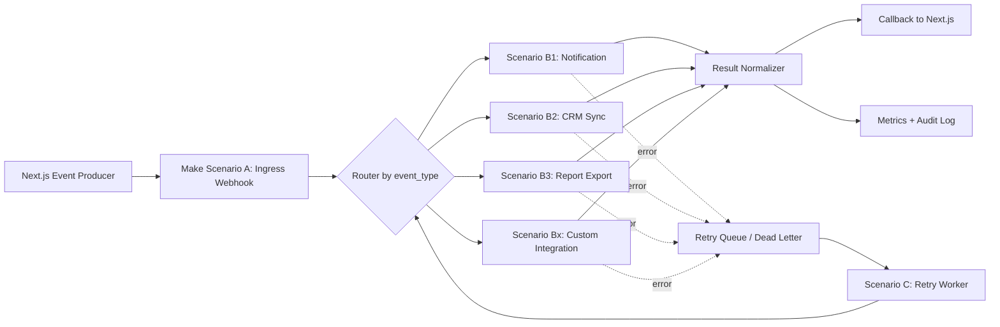

# Make Scenario 標準藍圖（入口 Router、重試、Callback）

> 文件版本：2026-05-24  
> 適用架構：JV Tutor Corner（Next.js + AWS Amplify Serverless + Make.com）

---

## 1. 目標與邊界

### 1.1 目標

- 將專案內「冷路徑工作流」標準化轉移到 Make.com。
- 以單一入口 Webhook 接收事件，透過 Router 分流到不同業務 Scenario。
- 對外部依賴失敗提供可重試與補償機制，避免事件遺失。
- 透過 callback 回寫執行結果到站內系統，維持可追蹤與一致性。

### 1.2 邊界

- 保留站內熱路徑：`/classroom/room`、whiteboard、presence。
- 外移冷路徑：通知、CRM、報表、非即時同步、第三方整合。

---

## 2. 總體架構藍圖



---

## 3. 事件契約（Ingress Webhook）

### 3.1 HTTP Header（建議）

- `x-jvt-event-id`: 全域唯一事件 ID（UUID）
- `x-jvt-event-type`: 事件類型（如 `course.approved`）
- `x-jvt-ts`: Unix timestamp（秒）
- `x-jvt-signature`: HMAC-SHA256 簽章

### 3.2 Request Body（標準格式）

```json
{
  "event_id": "evt_20260524_001",
  "event_type": "course.approved",
  "source": "jvtutorcorner-workflow",
  "occurred_at": "2026-05-24T10:00:00.000Z",
  "trace_id": "trace_abc123",
  "retry_count": 0,
  "payload": {
    "courseId": "CRS-2025-001",
    "teacherId": "T-001",
    "actionBy": "admin"
  }
}
```

### 3.3 Response Body（同步回應）

```json
{
  "ok": true,
  "accepted": true,
  "scenario_id": "make_ingress_001",
  "run_id": "run_123456",
  "message": "accepted"
}
```

---

## 4. Scenario A：入口 + Router 標準設計

### 4.1 模組順序

1. Custom Webhook（接收站內事件）
2. Signature Validator（驗簽）
3. Timestamp Guard（時效檢查，預設 5 分鐘）
4. Idempotency Check（事件去重）
5. Router（依 `event_type` 分流）
6. Sub-scenario Execute（執行子流程）
7. Result Normalizer（統一結果）
8. Callback Dispatcher（回寫站內）

### 4.2 Router 建議規則

- `notification.*` -> Notification Scenario
- `crm.*` -> CRM Scenario
- `report.*` -> Report Scenario
- `payment.*` -> Payment Sync Scenario
- 其他未知事件 -> Fallback Queue + 告警

### 4.3 Fallback 原則

- 路由不到分支：標記 `UNROUTED_EVENT`，推入 dead-letter。
- Schema 不合法：標記 `INVALID_PAYLOAD`，拒收並告警。

---

## 5. 重試與補償標準（Scenario C）

### 5.1 重試條件

可重試（Transient）：

- HTTP `429`
- HTTP `5xx`
- 網路 timeout

不可重試（Permanent）：

- HTTP `400/401/403/404`
- schema 或簽章錯誤

### 5.2 退避策略

- 最大重試次數：`5`
- 退避：指數退避 + jitter
- 範例：`5s -> 15s -> 45s -> 120s -> 300s`

### 5.3 Dead Letter 內容

```json
{
  "event_id": "evt_20260524_001",
  "event_type": "crm.sync",
  "last_error": "HTTP 503",
  "retry_count": 5,
  "failed_at": "2026-05-24T10:10:00.000Z",
  "payload_snapshot": {}
}
```

### 5.4 補償流程

1. 人工檢視 dead-letter
2. 修正資料或外部配置
3. 重新投遞（replay）
4. 對同 `event_id` 仍維持冪等

---

## 6. Callback 回寫規格（站內回收執行結果）

### 6.1 Callback Endpoint 建議

- 建議新增：`POST /api/workflows/make-callback`
- 僅允許服務對服務呼叫（API key / HMAC）

### 6.2 Callback Request

```json
{
  "event_id": "evt_20260524_001",
  "event_type": "course.approved",
  "status": "SUCCESS",
  "scenario_id": "make_ingress_001",
  "run_id": "run_123456",
  "processed_at": "2026-05-24T10:00:03.200Z",
  "result": {
    "channel": "email",
    "provider": "resend",
    "message_id": "msg_789"
  },
  "error": null
}
```

### 6.3 Callback 失敗處理

- Make callback 若遇到 `5xx/timeout`，依同一重試策略重送。
- 回寫成功前，執行結果視為 `PENDING_CALLBACK`。

---

## 7. 安全設計（必做）

1. 簽章驗證：`HMAC_SHA256(secret, timestamp + raw_body)`
2. 時間窗檢查：`abs(now - timestamp) <= 300s`
3. 冪等鍵：`event_id`
4. 秘密管理：全部放 Amplify env，不寫死於節點
5. 最小權限：Make 僅能呼叫必要 endpoint

---

## 8. 監控與 SLO（建議）

### 8.1 核心指標

- Ingress 接收成功率
- Router 命中率（非 fallback）
- Scenario 執行成功率
- Callback 成功率
- Retry 次數分佈
- Dead-letter 事件數
- End-to-end latency（`occurred_at -> callback processed_at`）

### 8.2 告警門檻（建議）

- `Scenario success rate < 99%`（5 分鐘）
- `Callback success rate < 99.5%`（5 分鐘）
- `Dead-letter > 10`（10 分鐘）
- `E2E p95 > 10s`（15 分鐘）

---

## 9. 分階段上線計畫

### Phase 1：雙寫驗證（1-2 週）

- 站內流程照舊 + 同步送一份到 Make
- 比對結果一致性（成功率、資料完整性）

### Phase 2：單寫切換（低風險事件先）

- 先切通知、報表，再切 CRM
- 支付與關鍵業務事件最後切換

### Phase 3：清理與收斂

- 移除重複站內步驟
- 保留 Trigger + Callback + 稽核資料

---

## 10. 實作清單（Checklist）

- [ ] 建立 Scenario A（Ingress + Router）
- [ ] 建立 Scenario C（Retry Worker + Dead Letter）
- [ ] 定義事件契約（Header/Body/Response）
- [ ] 站內加上 HMAC 產生與驗證
- [ ] 新增 callback endpoint（`/api/workflows/make-callback`）
- [ ] 建立冪等資料表（event_id 狀態）
- [ ] 設定監控與告警（成功率、延遲、dead-letter）
- [ ] 先雙寫後切流量，保留 rollback 開關

---

## 11. 你專案的對接位置（參考）

- 觸發入口：`POST /api/workflows/execute`
- 站內 workflow 執行引擎：`lib/workflowEngine.ts`
- Workflow 管理頁：`app/workflows/page.tsx`

建議做法：保留現有 Trigger 入口，將冷路徑 action 逐步改為標準化 HTTP 轉發 Make Webhook，再以 callback 回寫站內結果。
