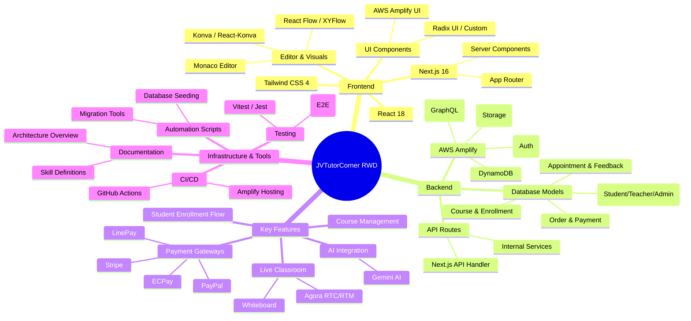

# JVTutorCorner RWD Project Diagram (Xmind Style)

This document provides a high-level mind map of the JVTutorCorner project architecture, components, and technology stack.

## Description of Branches

- **Frontend**: Rooted in Next.js 16, utilizing modern React features and Tailwind CSS 4 for a responsive, premium UI. Visual tools like Monaco, Konva, and React Flow empower the interactive parts of the platform.
- **Backend**: Leverages the AWS Amplify ecosystem for a scalable, serverless architecture. GraphQL serves as the primary data interface.
- **Key Features**: Covers the core business logic, including the tutoring workflow, AI-assisted learning (Gemini), multi-gateway payment support, and real-time classroom capabilities via Agora.
- **Infrastructure & Tools**: Ensures project quality and maintainability through automated testing, deployment pipelines, and comprehensive documentation.
