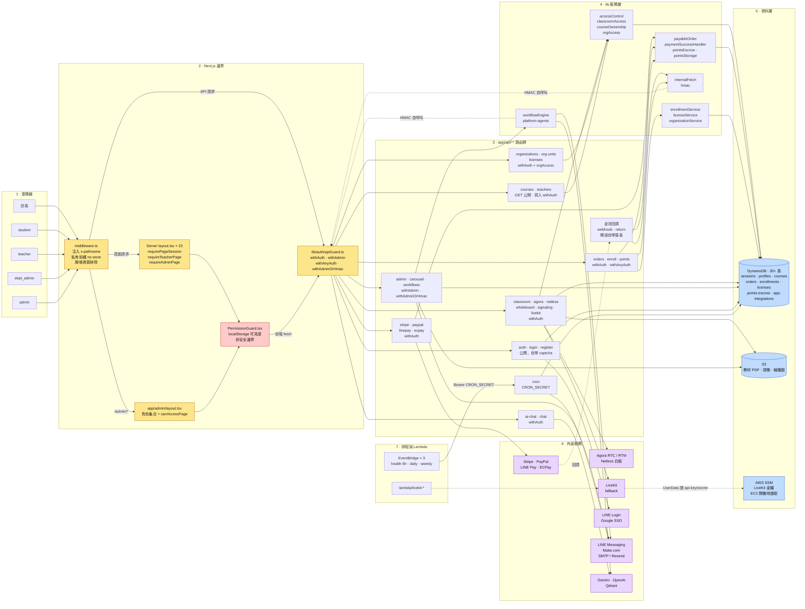
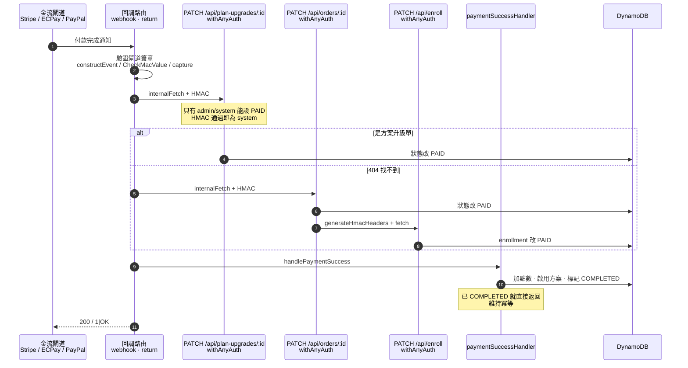

# 系統架構關聯圖（System Architecture Diagram）

> **定位**：這份文件回答「**誰呼叫誰**」——從瀏覽器進來的請求，經過哪幾層守衛、打到哪一組 API、
> 走進哪一支 lib 服務、最後落在哪張 DynamoDB 表或哪個外部服務。
>
> 權限層本身的細節（每一道守衛的判斷依據、helper 之間的依賴、角色矩陣）另有專文：
> [auth-architecture-diagram.md](./auth-architecture-diagram.md)。
> 教室熱／冷路徑效能分層見 [classroom-hot-cold-path-architecture.md](./classroom-hot-cold-path-architecture.md)；
> B2B 請求路徑見 [b2b-request-path-diagram.md](./b2b-request-path-diagram.md)。
> 平台成本與遷移適配性（AWS vs GCP vs Cloudflare）見 [cloud-platform-comparison-aws-gcp-cloudflare.md](./cloud-platform-comparison-aws-gcp-cloudflare.md)。
>
> **最後對照程式碼時間：2026-09-09**（commit `bd85fe7` 之後）。圖上每個節點都能對到下方「節點 → 檔案」表；
> 沒有程式碼依據的邊一律不畫。標籤 `[Known Gap]` 表示已知缺口，非本圖要描述的正常路徑。

---

## 1 · 全景關聯圖

**怎麼讀這張圖**

- **黃色**是真正的安全邊界（伺服器端判斷，使用者改不了）。
- **紅色**的 `PermissionGuard` 只控制畫面可見度，角色來自 `localStorage`，**不是安全邊界**——
  它的原始碼註解也是這樣寫的。真正的邊界永遠是 API 上的 `withAuth` 家族。
- **虛線**是伺服器對伺服器的自呼叫：金流回調與工作流程引擎會用 HMAC 簽章回打自己的 API，
  因此箭頭繞回 `apiGuard`（走 `withAnyAuth` / `withAdminOrHmac` 的 HMAC 支線，取得虛擬 `system` 身分）。
- `A_CB`（金流回調）**不經過** `apiGuard`：它們各自驗證閘道自己的簽章
  （Stripe `constructEvent`、ECPay `verifyCheckMacValue`、PayPal capture 結果），這是刻意的設計。

---

## 2 · 付款完成的伺服器對伺服器路徑

這條鏈最容易看不出關聯——閘道回調並不直接寫資料庫，而是**用 HMAC 簽章回打自己的 API**，
一層一層往下觸發。三家閘道（Stripe / ECPay / PayPal）走的是同一條路徑。

**關鍵設計**：`plan-upgrades` 與 `orders` 的 PATCH 都限定「只有 `admin`/`system` 能把狀態設成 `PAID`」。
回調本身沒有使用者 session，靠 `internalFetch` 的 HMAC 簽章換到虛擬 `system` 身分才過得了關。
簽章涵蓋 `method + path + query + body + timestamp`，所以**每一個回調 URL 都必須逐字簽對**——
這也是為什麼這幾支不能改用裸 `fetch`。

退款走同一條路的反向：`PATCH /api/orders/:id` 收到 `REFUNDED` 時，會 `refundEscrow()` 退回託管點數，
再以 HMAC 呼叫 `PATCH /api/enroll` 把 enrollment 改成 `CANCELLED`，撤銷課程權限。

---

## 3 · 節點 → 檔案對照

| 圖上節點 | 檔案 |
|---|---|
| `middleware.ts` | [middleware.ts](../middleware.ts) |
| Server layout 守衛 | [lib/auth/pageGuard.ts](../lib/auth/pageGuard.ts) + 23 個 `app/**/layout.tsx` |
| admin layout | [app/admin/layout.tsx](../app/admin/layout.tsx)、[lib/auth/pagePermissions.ts](../lib/auth/pagePermissions.ts) |
| PermissionGuard | [components/auth/PermissionGuard.tsx](../components/auth/PermissionGuard.tsx) |
| apiGuard | [lib/auth/apiGuard.ts](../lib/auth/apiGuard.ts) |
| accessControl 家族 | [lib/accessControl.ts](../lib/accessControl.ts)、[lib/auth/classroomAccess.ts](../lib/auth/classroomAccess.ts)、[lib/auth/courseOwnership.ts](../lib/auth/courseOwnership.ts)、[lib/auth/orgAccess.ts](../lib/auth/orgAccess.ts) |
| 金流服務 | [lib/payments/payableOrder.ts](../lib/payments/payableOrder.ts)、[lib/paymentSuccessHandler.ts](../lib/paymentSuccessHandler.ts)、[lib/pointsEscrow.ts](../lib/pointsEscrow.ts) |
| 報名／授權 | [lib/enrollmentService.ts](../lib/enrollmentService.ts)、[lib/licenseService.ts](../lib/licenseService.ts)、[lib/organizationService.ts](../lib/organizationService.ts) |
| 內部簽章呼叫 | [lib/auth/internalFetch.ts](../lib/auth/internalFetch.ts)、[lib/auth/hmac.ts](../lib/auth/hmac.ts) |
| 工作流程引擎 | [lib/workflowEngine.ts](../lib/workflowEngine.ts) |
| DynamoDB 共用 client | [lib/dynamo.ts](../lib/dynamo.ts) |
| S3 | [lib/s3.ts](../lib/s3.ts) |
| SSM（LiveKit 金鑰） | [cloudformation/livekit-ec2.yml](../cloudformation/livekit-ec2.yml) UserData；`app/api/agora/token/route.ts` 雖 import SSM 但從未呼叫（死碼） |
| LiveKit | [lib/livekit/](../lib/livekit/)、[app/api/livekit/](../app/api/livekit/)、[lambda/livekit-token/](../lambda/livekit-token/) |
| 排程 | [cloudformation/daily-report-scheduler.yml](../cloudformation/daily-report-scheduler.yml)、[app/api/cron/](../app/api/cron/) |

---

## 4 · DynamoDB 表一覽

同一個 `ddbDocClient`（[lib/dynamo.ts](../lib/dynamo.ts)）服務所有表；表名一律「環境變數 → 預設值」。

| 用途 | 環境變數 | 預設表名 | 主要擁有者 |
|---|---|---|---|
| Session | `DYNAMODB_TABLE_SESSIONS` | `jvtutorcorner-sessions` | `lib/auth/sessionManager.ts`（24h TTL） |
| 使用者 | `DYNAMODB_TABLE_PROFILES` | `jvtutorcorner-profiles` | `lib/profilesService.ts` |
| 老師 | `DYNAMODB_TABLE_TEACHERS` | `jvtutorcorner-teachers` | 路由直接存取 |
| 課程 | `DYNAMODB_TABLE_COURSES` | `jvtutorcorner-courses` | `lib/auth/classroomAccess.ts`、`app/api/courses/*` |
| 訂單 | `DYNAMODB_TABLE_ORDERS` | `jvtutorcorner-orders` | `lib/payments/payableOrder.ts` |
| 方案升級 | `DYNAMODB_TABLE_PLAN_UPGRADES` | `jvtutorcorner-plan-upgrades` | 同上 |
| 報名 | `DYNAMODB_TABLE_ENROLLMENTS` | `jvtutorcorner-enrollments` | `lib/enrollmentService.ts`（GSI `byUserId`） |
| 點數 | `DYNAMODB_TABLE_USER_POINTS` | `jvtutorcorner-user-points` | `lib/pointsStorage.ts` |
| 點數託管 | `DYNAMODB_TABLE_POINTS_ESCROW` | `jvtutorcorner-points-escrow` | `lib/pointsEscrow.ts` |
| 頁面權限 | `DYNAMODB_TABLE_PAGE_PERMISSIONS` | `jvtutorcorner-page-permissions` | `lib/auth/pagePermissions.ts`（GSI `RolePathIndex`） |
| 第三方憑證 | `DYNAMODB_TABLE_APP_INTEGRATIONS` | `jvtutorcorner-app-integrations` | 所有整合共用的憑證庫 |
| B2B 組織 | `DYNAMODB_TABLE_ORGANIZATIONS` / `_ORG_UNITS` / `_LICENSES` | `jvtutorcorner-organizations` 等 | `lib/organizationService.ts`、`orgUnitService.ts`、`licenseService.ts` |
| 白板／教室 | `DYNAMODB_TABLE_WHITEBOARD` | `jvtutorcorner-whiteboard` | `app/api/classroom/{ready,session}` |
| 稽核 | `DYNAMODB_TABLE_AUDIT_LOGS` | `jvtutorcorner-audit-logs` | `lib/auditLogService.ts` |

其餘表（pricing、roles、carousel、questionnaires、teacher-reviews、course-sessions、attendance、
ai-models、agora-logs、key-logs、webhook-logs、calendar-reminders、app-permissions、
whiteboard-permissions、user-interactions）用途單一，可直接 grep `DYNAMODB_TABLE_` 取得完整清單。
CloudFormation 定義在 [cloudformation/](../cloudformation/) 的 `dynamodb-*.yml`。

---

## 5 · 排程觸發

| 觸發來源 | 週期 | 目標 | 認證 |
|---|---|---|---|
| EventBridge `jvtutor-report-health-6h` | `cron(0 */6 * * ? *)` | `POST /api/cron/daily-report?tier=health` | `Bearer CRON_SECRET` |
| EventBridge `jvtutor-report-daily-news` | `cron(0 16 * * ? *)`（台北 00:00） | 同上 `tier=daily` | 同上 |
| EventBridge `jvtutor-report-weekly-risk` | `cron(0 16 ? * SUN *)`（台北週一 00:00） | 同上 `tier=weekly` | 同上 |
| 外部排程／手動 | 依需求 | `POST /api/cron/process-reminders` | 同上 |

兩支 cron 在**正式環境未設 `CRON_SECRET` 時一律拒絕**（fail-closed）；非正式環境才允許未認證呼叫並印警告。

---

## 6 · Provider 切換（RTC / 白板 / 信令）

即時通訊層有一層 provider 抽象（[lib/providers/](../lib/providers/)），以 build-time 環境變數選擇實作，
預設值全部指向現況的 Agora / Netless：

| 變數 | 預設 | 其他選項 |
|---|---|---|
| `NEXT_PUBLIC_RTC_PROVIDER` | `agora` | `livekit`（已有 `lib/livekit/*` 與 `app/api/livekit/*` 實作）、`chime`（stub） |
| `NEXT_PUBLIC_SIGNALING_PROVIDER` | `agora-rtm` | `aws-apigw-ws`（搭配 `/api/signaling/token`） |
| `NEXT_PUBLIC_WHITEBOARD_PROVIDER` | `netless` | `tldraw`（stub） |

LiveKit 是**備援**而非取代——Agora 仍為現行主力，切換靠上述變數。
背景與成本分析見 [livekit-migration/](./livekit-migration/)。
